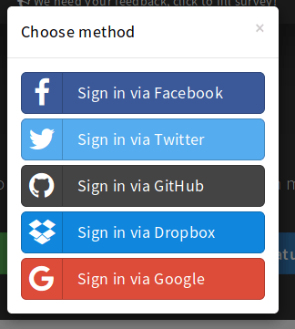

### E.2.7 Capturas de pantallas 

**Figura E.2.7.1:** Página de inicio

**Figura E.2.7.2:** Inicio de sesión con servicios externos

**Figura E.2.7.3:** Registro e inicio de sesión de usuarios 

**Figura E.2.7.4:** Portada con sesión iniciada

**Figura E.2.7.5:** Ejemplo de nota (modo Vista)

**Figura E.2.7.6:** Ejemplo de nota (modo Ambos)

**Figura E.2.7.6:** Ejemplo de nota (modo Edición)

**Figura E.2.7.7:** Menú de nota (Extra, Exportación, Importación y Descargas)

**Figura E.2.7.8: **Historial de revisiones 

**Figura E.2.7.9: **Usuarios conectados a una nota

**Figura E.2.7.10: **Modo de visionado de presentaciones

**Figura E.2.7.11: **Modo de visionado de libro

