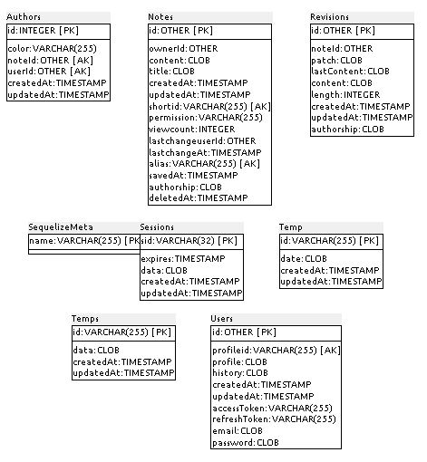

### E.2.5 Modelo de datos

#### E.2.5.1 Modelos relevantes

Los modelos relevantes son Notes, Users y Revisions. 

#### E.2.5.2 Tablas

Cuenta con 8 tablas:

* Authors 	 

* Notes   	 

* Revisions    

* SequelizeMeta

* Sessions	 

* Temp    	 

* Temps   	 

* Users   

#### E.2.5.3 Gráficos UML

 

**Figura E.2.5.1:** Tablas de la base de datos de hackmd

