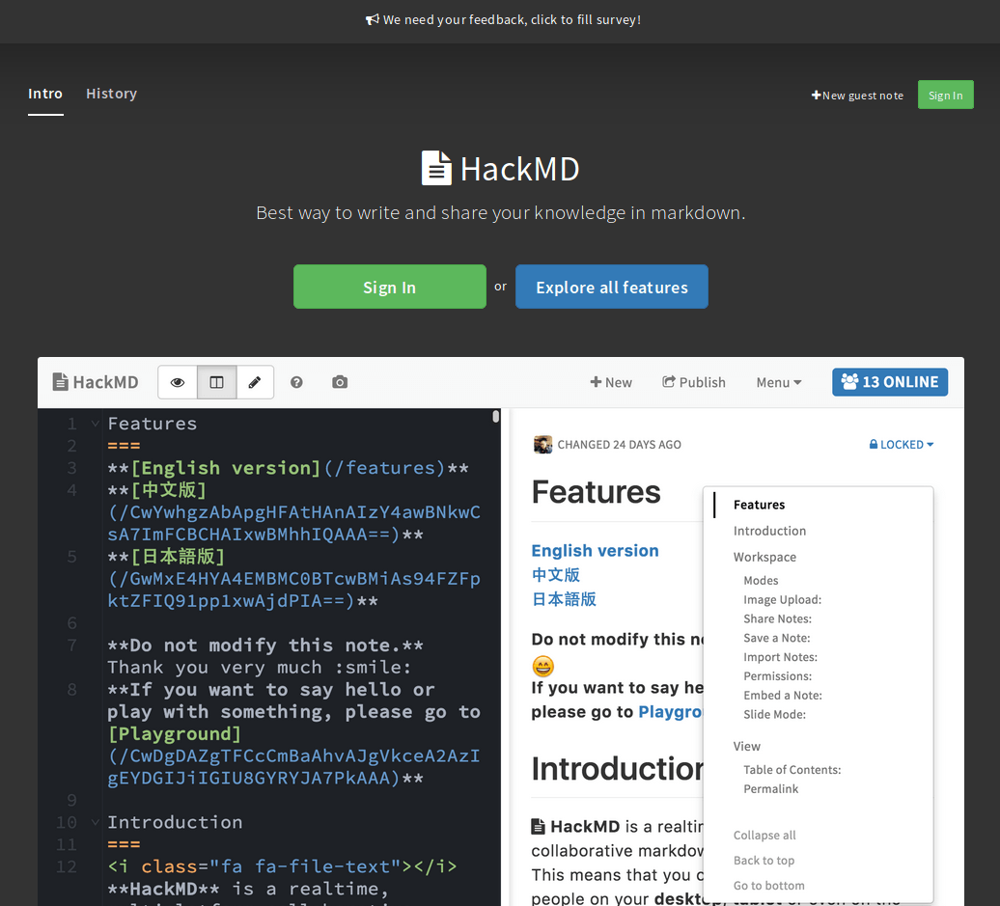

## E.2 HackMD

**Figura E.2.0:** Portada de [https://hackmd.io/](https://hackmd.io/) 

*HackMD permite crear notas de marcado de colaboración en tiempo real en todas las plataformas. Inspirado por Hackpad, con más foco en velocidad y flexibilidad. Todavía en la primera etapa, siéntase libre de forkear o contribuir a HackMD.*[^1]

[^1]: https://github.com/hackmdio/hackmd 
Texto original: HackMD lets you create realtime collaborative markdown notes on all platforms. Inspired by Hackpad, with more focus on speed and flexibility. Still in the early stage, feel free to fork or contribute to HackMD.

