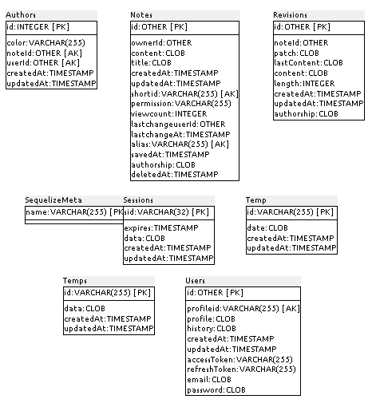
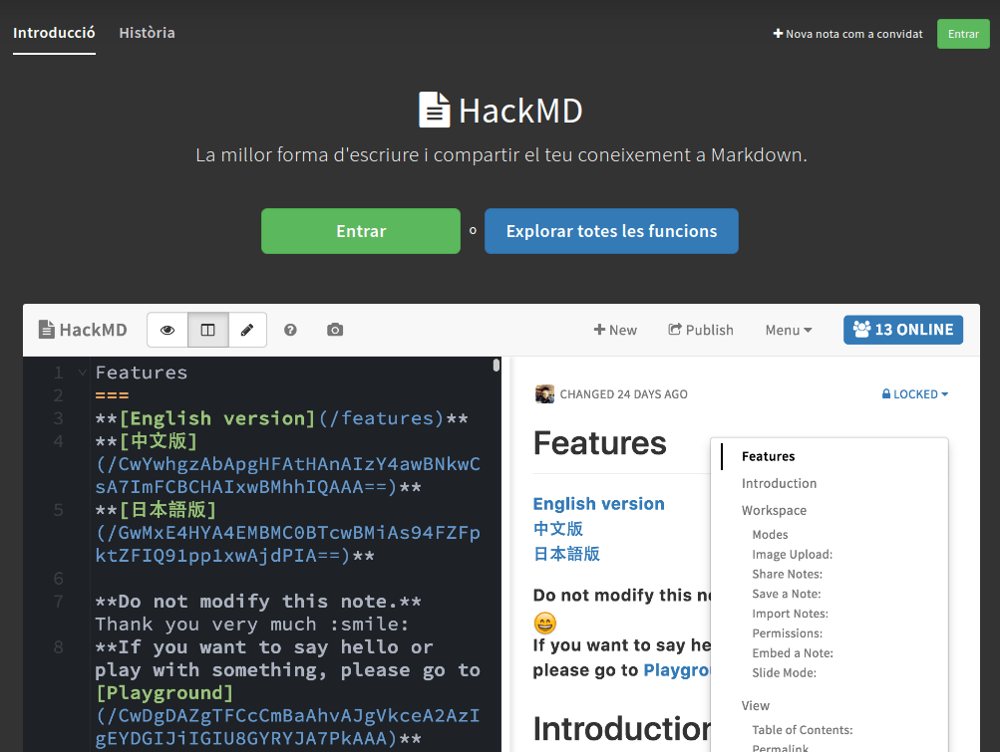
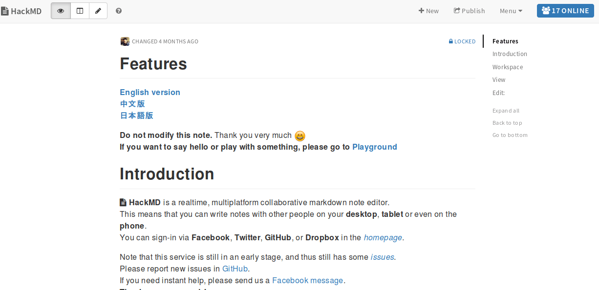
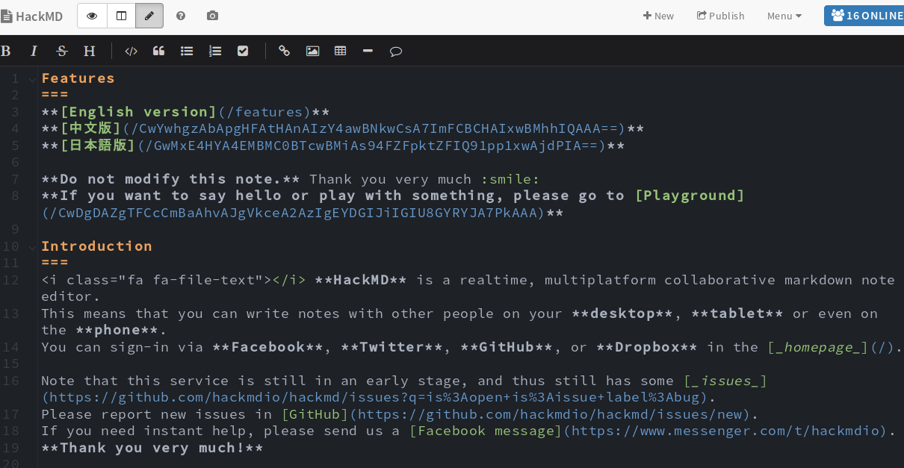
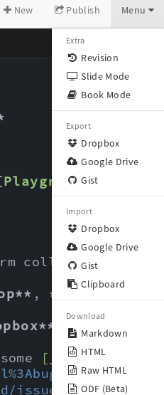
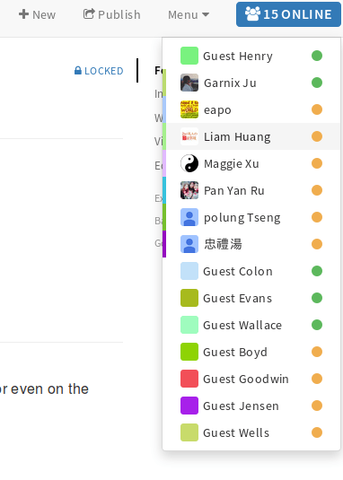
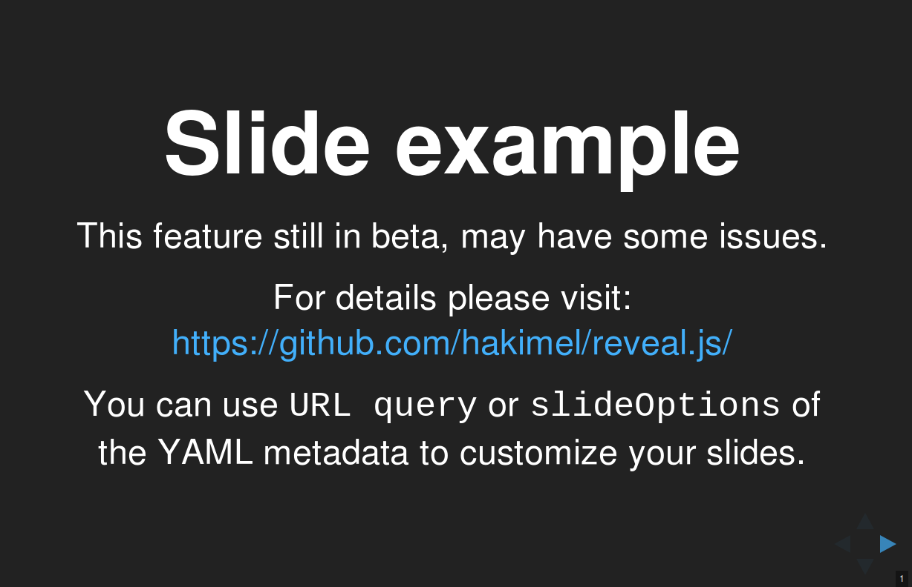

## Anexo E.2 HackMD

### 

**Figura E.2.0:** Portada de [https://hackmd.io/](https://hackmd.io/) 

*HackMD permite crear notas de marcado de colaboración en tiempo real en todas las plataformas. Inspirado por Hackpad, con más foco en velocidad y flexibilidad. Todavía en la primera etapa, siéntase libre de forkear o contribuir a HackMD.* (NOTE:  https://github.com/hackmdio/hackmd 
Texto original: HackMD lets you create realtime collaborative markdown notes on all platforms. Inspired by Hackpad, with more focus on speed and flexibility. Still in the early stage, feel free to fork or contribute to HackMD. )

### E.2.1 Metadatos

<table>
  <tr>
    <td>Nombre</td>
    <td>HackMD</td>
  </tr>
  <tr>
    <td>URL</td>
    <td>https://hackmd.io/ </td>
  </tr>
  <tr>
    <td>URL repositorio</td>
    <td>https://github.com/hackmdio/hackmd </td>
  </tr>
  <tr>
    <td>Resumen (Inglés)</td>
    <td>Best way to write and share your knowledge in markdown</td>
  </tr>
  <tr>
    <td>Resumen (Castellano)</td>
    <td>La mejor forma para escribir y compartir tu conocimiento en markdown</td>
  </tr>
  <tr>
    <td>Lenguaje</td>
    <td>Javascript</td>
  </tr>
  <tr>
    <td>Framework</td>
    <td>Node.js</td>
  </tr>
  <tr>
    <td>Fecha primer commit</td>
    <td>Mayo de 2015</td>
  </tr>
  <tr>
    <td>Versión analizada</td>
    <td>0.5.1</td>
  </tr>
  <tr>
    <td>Nº de versiones</td>
    <td>11</td>
  </tr>
  <tr>
    <td>Nº de tablas en la BBDD</td>
    <td>8</td>
  </tr>
  <tr>
    <td>Nº de contribuidores</td>
    <td>54</td>
  </tr>
  <tr>
    <td>Nº de stars</td>
    <td>2814</td>
  </tr>
  <tr>
    <td>Licencia</td>
    <td> MIT</td>
  </tr>
  <tr>
    <td>Mantenido</td>
    <td>Sí</td>
  </tr>
  <tr>
    <td>Diseño responsivo</td>
    <td>Sí</td>
  </tr>
</table>

 

### E.2.2 Funcionalidades 

* Es una aplicación web de escritura colaborativa en tiempo real. 

* Cuenta con un completo sistema de permisos de acceso, configurables porpro el autor inicial de la nota:

    * **Libre**: Cualquier persona puede editar la nota.

    * **Editable**: un usuario que haya iniciado sesión puede editar la nota.

    * **Limitado**: las personas deben iniciar sesión para ver y editar la nota.

    * **Bloqueado**: Cualquiera puede ver la nota, pero sólo el propietario puede editarla.

    * **Protegido**: las personas deben iniciar sesión para ver la nota pero sólo el propietario puede editarla.

    * **Privado**: Sólo el propietario puede ver y editar esta nota.

* Permite inicio de sesión a través de Facebook, Twitter, GitHub, o Dropbox.

* Permite ver el texto en 3 modos:

    * Edición: Ver solo el editor.

    * Vista: Ver solo el resultado.

    * Ambos: Ver ambos en modo división.

* Soporta Emojis

* Permite subir imágenes de distintas formas: a través del formulario, arrastrando y soltando o pegando una imagen. Por defecto las guarda en el servicio externo privativo imgur (NOTE:  https://imgur.com/).

* Se pueden exportar las notas a través de Dropbox o descargando un fichero markdown en local.

* Se pueden importar notas a través de Dropbox o del portapapeles.

* Se pueden embeber notas en otras webs a través de iframes

* Permite convertir una nota en una presentación con una sintaxis especial.

* Permite configurar automáticamente una tabla de contenidos.

* El editor cuenta con autocompletado de ayuda de markdown de emojis, encabezados, imágenes, etc.

* Integra automáticamente contenido de sitios externos (YouTube, Vimeo, Gist, SlideShare y Speakerdeck), formatos (PDF) y sintaxis en diferentes lenguajes (MathJax, diagramas UML, diagramas de secuencia, gráficos de flujo, Graphviz, Mermaid, Abc) 

### E.2.3 Análisis

No cuenta con soporte básico de confirmación de correo electrónico de usuarios, por lo tanto no cuenta con funcionalidades estándares como por ejemplo la de "ha olvidado su contraseña".

* En su propia documentación mencionan que se encuentran en un estado inicialde desarrollo (NOTE:  Texto original: Note that this service is still in an early stage, and thus still has some issues.), por lo que se pueden encontrar errores de programación (bugs):

*Tenga en cuenta que este servicio todavía está en una etapa temprana, y por lo tanto todavía tiene algunos problemas.*

Cuenta con imágenes docker para su instalación (NOTE:   https://github.com/hackmdio/docker-hackmd ). 

Entre sus funcionalidades más destacadas se encuentran sus posibilidades de exportación e importación, desde múltiples servicios y formatos (Dropbox, Google Drive, Markdown, etc)  

### E.2.4 Arquitectura

A nivel de despliegue de la aplicación cuenta con la posibilidad de hacerlo a través de Docker (NOTE:   https://github.com/hackmdio/docker-hackmd). 

Tiene la posibilidad de trabajar de forma fuera de línea (*offline*), permitiendo también trabajar con un cliente de escritorio hecho con el framework *electron*. 

A nivel tecnológico es destacable el uso del estándar WebSocket para la comunicación de los cambios realizados en los documentos. 

**Figura E.2.4.1:** Arquitectura de servidores de hackmd

### E.2.5 Modelo de datos

#### E.2.5.1 Modelos relevantes

Los modelos relevantes son Notes, Users y Revisions. 

#### E.2.5.2 Tablas

Cuenta con 8 tablas:

* Authors 	 

* Notes   	 

* Revisions    

* SequelizeMeta

* Sessions	 

* Temp    	 

* Temps   	 

* Users   

#### E.2.5.3 Gráficos UML

# 

**Figura E.2.5.1:** Tablas de la base de datos de hackmd

### XX E.2.6 Conclusiones y recomendaciones

### E.2.7 Capturas de pantallas 

**Figura E.2.7.1:** Página de inicio

**Figura E.2.7.2:** Inicio de sesión con servicios externos

**Figura E.2.7.3:** Registro e inicio de sesión de usuarios 

**Figura E.2.7.4:** Portada con sesión iniciada

**Figura E.2.7.5:** Ejemplo de nota (modo Vista)

**Figura E.2.7.6:** Ejemplo de nota (modo Ambos)

**Figura E.2.7.6:** Ejemplo de nota (modo Edición)

**Figura E.2.7.7:** Menú de nota (Extra, Exportación, Importación y Descargas)

**Figura E.2.7.8: **Historial de revisiones 

**Figura E.2.7.9: **Usuarios conectados a una nota

**Figura E.2.7.10: **Modo de visionado de presentaciones

**Figura E.2.7.11: **Modo de visionado de libro

