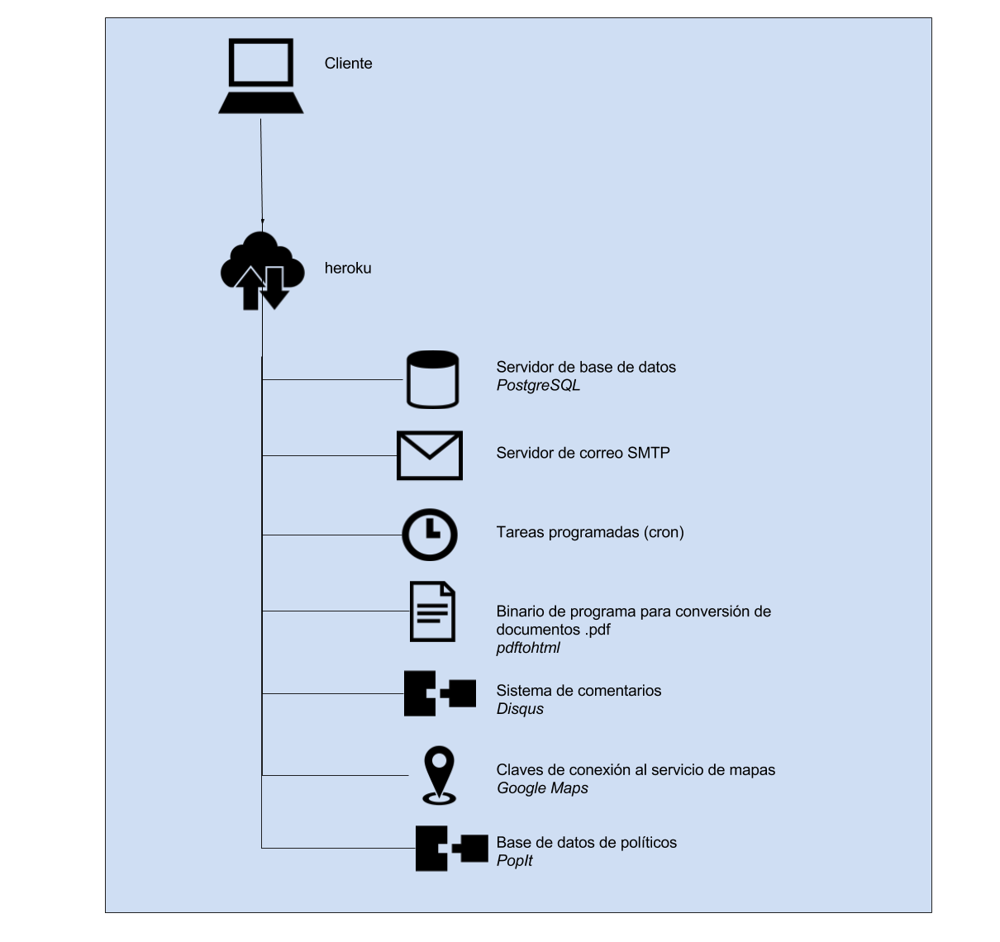

### F.1.4 Arquitectura

Está desarrollado con el framework Django del lenguaje de programación python. 

Permite tener distintas instancias y presentar un diseño, contenidos o código en función de la configuración que tenga en la variable COUNTRY_APP del fichero conf/general.yml (por ejemplo *ghana*, *kenya* o *nigeria*). Cada una de estas configuraciones son librerías (aplicaciones en la jerga de Django) que permite un grado de personalización profundo. Para cada uno de los ejemplos: 

*pombola# ls pombola/ghana/*

*context_processors.py  data  data.py  forms.py  __init__.py  management  models.py  static  templates  tests.py  urls.py  utils.py  views.py*

*pombola# ls pombola/kenya/*

*2013-election-data  forms.py 	__init__.pyc  management  shujaaz.pyc  tests.py  views_facebook_experiments.py   views_iebc_office_locator.pyc*

*budget-data     	forms.pyc	lib.py    	migrations  static   	urls.py   views_facebook_experiments.pyc  views.py*

*election_data_2017  __init__.py  lib.pyc   	shujaaz.py  templates	urls.pyc  views_iebc_office_locator.py	views.pyc*

*pombola# ls pombola/nigeria/*

*data  initial_import  __init__.py  lib.py  management  static  templates  tests.py  urls.py  views.py*

En su propia documentación comentan que esta forma de personalizar no es la óptima sino como se encuentra funcionando actualmente (NOTE:  https://github.com/mysociety/pombola/blob/master/docs/STYLING_NOTES.md 
Texto original: These notes cover how the styling currently works, but it is almost certainly not the best way and needs improving, which will hopefully be done as part of a larger refactor to make it easier to reuse the codebase across several countries.):

*Estas notas cubren cómo funciona actualmente el estilo, pero es casi seguro que no es el mejor camino y necesita mejoras, lo que se espera que se haga como parte de una refactorización más amplia para facilitar la reutilización de la base de código en varios países.*

A nivel de servidores se recomienda el uso del servicio de SaaS (*Software as a Service*) Heroku (NOTE:  https://github.com/mysociety/pombola/blob/master/docs/heroku.md ), aunque también cuenta con ejemplos de configuración en servidores web para tener una instalación propia.

**Figura F.1.4.1:** Arquitectura de servidores de Pombola

