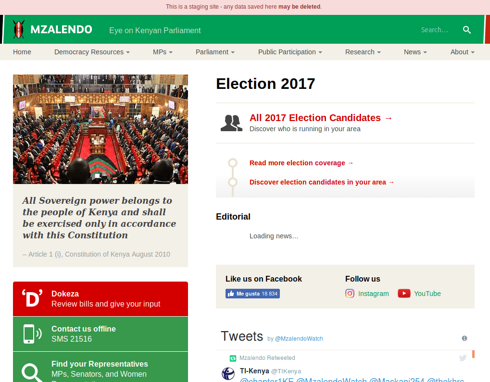
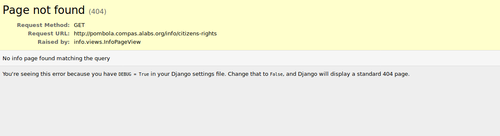
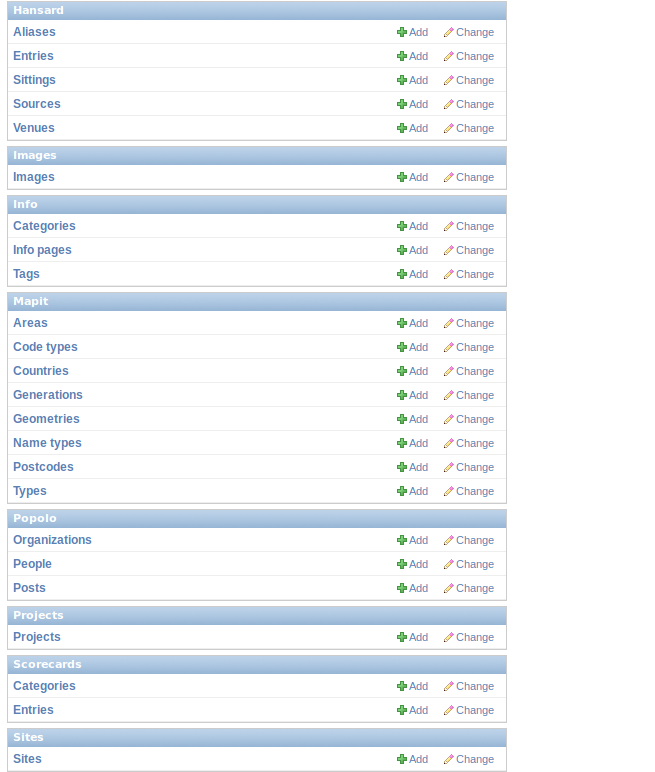
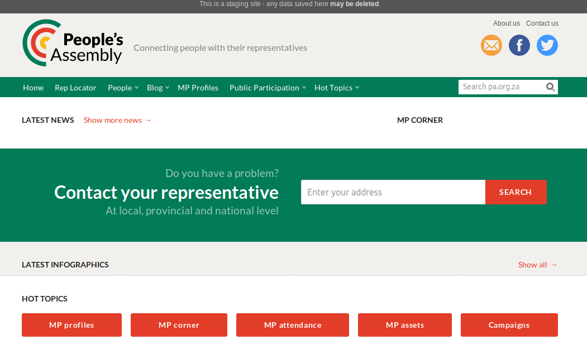
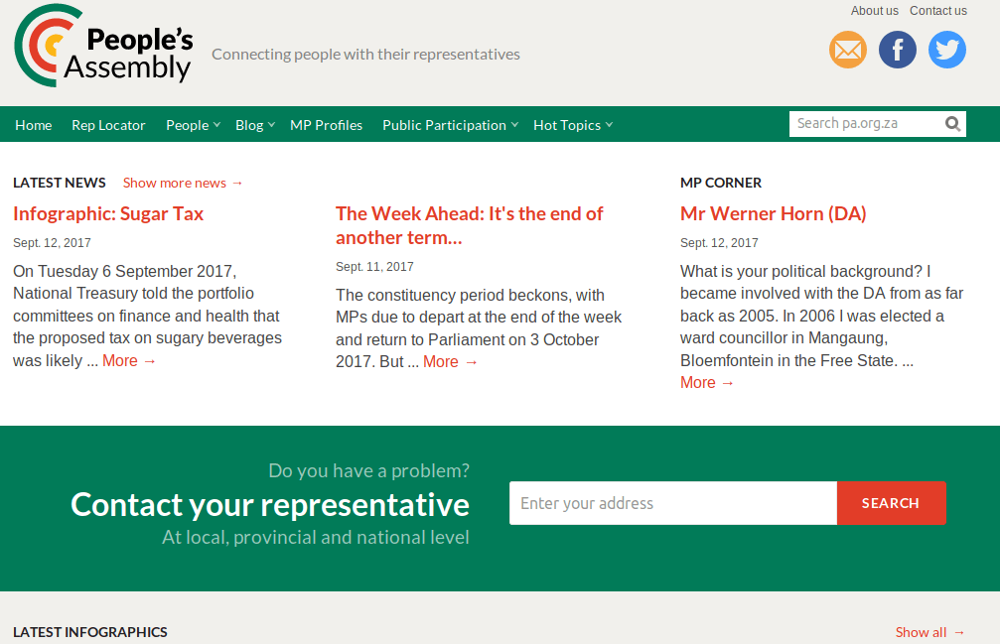
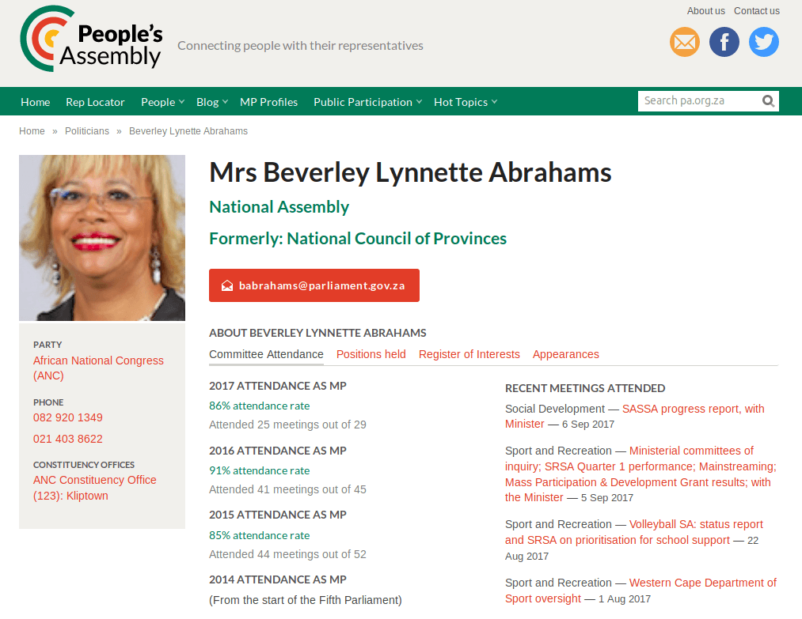
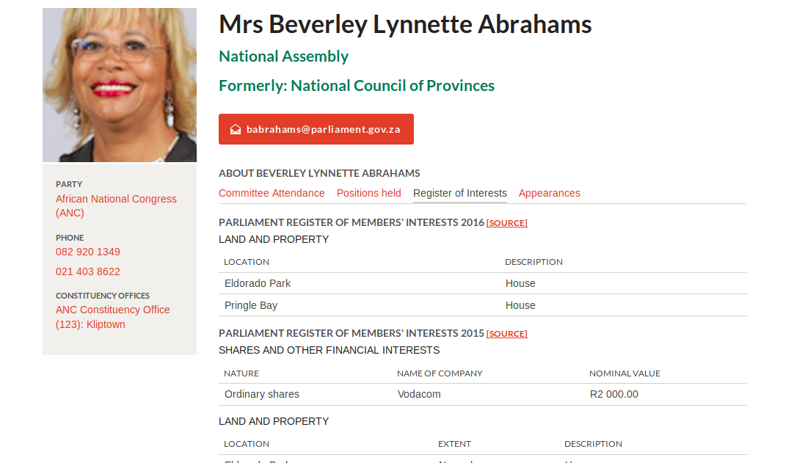
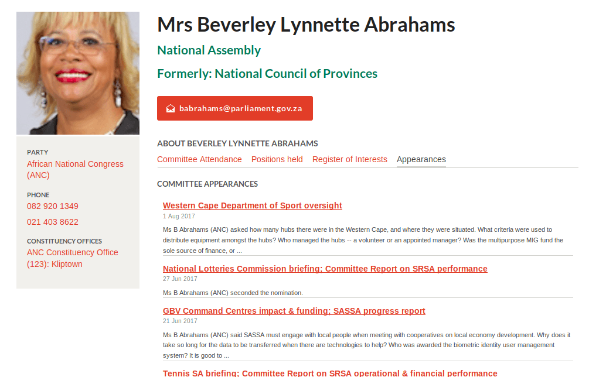
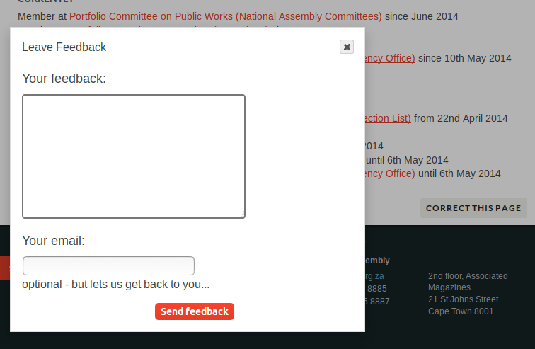

### F.1.7 Capturas de pantallas 

**Figura F.1.7.1: **Portada por defecto (Kenya) I

**Figura F.1.7.2: **Portada por defecto (Kenya) II

**Figura F.1.7.3: **Error 404 (no encontrado) al acceder a páginas estáticas

**Figura F.1.7.4: **Panel de administración I

**Figura F.1.7.5: **Panel de administración II

**Figura F.1.7.6: **Panel de administración III

**Figura F.1.7.7: **Formulario de edición de Personas en administración

**Figura F.1.7.8: **Listado de representantes 

**Figura F.1.7.9: **Buscador de representantes 

**Figura F.1.7.10: **Portada de People’ Assembly (Sudáfrica)

**Figura F.1.7.11:** Listado de representantes

**Figura F.1.7.12: **Perfil de representante (Comités)

**Figura F.1.7.13: **Perfil de representante (Posiciones)

**Figura F.1.7.14: **Perfil de representante (Intereses)

**Figura F.1.7.15: **Perfil de representante (Participaciones en Comités)

**Figura F.1.7.7.16:** Formulario de correcciones

