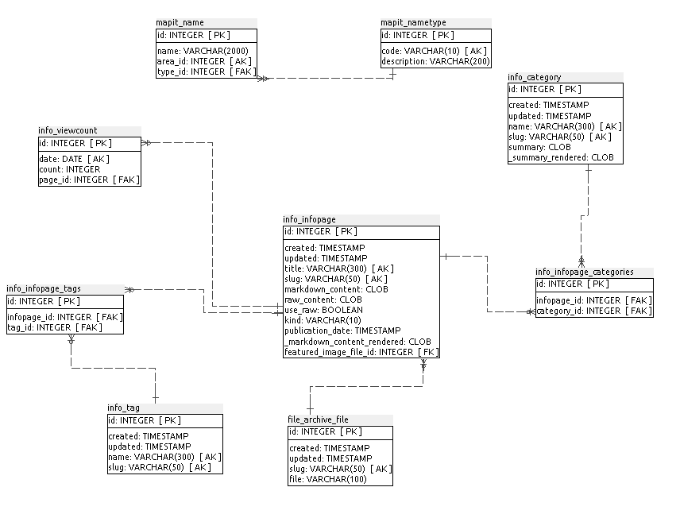
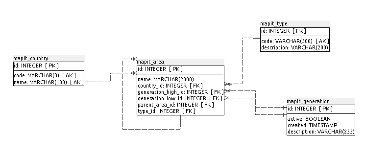
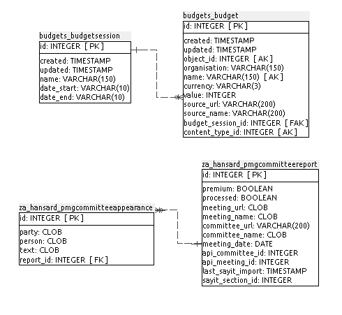
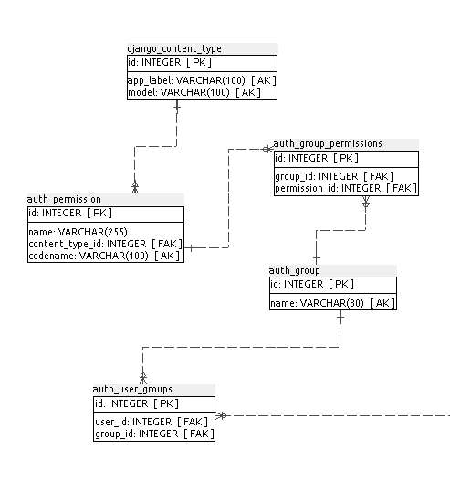
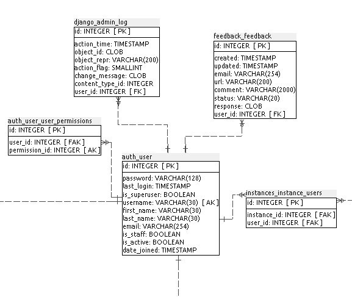
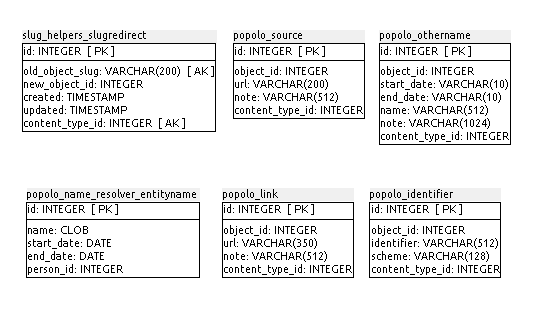
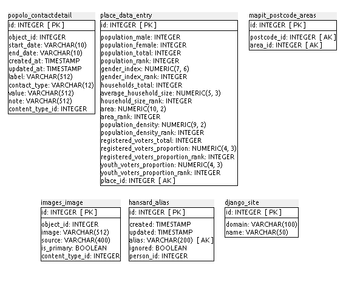
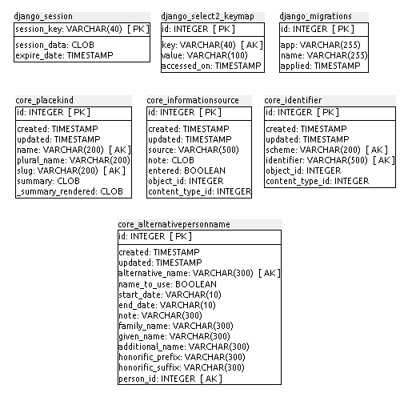
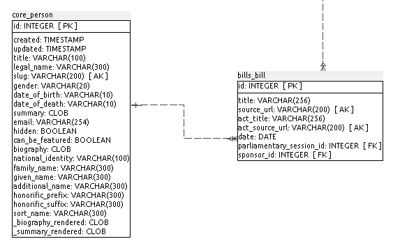

### F.1.5 Modelo de datos

#### F.1.5.1 Modelos relevantes

Los modelos más relevantes son Core_Person, Core_Position, Core_Organisation y Core_ParliamentarySession. 

#### F.1.5.2 Tablas

Cuenta con 107 tablas:

* auth_group                    	 

* auth_group_permissions         

* auth_permission               	 

* auth_user                     	 

* auth_user_groups              	 

* auth_user_user_permissions    

* bills_bill                    	 

* budgets_budget                	 

* budgets_budgetsession         	 

* core_alternativepersonname     

* core_contact                  	 

* core_contactkind              	 

* core_identifier               	 

* core_informationsource        	 

* core_organisation             	 

* core_organisationkind         	 

* core_organisationrelationship core_organisationrelationshipkind  

* core_parliamentarysession      

* core_person                   	 

* core_placekind                	 

* core_position                 	 

* core_positiontitle            	 

* django_admin_log              	 

* django_content_type           	 

* django_migrations             	 

* django_select2_keymap        

* django_session                	 

* django_site                   	 

* easy_thumbnails_source         

* easy_thumbnails_thumbnail      

* easy_thumbnails_thumbnaildimensions

* experiments_event             	 

* experiments_experiment         

* feedback_feedback             	 

* file_archive_file             	 

* hansard_alias                 	 

* hansard_entry                 	 

* hansard_sitting               	 

* hansard_source                	 

* hansard_venue                 	 

* images_image                  	 

* info_category                 	 

* info_infopage                 	 

* info_infopage_categories      	 

* info_infopage_tags            	 

* info_tag                      	 

* info_viewcount                	 

* instances_instance            	 

* instances_instance_users       

* interests_register_category   	 

* interests_register_entry      	 

* interests_register_entrylineitem   

* interests_register_release    	 

* mapit_area                    	 

* mapit_code                    	 

* mapit_codetype                	 

* mapit_country                 	 

* mapit_generation              	 

* mapit_name                    	 

* mapit_nametype                	 

* mapit_postcode_areas          	 

* mapit_type                    	 

* place_data_entry              	 

* pombola_sayit_pombolasayitjoin

* popolo_area                   	 

* popolo_areai18name            	 

* popolo_contactdetail          	 

* popolo_identifier             	 

* popolo_language               	 

* popolo_link                   	 

* popolo_membership             	 

* popolo_name_resolver_entityname    

* popolo_organization           	 

* popolo_othername              	 

* popolo_person                 	 

* popolo_post                   	 

* popolo_source                 	 

* scorecards_category           	 

* scorecards_entry              	 

* slug_helpers_slugredirect     	 

* speeches_recording            	 

* speeches_recordingtimestamp  

* speeches_section              	 

* speeches_slug                 	 

* speeches_speaker              	 

* speeches_speech               	 

* speeches_speech_tags         

* speeches_tag                  	 

* spinner_imagecontent          	 

* spinner_quotecontent          	 

* spinner_slide                 	 

* tasks_task                    	 

* tasks_taskcategory            	 

* thumbnail_kvstore             	 

* votematch_answer              	 

* votematch_party               	 

* votematch_quiz                	 

* votematch_stance              	 

* votematch_statement           	 

* votematch_submission   

* za_hansard_answer             	 

* za_hansard_pmgcommitteeappearance  

* za_hansard_pmgcommitteereport

* za_hansard_question           	 

* za_hansard_questionpaper      

* za_hansard_source             	 

#### F.1.5.3 Gráficos UML

**Figura F.1.5.1:** Tablas de la base de datos de pombola

**Figura F.1.5.2:** Tablas de la base de datos de pombola

**Figura F.1.5.3:** Tablas de la base de datos de pombola

**Figura F.1.5.4:** Tablas de la base de datos de pombola

**Figura F.1.5.5:** Tablas de la base de datos de pombola

**Figura F.1.5.6:** Tablas de la base de datos de pombola

**Figura F.1.5.7:** Tablas de la base de datos de pombola

**Figura F.1.5.8:** Tablas de la base de datos de pombola

**Figura F.1.5.9:** Tablas de la base de datos de pombola

**Figura F.1.5.10:** Tablas de la base de datos de pombola

**Figura F.1.5.11:** Tablas de la base de datos de pombola

**Figura F.1.5.12:** Tablas de la base de datos de pombola

**Figura F.1.5.13:** Tablas de la base de datos de pombola

**Figura F.1.5.14:** Tablas de la base de datos de pombola

**Figura F.1.5.15:** Tablas de la base de datos de pombola

**Figura F.1.5.16:** Tablas de la base de datos de pombola

