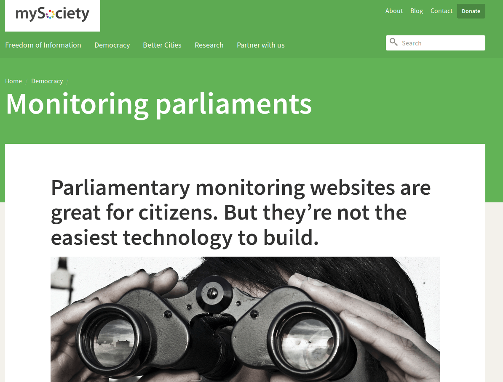

## F.1 Pombola 

**Figura F.1.0: **Portada de Pombola en [https://www.mysociety.org/](https://www.mysociety.org/) 

*Los buenos sitios de control parlamentario permiten a los ciudadanos vigilar a las personas en el poder. Facilitan la tarea de averiguar quién lo representa, qué se está debatiendo y cómo han votado los miembros. Pero el trabajo duro consiste en presentar ese tipo de información de manera simple y clara. Estos sitios requieren bases de datos complejas de los políticos, que pueden actualizarse fácilmente cuando se celebran las elecciones. Necesitan una forma de recopilar y publicar las actas escritas de los debates. Y para ser realmente eficaces, necesitan hacer coincidir a los usuarios con sus circunscripciones electorales, para que la gente pueda ver rápida y fácilmente quién los representa. *

