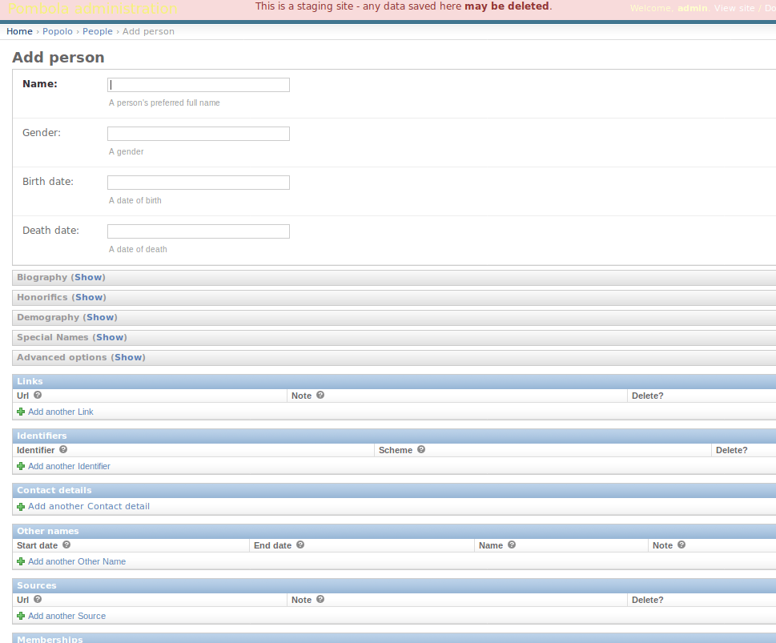

## Anexo F.1 Pombola 

**Figura F.1.0: **Portada de Pombola en [https://www.mysociety.org/](https://www.mysociety.org/) 

*Los buenos sitios de control parlamentario permiten a los ciudadanos vigilar a las personas en el poder. Facilitan la tarea de averiguar quién lo representa, qué se está debatiendo y cómo han votado los miembros. Pero el trabajo duro consiste en presentar ese tipo de información de manera simple y clara. Estos sitios requieren bases de datos complejas de los políticos, que pueden actualizarse fácilmente cuando se celebran las elecciones. Necesitan una forma de recopilar y publicar las actas escritas de los debates. Y para ser realmente eficaces, necesitan hacer coincidir a los usuarios con sus circunscripciones electorales, para que la gente pueda ver rápida y fácilmente quién los representa. *

### F.1.1 Metadatos

<table>
  <tr>
    <td>Nombre</td>
    <td>Pombola</td>
  </tr>
  <tr>
    <td>URL</td>
    <td>https://www.mysociety.org/democracy/pombola/</td>
  </tr>
  <tr>
    <td>URL repositorio</td>
    <td>https://github.com/mysociety/pombola </td>
  </tr>
  <tr>
    <td>Resumen (Inglés)</td>
    <td>Pombola is a parliamentary monitoring (PMO) platform; its biggest instances are Mzalendo.com and pa.org.za</td>
  </tr>
  <tr>
    <td>Resumen (Castellano)</td>
    <td>Pombola es una plataforma de seguimiento parlamentario (PMO); sus mayores instancias son Mzalendo.com y pa.org.za</td>
  </tr>
  <tr>
    <td>Lenguaje</td>
    <td>Ruby </td>
  </tr>
  <tr>
    <td>Framework</td>
    <td>Ruby on Rails</td>
  </tr>
  <tr>
    <td>Fecha primer commit</td>
    <td>Julio de 2011</td>
  </tr>
  <tr>
    <td>Versión analizada</td>
    <td>No aplica</td>
  </tr>
  <tr>
    <td>Nº de versiones</td>
    <td>No aplica</td>
  </tr>
  <tr>
    <td>Nº de tablas en la BBDD</td>
    <td>107</td>
  </tr>
  <tr>
    <td>Nº de contribuidores</td>
    <td>27</td>
  </tr>
  <tr>
    <td>Nº de stars</td>
    <td>55</td>
  </tr>
  <tr>
    <td>Licencia</td>
    <td> GNU Affero GPL v3</td>
  </tr>
  <tr>
    <td>Mantenido</td>
    <td>Sí</td>
  </tr>
  <tr>
    <td>Diseño responsivo</td>
    <td>Sí</td>
  </tr>
</table>

###  F.1.2 Funcionalidades 

* Permite hacer seguimiento a un Parlamentario concreto, viendo en qué comisiones se encuentra, a qué reuniones ha asistido, con qué bienes cuenta, etc.

* Permite realizar aportaciones de correcciones sobre estos datos.

* Cuenta con soporte de personalización de distintos sitios con su imagen. 

* Cuenta con integraciones de otros servicios de MySociety: MapIt, Popolo, SayIt, etc. 

* Permite tener la estructura de representantes de un parlamento o asamblea, ver las transcripciones de lo que se ha dicho, así como ver quién es el representante de una zona geográfica dada. 

### F.1.3 Análisis

Es un proyecto de MySociety, basado en el sitio web TheyWorkForYou (NOTE:  https://www.theyworkforyou.com/ ). Se trata de una reescritura con soporte para múltiples sitios, y actualmente se encuentra funcionando en diversos países, siempre gestionado por la sociedad civil: 

<table>
  <tr>
    <td>País</td>
    <td>Nombre</td>
    <td>URL</td>
  </tr>
  <tr>
    <td>Ghana</td>
    <td>Odekro</td>
    <td>http://www.odekro.org/ </td>
  </tr>
  <tr>
    <td>Kenya</td>
    <td>Mzalendo</td>
    <td>http://info.mzalendo.com/ </td>
  </tr>
  <tr>
    <td>Nigeria</td>
    <td>Shine Your Eye</td>
    <td>http://www.shineyoureye.org/ </td>
  </tr>
  <tr>
    <td>Sudáfrica</td>
    <td>People's Assembly</td>
    <td>https://www.pa.org.za/ </td>
  </tr>
  <tr>
    <td>Zimbabwe</td>
    <td>Kuvakazim</td>
    <td>http://www.kuvakazim.com/ </td>
  </tr>
</table>

### F.1.4 Arquitectura

Está desarrollado con el framework Django del lenguaje de programación python. 

Permite tener distintas instancias y presentar un diseño, contenidos o código en función de la configuración que tenga en la variable COUNTRY_APP del fichero conf/general.yml (por ejemplo *ghana*, *kenya* o *nigeria*). Cada una de estas configuraciones son librerías (aplicaciones en la jerga de Django) que permite un grado de personalización profundo. Para cada uno de los ejemplos: 

*pombola# ls pombola/ghana/*

*context_processors.py  data  data.py  forms.py  __init__.py  management  models.py  static  templates  tests.py  urls.py  utils.py  views.py*

*pombola# ls pombola/kenya/*

*2013-election-data  forms.py 	__init__.pyc  management  shujaaz.pyc  tests.py  views_facebook_experiments.py   views_iebc_office_locator.pyc*

*budget-data     	forms.pyc	lib.py    	migrations  static   	urls.py   views_facebook_experiments.pyc  views.py*

*election_data_2017  __init__.py  lib.pyc   	shujaaz.py  templates	urls.pyc  views_iebc_office_locator.py	views.pyc*

*pombola# ls pombola/nigeria/*

*data  initial_import  __init__.py  lib.py  management  static  templates  tests.py  urls.py  views.py*

En su propia documentación comentan que esta forma de personalizar no es la óptima sino como se encuentra funcionando actualmente (NOTE:  https://github.com/mysociety/pombola/blob/master/docs/STYLING_NOTES.md 
Texto original: These notes cover how the styling currently works, but it is almost certainly not the best way and needs improving, which will hopefully be done as part of a larger refactor to make it easier to reuse the codebase across several countries.):

*Estas notas cubren cómo funciona actualmente el estilo, pero es casi seguro que no es el mejor camino y necesita mejoras, lo que se espera que se haga como parte de una refactorización más amplia para facilitar la reutilización de la base de código en varios países.*

A nivel de servidores se recomienda el uso del servicio de SaaS (*Software as a Service*) Heroku (NOTE:  https://github.com/mysociety/pombola/blob/master/docs/heroku.md ), aunque también cuenta con ejemplos de configuración en servidores web para tener una instalación propia.

**Figura F.1.4.1:** Arquitectura de servidores de Pombola

### F.1.5 Modelo de datos

#### F.1.5.1 Modelos relevantes

Los modelos más relevantes son Core_Person, Core_Position, Core_Organisation y Core_ParliamentarySession. 

#### F.1.5.2 Tablas

Cuenta con 107 tablas:

* auth_group                    	 

* auth_group_permissions         

* auth_permission               	 

* auth_user                     	 

* auth_user_groups              	 

* auth_user_user_permissions    

* bills_bill                    	 

* budgets_budget                	 

* budgets_budgetsession         	 

* core_alternativepersonname     

* core_contact                  	 

* core_contactkind              	 

* core_identifier               	 

* core_informationsource        	 

* core_organisation             	 

* core_organisationkind         	 

* core_organisationrelationship core_organisationrelationshipkind  

* core_parliamentarysession      

* core_person                   	 

* core_placekind                	 

* core_position                 	 

* core_positiontitle            	 

* django_admin_log              	 

* django_content_type           	 

* django_migrations             	 

* django_select2_keymap        

* django_session                	 

* django_site                   	 

* easy_thumbnails_source         

* easy_thumbnails_thumbnail      

* easy_thumbnails_thumbnaildimensions

* experiments_event             	 

* experiments_experiment         

* feedback_feedback             	 

* file_archive_file             	 

* hansard_alias                 	 

* hansard_entry                 	 

* hansard_sitting               	 

* hansard_source                	 

* hansard_venue                 	 

* images_image                  	 

* info_category                 	 

* info_infopage                 	 

* info_infopage_categories      	 

* info_infopage_tags            	 

* info_tag                      	 

* info_viewcount                	 

* instances_instance            	 

* instances_instance_users       

* interests_register_category   	 

* interests_register_entry      	 

* interests_register_entrylineitem   

* interests_register_release    	 

* mapit_area                    	 

* mapit_code                    	 

* mapit_codetype                	 

* mapit_country                 	 

* mapit_generation              	 

* mapit_name                    	 

* mapit_nametype                	 

* mapit_postcode_areas          	 

* mapit_type                    	 

* place_data_entry              	 

* pombola_sayit_pombolasayitjoin

* popolo_area                   	 

* popolo_areai18name            	 

* popolo_contactdetail          	 

* popolo_identifier             	 

* popolo_language               	 

* popolo_link                   	 

* popolo_membership             	 

* popolo_name_resolver_entityname    

* popolo_organization           	 

* popolo_othername              	 

* popolo_person                 	 

* popolo_post                   	 

* popolo_source                 	 

* scorecards_category           	 

* scorecards_entry              	 

* slug_helpers_slugredirect     	 

* speeches_recording            	 

* speeches_recordingtimestamp  

* speeches_section              	 

* speeches_slug                 	 

* speeches_speaker              	 

* speeches_speech               	 

* speeches_speech_tags         

* speeches_tag                  	 

* spinner_imagecontent          	 

* spinner_quotecontent          	 

* spinner_slide                 	 

* tasks_task                    	 

* tasks_taskcategory            	 

* thumbnail_kvstore             	 

* votematch_answer              	 

* votematch_party               	 

* votematch_quiz                	 

* votematch_stance              	 

* votematch_statement           	 

* votematch_submission   

* za_hansard_answer             	 

* za_hansard_pmgcommitteeappearance  

* za_hansard_pmgcommitteereport

* za_hansard_question           	 

* za_hansard_questionpaper      

* za_hansard_source             	 

#### F.1.5.3 Gráficos UML

**Figura F.1.5.1:** Tablas de la base de datos de pombola

**Figura F.1.5.2:** Tablas de la base de datos de pombola

**Figura F.1.5.3:** Tablas de la base de datos de pombola

**Figura F.1.5.4:** Tablas de la base de datos de pombola

**Figura F.1.5.5:** Tablas de la base de datos de pombola

**Figura F.1.5.6:** Tablas de la base de datos de pombola

**Figura F.1.5.7:** Tablas de la base de datos de pombola

**Figura F.1.5.8:** Tablas de la base de datos de pombola

**Figura F.1.5.9:** Tablas de la base de datos de pombola

**Figura F.1.5.10:** Tablas de la base de datos de pombola

**Figura F.1.5.11:** Tablas de la base de datos de pombola

**Figura F.1.5.12:** Tablas de la base de datos de pombola

**Figura F.1.5.13:** Tablas de la base de datos de pombola

**Figura F.1.5.14:** Tablas de la base de datos de pombola

**Figura F.1.5.15:** Tablas de la base de datos de pombola

**Figura F.1.5.16:** Tablas de la base de datos de pombola

### XX F.1.6 Conclusiones

### F.1.7 Capturas de pantallas 

**Figura F.1.7.1: **Portada por defecto (Kenya) I

**Figura F.1.7.2: **Portada por defecto (Kenya) II

**Figura F.1.7.3: **Error 404 (no encontrado) al acceder a páginas estáticas

**Figura F.1.7.4: **Panel de administración I

**Figura F.1.7.5: **Panel de administración II

**Figura F.1.7.6: **Panel de administración III

**Figura F.1.7.7: **Formulario de edición de Personas en administración

**Figura F.1.7.8: **Listado de representantes 

**Figura F.1.7.9: **Buscador de representantes 

**Figura F.1.7.10: **Portada de People’ Assembly (Sudáfrica)

**Figura F.1.7.11:** Listado de representantes

**Figura F.1.7.12: **Perfil de representante (Comités)

**Figura F.1.7.13: **Perfil de representante (Posiciones)

**Figura F.1.7.14: **Perfil de representante (Intereses)

**Figura F.1.7.15: **Perfil de representante (Participaciones en Comités)

**Figura F.1.7.7.16:** Formulario de correcciones

###  

