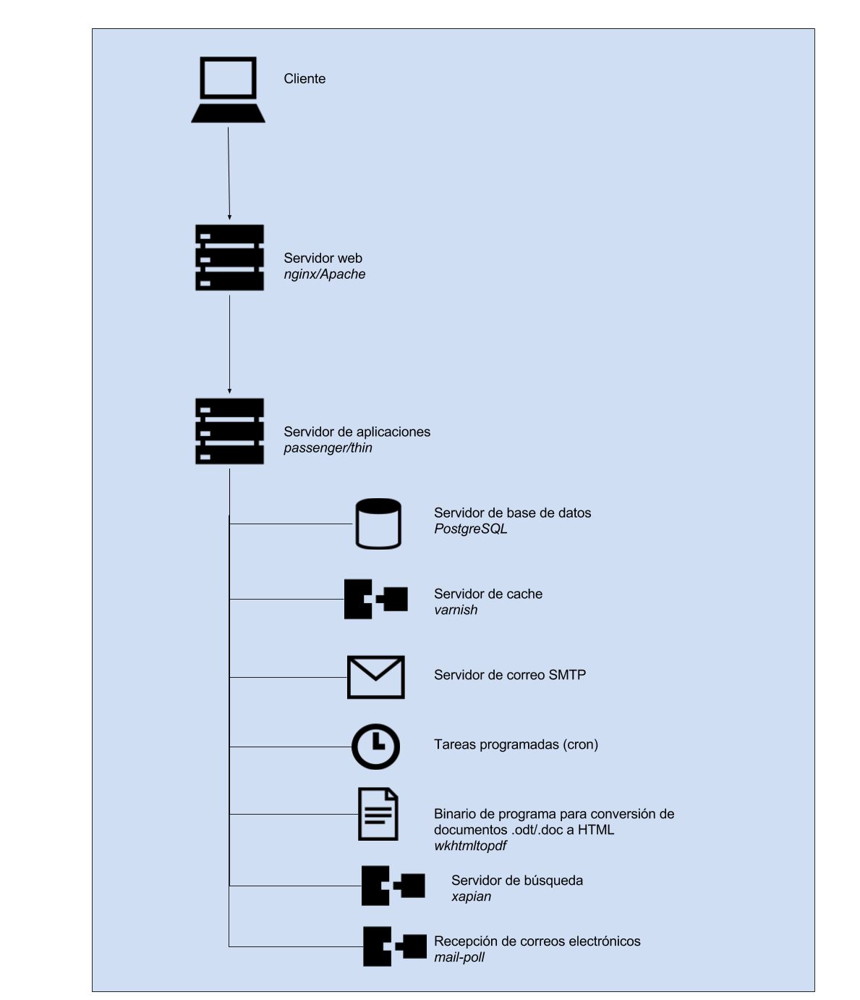

### F.2.4 Arquitectura

Como la mayoría de las aplicaciones de mySociety, cuenta con una extensa documentación[^1], tanto de aspectos técnicos (cómo instalarlo, desarrollarlo o administrarlo) como políticos (cómo preparar el equipo motor inicial, promocionar el sitio o conseguir voluntarios para el mantenimiento de la plataforma).  

Soporta varios métodos de instalación documentados[^2]:

* Utilizando el servicio de cloud computing Amazon EC2 

* Utilizando un script de instalación

* Instalación manual 

Cuenta con soporte de personalización, tanto a nivel de imagen gráfica mediante el uso de temas, como de localización[^3]. 

**Figura F.2.4.1:** Arquitectura de servidores de Alaveteli

[^1]: http://alaveteli.org/docs/
[^2]: http://alaveteli.org/docs/installing/
[^3]: http://alaveteli.org/docs/customising/
