### F.2.7 Capturas de pantallas

  

**Figura F.2.7.1:** Portada I (Llamada a la acción / Call to action)

**Figura F.2.7.2:** Portada II (explicación del funcionamiento) 

**Figura F.2.7.3:** Portada III (actividad reciente)

**Figura F.2.7.4:** Creación de cuenta de usuario e inicio de sesión

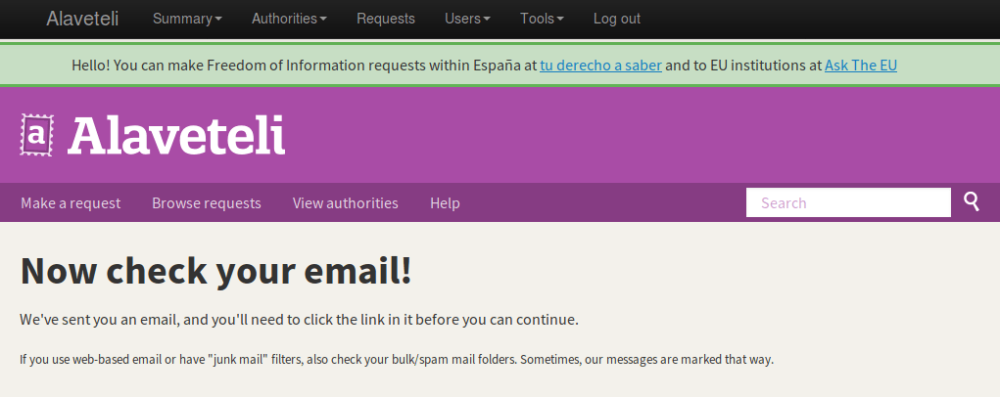

**Figura F.2.7.5:** Aviso de confirmación de correo electrónico

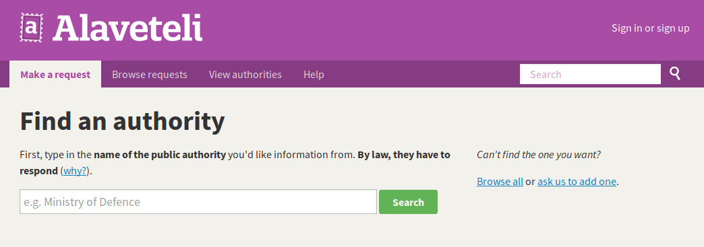

**Figura F.2.7.6:** Buscador de autoridades I

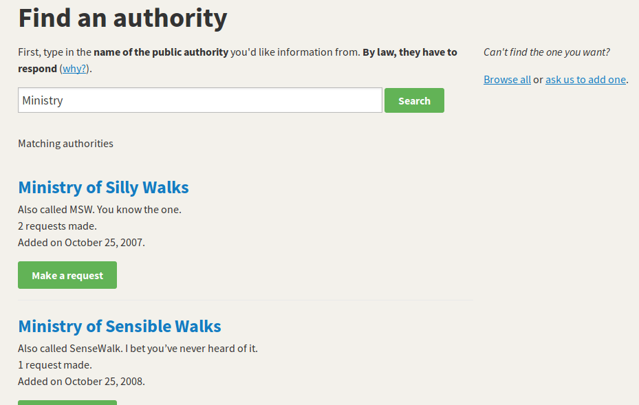

**Figura F.2.7.7:** Buscador de autoridades II 

**Figura F.2.7.8:** Dar de alta una petición 

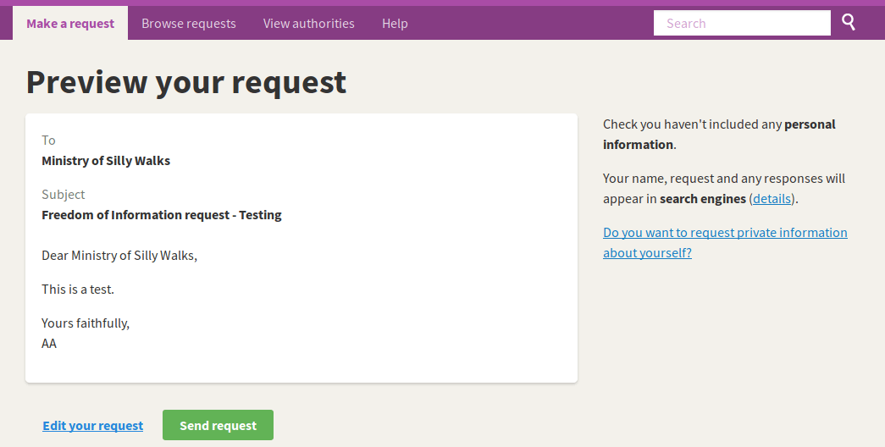

**Figura F.2.7.9:** Previsualización de petición 

**Figura F.2.7.10:** Mensaje posterior a publicación de petición

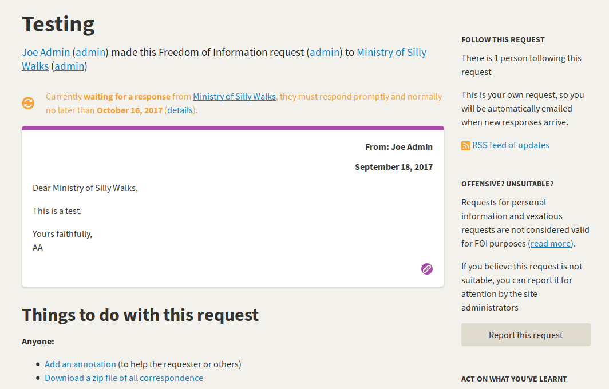

**Figura F.2.7.11:** Petición pubolicada I

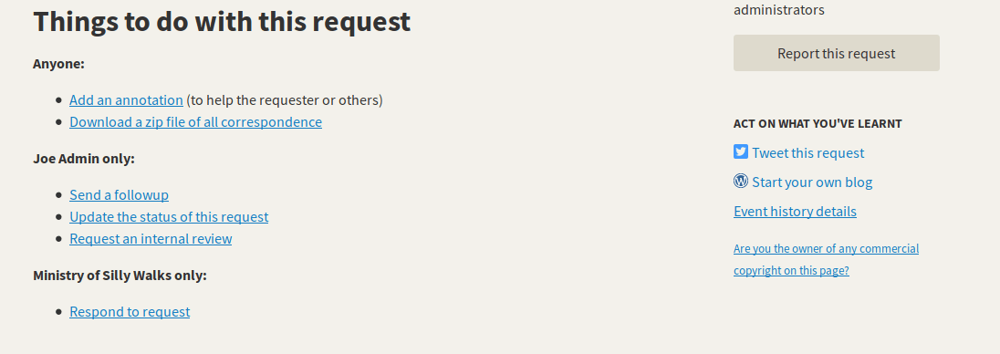

**Figura F.2.7.12:** Petición publicada II

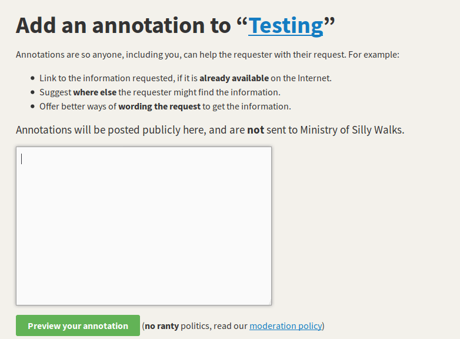

**Figura F.2.7.13:** Agregar anotación a petición

**Figura F.2.7.14:** Previsualización de anotación 

**Figura F.2.7.15:** Anotación agregada a petición

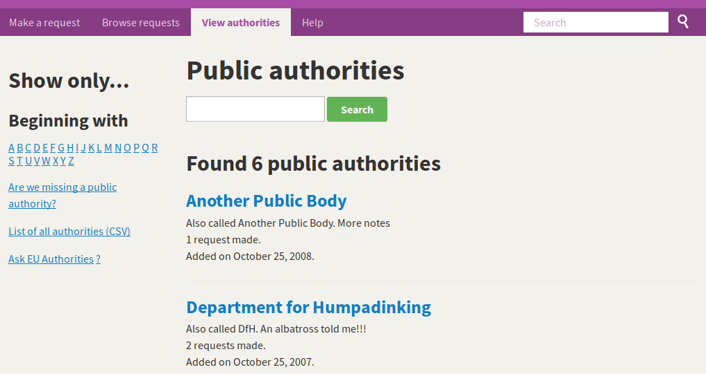

**Figura F.2.7.16:** Navegación de autoridades 

**Figura F.2.7.17:** Páginas estáticas 

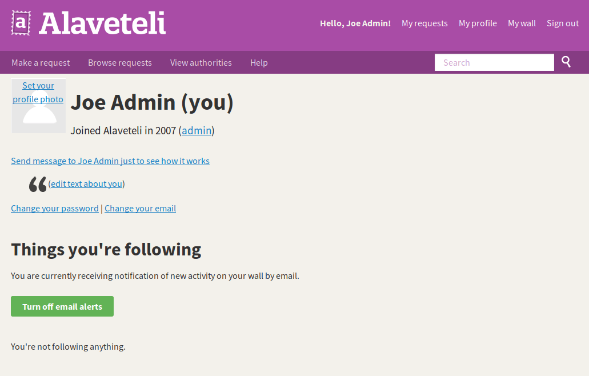

**Figura F.2.7.18:** Perfil de usuario 

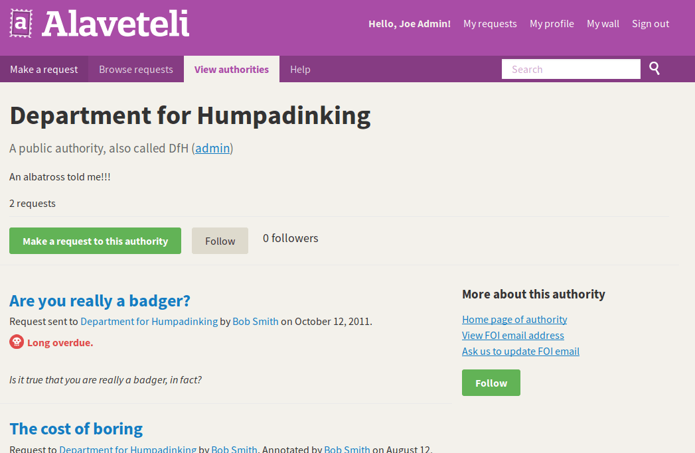

**Figura F.2.7.19:** Página de autoridad 

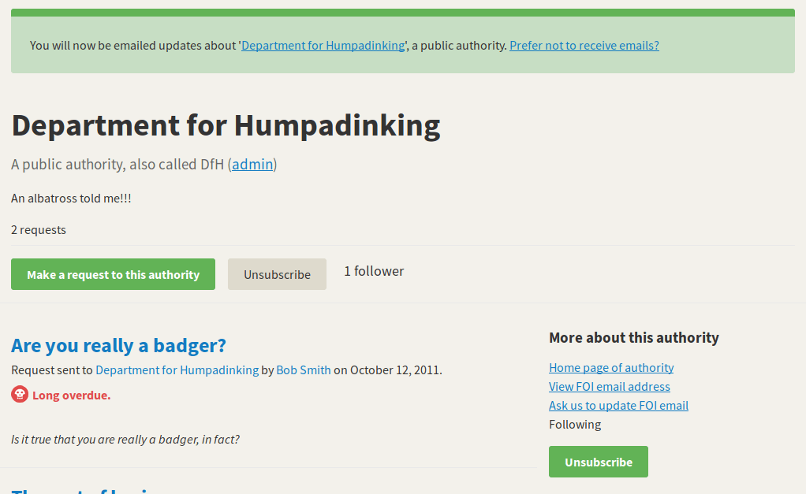

**Figura F.2.7.20:** Mensaje en autoridad de suscripción de actividad

**Figura F.2.7.21:** Administrador: resumen y gráficos de actividad I

**Figura F.2.7.22:** Administrador: resumen y gráficos de actividad II

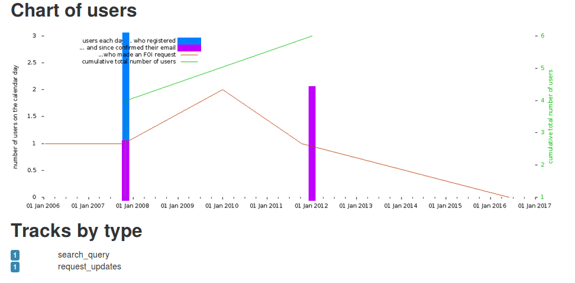

**Figura F.2.7.23:** Administrador: resumen y gráficos de actividad III

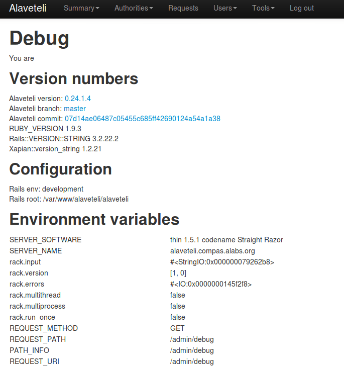

**Figura F.2.7.24:** Administrador: información de depuración (debugging)

**Figura F.2.7.25:** Administrador: listado de autoridades

**Figura F.2.7.26:** Administrador: gestión de categorias 

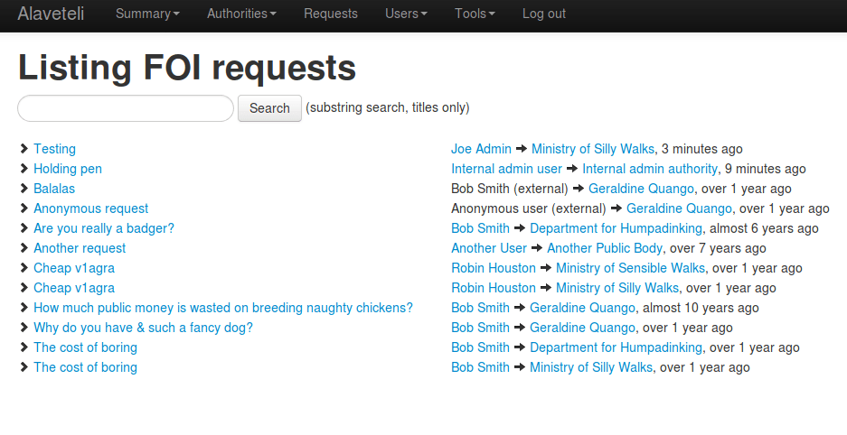

**Figura F.2.7.27:** Administrador: gestión de peticiones

**Figura F.2.7.28:** Administrador: gestión de usuarios

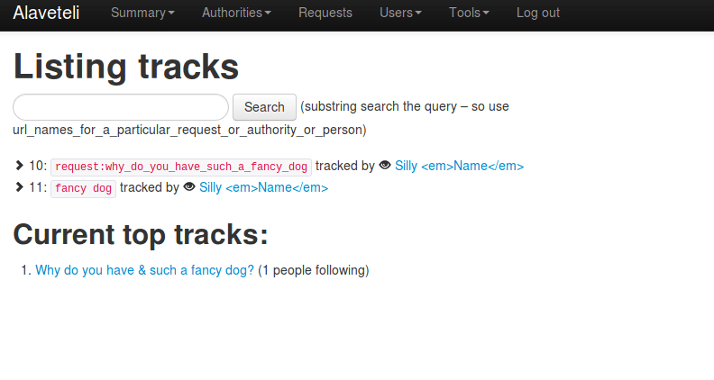

**Figura F.2.7.29:** Administrador: gestión de seguimientos 

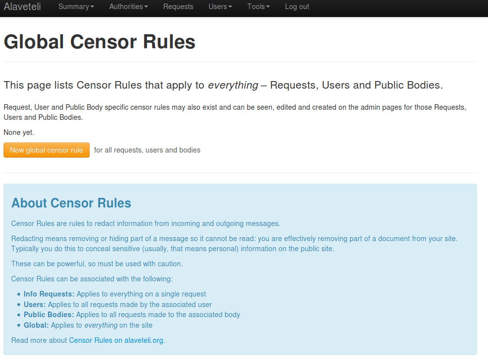

**Figura F.2.7.30:** Administrador: gestión de información sensible (reglas de censura)

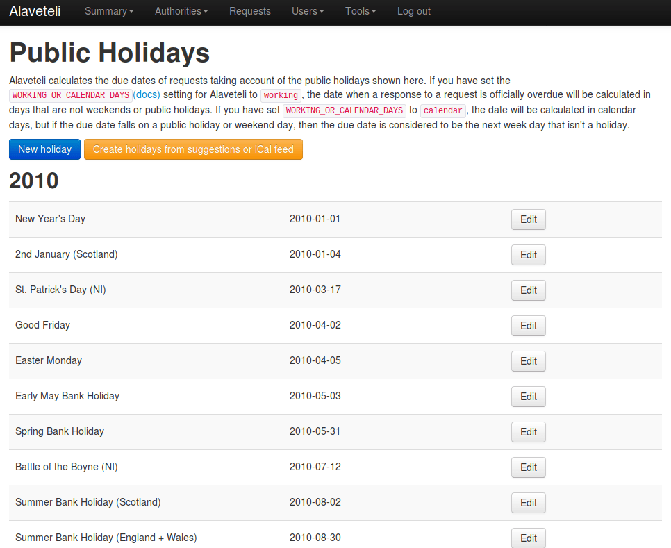

**Figura F.2.7.31:** Administrador: gestión de días festivos

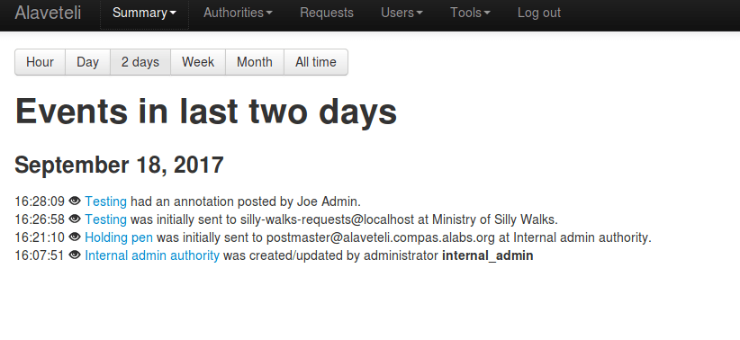

**Figura F.2.7.32:** Administrador: eventos con filtros temporales  	

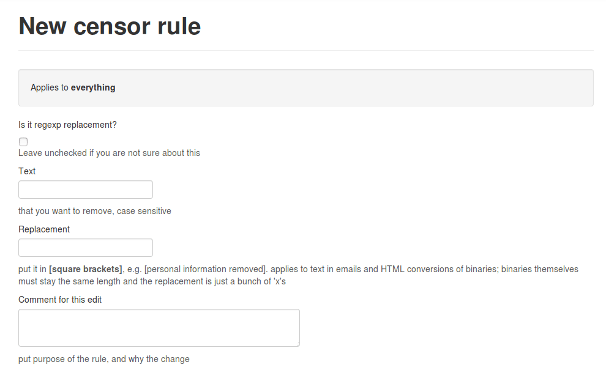

**Figura F.2.7.33:** Administrador: creación de regla de censura I

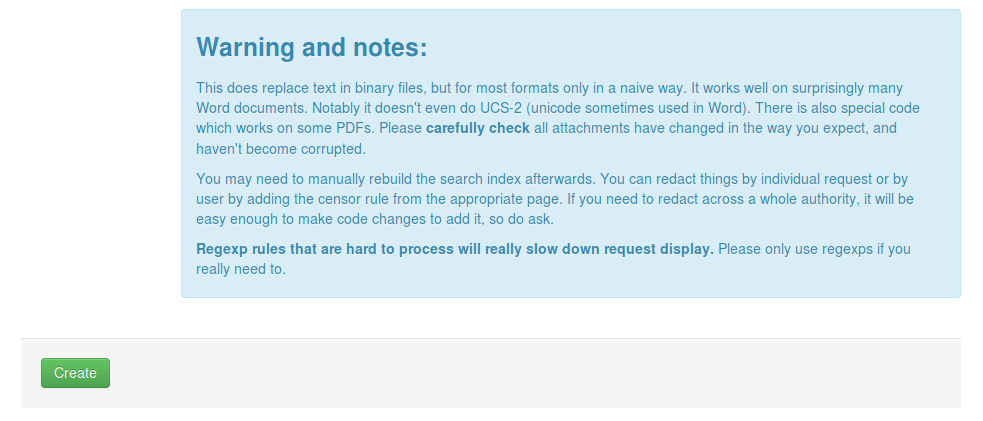

**Figura F.2.7.34:** Administrador: creación de regla de censura II

