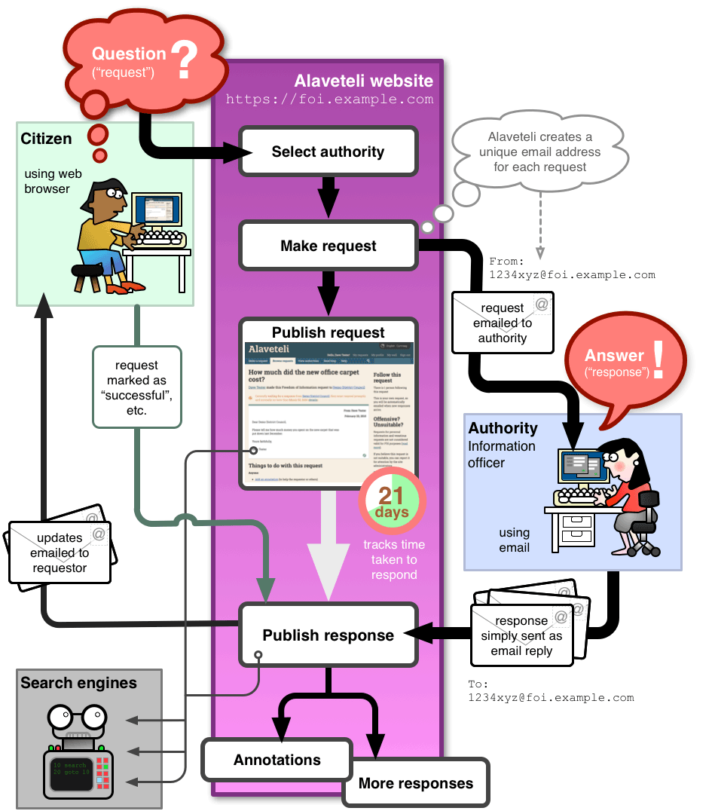

### F.2.3 Implantación

Cuenta con más de 24 instalaciones en distintos países (NOTE:  http://alaveteli.org/deployments/ ): 

<table>
  <tr>
    <td>Nombre</td>
    <td>País</td>
    <td>URL</td>
  </tr>
  <tr>
    <td>WhatDoTheyKnow</td>
    <td>United Kingdom</td>
    <td>https://www.whatdotheyknow.com/</td>
  </tr>
  <tr>
    <td>Ki Mit Tud</td>
    <td>Hungary</td>
    <td>http://kimittud.atlatszo.hu/</td>
  </tr>
  <tr>
    <td>FYI</td>
    <td>New Zealand</td>
    <td>https://fyi.org.nz/</td>
  </tr>
  <tr>
    <td>Доступ до правди</td>
    <td>Ukraine</td>
    <td>https://dostup.pravda.com.ua/</td>
  </tr>
  <tr>
    <td>Info Pro Všechny</td>
    <td>Czech Republic</td>
    <td>http://www.infoprovsechny.cz/</td>
  </tr>
  <tr>
    <td>Imamo pravo znati</td>
    <td>Croatia</td>
    <td>http://imamopravoznati.org/</td>
  </tr>
  <tr>
    <td>Right To Know</td>
    <td>Australia</td>
    <td>https://www.righttoknow.org.au/</td>
  </tr>
  <tr>
    <td>RightToKnow</td>
    <td>Malaysia</td>
    <td>http://foi.sinarproject.org/</td>
  </tr>
  <tr>
    <td>Que Sabes</td>
    <td>Uruguay</td>
    <td>http://www.quesabes.org/</td>
  </tr>
  <tr>
    <td>Nu Vă Supărați</td>
    <td>Romania</td>
    <td>http://nuvasuparati.info/</td>
  </tr>
  <tr>
    <td>Pravo Da Znam</td>
    <td>Bosnia</td>
    <td>http://www.pravodaznam.ba/</td>
  </tr>
  <tr>
    <td>Ask Data</td>
    <td>Israel</td>
    <td>http://askdata.org.il/</td>
  </tr>
  <tr>
    <td>Слободен пристап</td>
    <td>Macedonia</td>
    <td>http://www.slobodenpristap.mk/</td>
  </tr>
  <tr>
    <td>Sobanukirwa</td>
    <td>Rwanda</td>
    <td>https://sobanukirwa.rw/</td>
  </tr>
  <tr>
    <td>Chiedi</td>
    <td>Italy</td>
    <td>https://chiedi.dirittodisapere.it/</td>
  </tr>
  <tr>
    <td>accessinfo.hk</td>
    <td>Hong Kong</td>
    <td>https://accessinfo.hk/</td>
  </tr>
  <tr>
    <td>Ask Your Gov</td>
    <td>Uganda</td>
    <td>http://askyourgov.ug/</td>
  </tr>
  <tr>
    <td>Mimes Brønn</td>
    <td>Norway</td>
    <td>https://www.mimesbronn.no/</td>
  </tr>
  <tr>
    <td>QueremoSaber</td>
    <td>Paraguay</td>
    <td>http://queremosaber.org.py/</td>
  </tr>
  <tr>
    <td>Derecho A Preguntar</td>
    <td>Nicaragua</td>
    <td>https://derechoapreguntar.org/</td>
  </tr>
  <tr>
    <td>InfoLib</td>
    <td>Liberia</td>
    <td>http://infolib.org.lr/</td>
  </tr>
  <tr>
    <td>Transparencia</td>
    <td>Belgium</td>
    <td>https://transparencia.be/</td>
  </tr>
  <tr>
    <td>Queremosdatos</td>
    <td>Colombia</td>
    <td>https://www.queremosdatos.co/</td>
  </tr>
  <tr>
    <td>Fråga Staten</td>
    <td>Sweden</td>
    <td>https://fragastaten.se/</td>
  </tr>
</table>

Cuenta con documentación extensa para facilitar su instalación y personalización, así como del funcionamiento del flujo de la aplicación (NOTE:  http://alaveteli.org/docs/getting_started/ ): 

**Figura F.2.3.1:** Funcionamiento de Alaveteli

