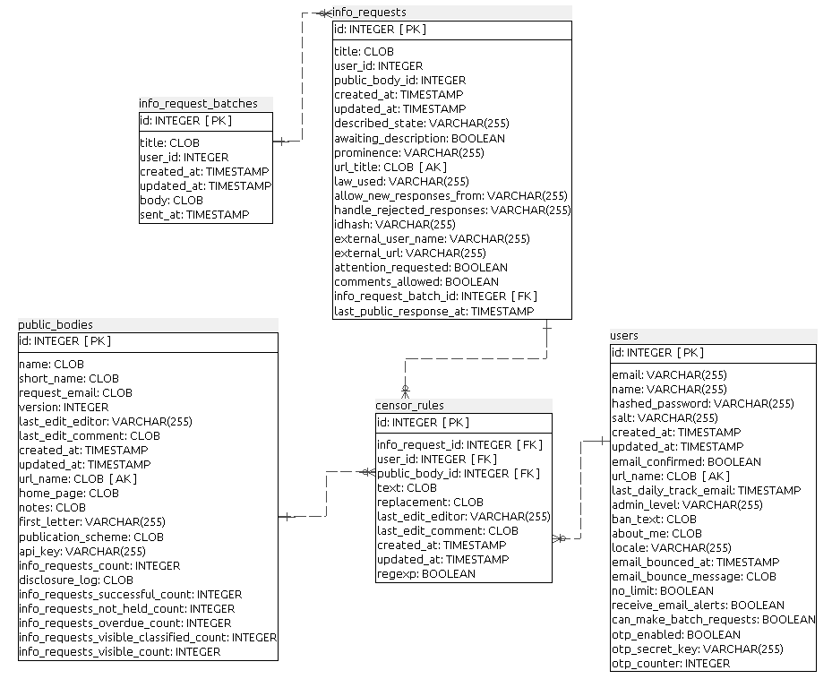
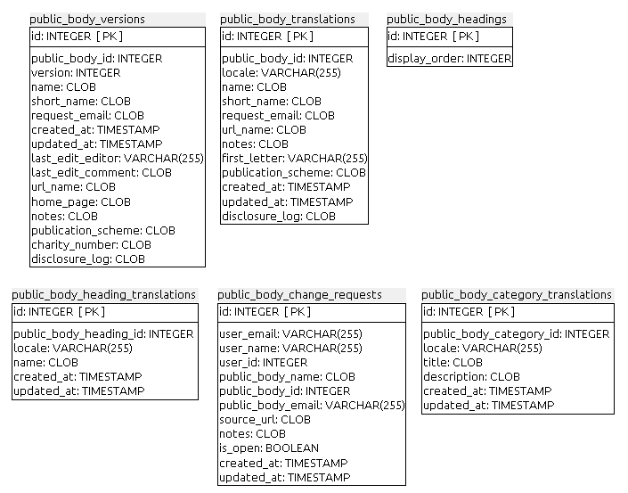
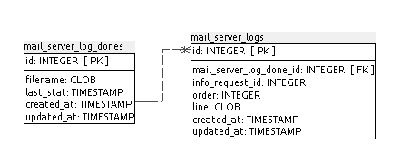

### F.2.5 Modelo de datos

#### F.2.5.1 Modelos relevantes

Los modelos relevantes son Users, InfoRequests y PublicBodies.

#### F.2.5.2 Tablas

Cuenta con 35 tablas:

* acts_as_xapian_jobs          	 

* censor_rules                 	 

* comments                     	 

* foi_attachments              	 

* has_tag_string_tags          	 

* holidays                     	 

* incoming_messages            	 

* info_request_batches       	 

* info_request_batches_public_bodies

* info_request_events          	 

* info_requests                	 

* mail_server_log_dones        	 

* mail_server_logs             	 

* outgoing_messages            	 

* post_redirects               	 

* profile_photos               	 

* public_bodies                	 

* public_body_categories       	 

* public_body_category_links  

* public_body_category_translations

* public_body_change_requests  

* public_body_heading_translations  

* public_body_headings         	 

* public_body_translations     	 

* public_body_versions         	 

* purge_requests               	 

* raw_emails                   	 

* request_classifications      	 

* schema_migrations            	 

* spam_addresses               	 

* track_things                 	 

* track_things_sent_emails     	 

* user_info_request_sent_alerts

* users                        	 

* widget_votes                 	 

#### F.2.5.3 Gráficos UML

**Figura F.2.5.1:** Tablas de la base de datos de Alaveteli

**Figura F.2.5.2:** Tablas de la base de datos de Alaveteli

**Figura F.2.5.3:** Tablas de la base de datos de Alaveteli

**Figura F.2.5.4:** Tablas de la base de datos de Alaveteli

**Figura F.2.5.5:** Tablas de la base de datos de Alaveteli

**Figura F.2.5.6:** Tablas de la base de datos de Alaveteli

