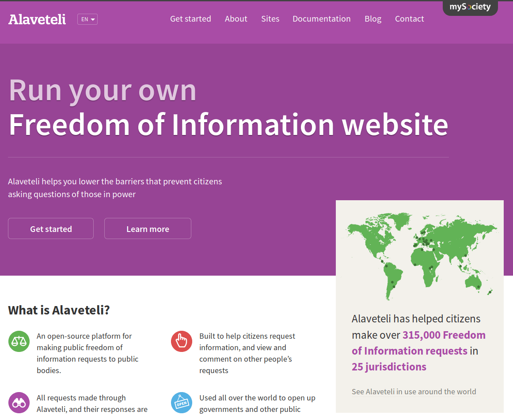
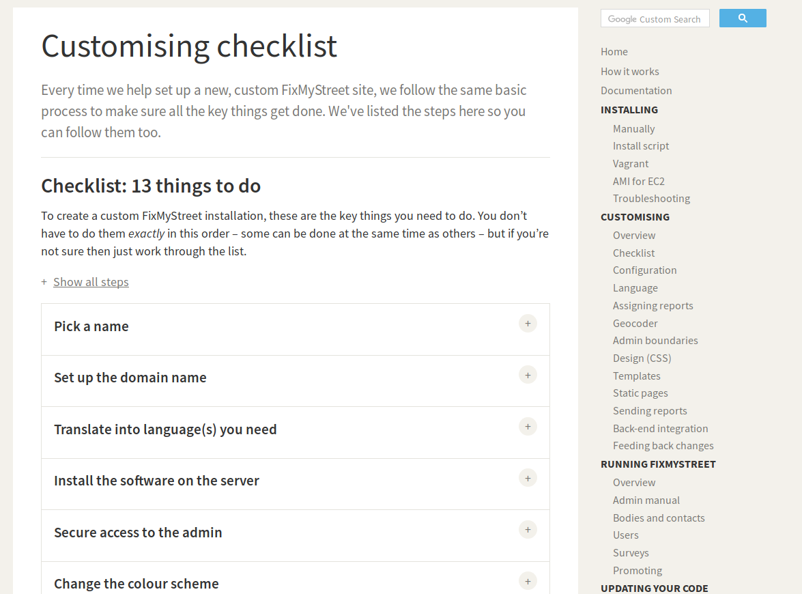

## F.2 Alaveteli

**Figura F.2.0:** Portada de [http://alaveteli.org/](http://alaveteli.org/) 

*Este es un proyecto de código abierto para crear una plataforma estándar e internacionalizada para realizar solicitudes de Libertad de Información (FOI) en diferentes países del mundo. El software empezó como WhatDoTheyKnow, un sitio web producido por mySociety para hacer solicitudes de FOI en el Reino Unido.*[^1]

**Figura F.2.3.2:** Documentación: como personalizar la instalación 

[^1]: https://github.com/mysociety/alaveteli
Texto original: This is an open source project to create a standard, internationalised platform for making Freedom of Information (FOI) requests in different countries around the world. The software started off life as WhatDoTheyKnow, a website produced by mySociety for making FOI requests in the UK.
