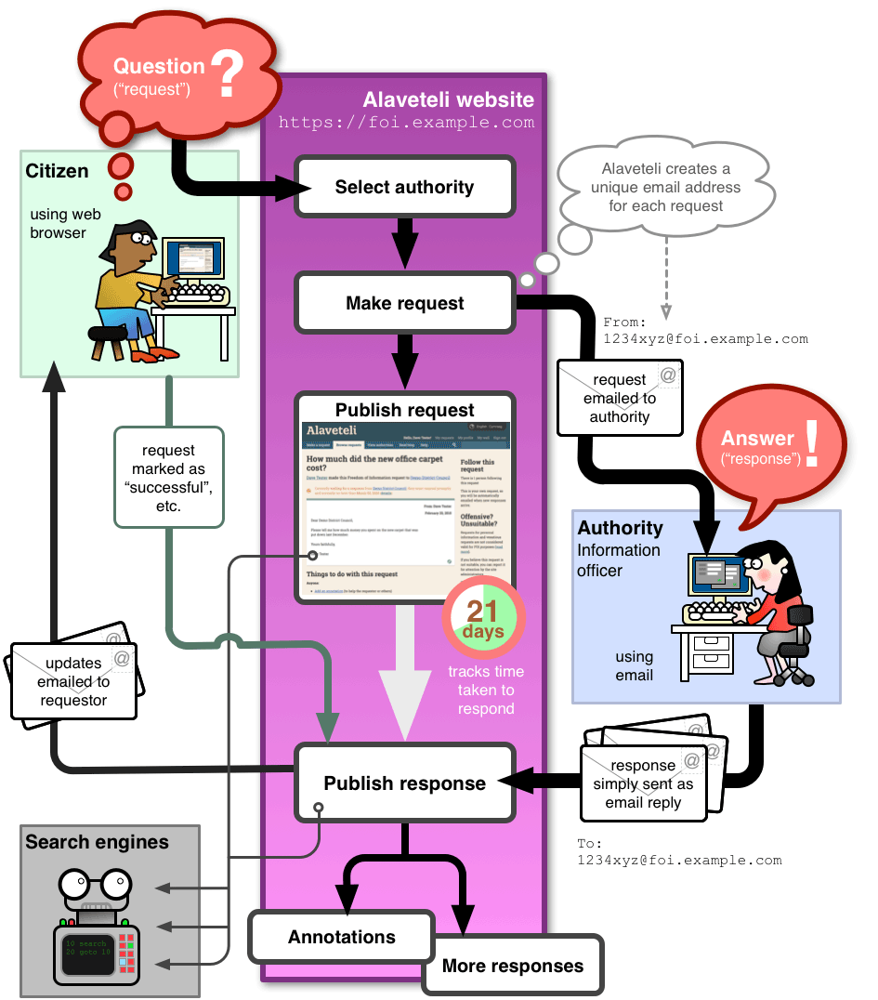
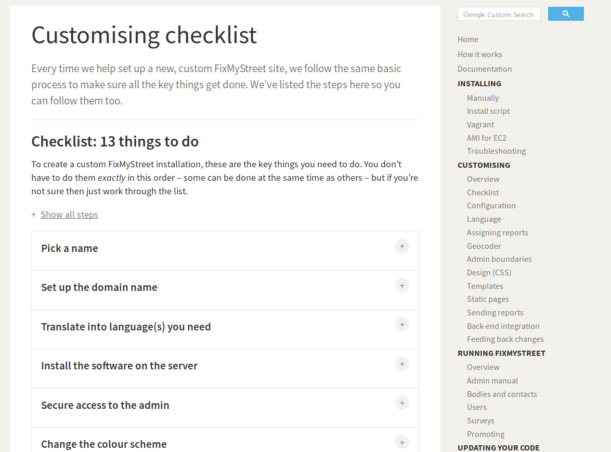
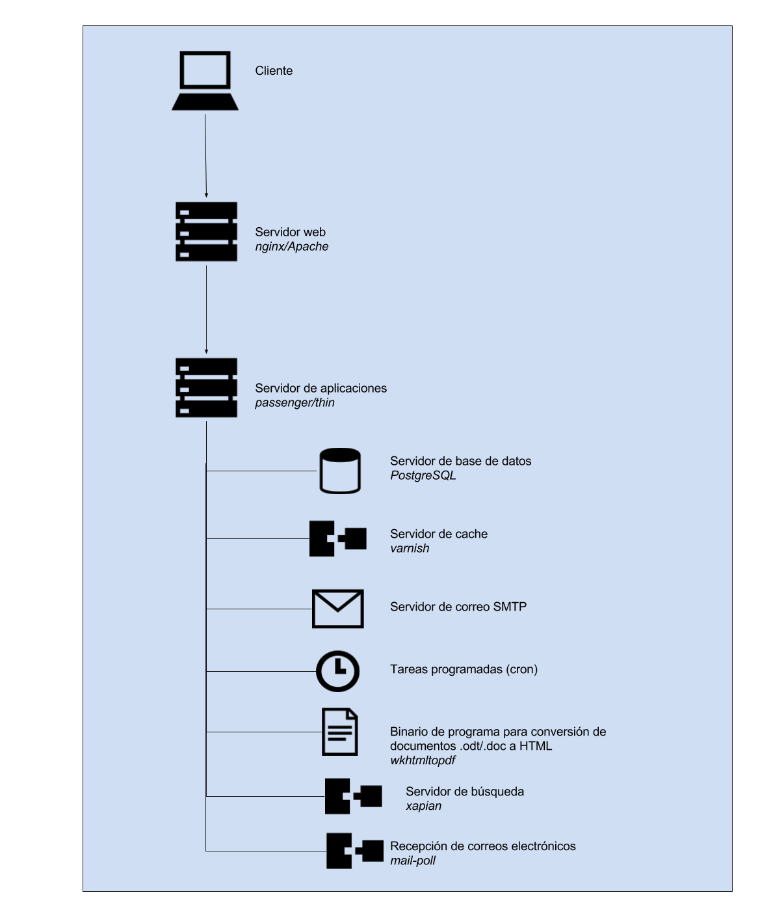
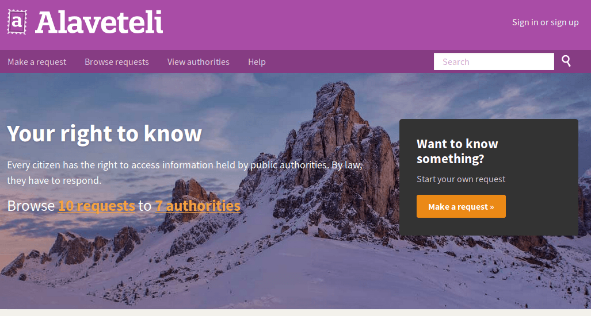
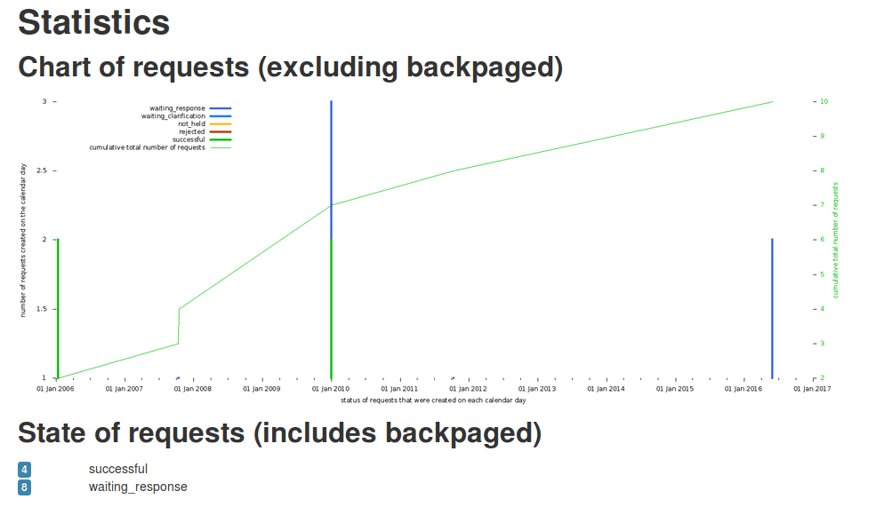
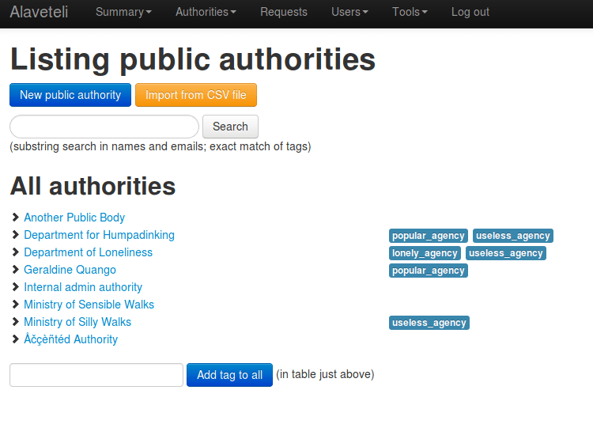

## Anexo F.2 Alaveteli

### 

**Figura F.2.0:** Portada de [http://alaveteli.org/](http://alaveteli.org/) 

 

*Este es un proyecto de código abierto para crear una plataforma estándar e internacionalizada para realizar solicitudes de Libertad de Información (FOI) en diferentes países del mundo. El software empezó como WhatDoTheyKnow, un sitio web producido por mySociety para hacer solicitudes de FOI en el Reino Unido.* (NOTE:  https://github.com/mysociety/alaveteli 
Texto original: This is an open source project to create a standard, internationalised platform for making Freedom of Information (FOI) requests in different countries around the world. The software started off life as WhatDoTheyKnow, a website produced by mySociety for making FOI requests in the UK.)

### F.2.1 Metadatos

<table>
  <tr>
    <td>Nombre</td>
    <td>Alaveteli</td>
  </tr>
  <tr>
    <td>URL</td>
    <td>http://alaveteli.org/ </td>
  </tr>
  <tr>
    <td>URL repositorio</td>
    <td>https://github.com/mysociety/alaveteli </td>
  </tr>
  <tr>
    <td>Resumen (Inglés)</td>
    <td>Provide a Freedom of Information request system for your jurisdiction.</td>
  </tr>
  <tr>
    <td>Resumen (Castellano)</td>
    <td>Proporciona un sistema de peticiones de libertad de información para su jurisdicción.</td>
  </tr>
  <tr>
    <td>Lenguaje</td>
    <td>Ruby</td>
  </tr>
  <tr>
    <td>Framework</td>
    <td>Ruby on Rails</td>
  </tr>
  <tr>
    <td>Fecha primer commit</td>
    <td>Octubre de 2010</td>
  </tr>
  <tr>
    <td>Versión analizada </td>
    <td>0.28.0.12</td>
  </tr>
  <tr>
    <td>Nº de versiones</td>
    <td>316</td>
  </tr>
  <tr>
    <td>Nº de tablas en la BBDD</td>
    <td>35</td>
  </tr>
  <tr>
    <td>Nº de contribuidores</td>
    <td>45</td>
  </tr>
  <tr>
    <td>Nº de stars</td>
    <td>213</td>
  </tr>
  <tr>
    <td>Licencia</td>
    <td> GNU Affero GPL v3</td>
  </tr>
  <tr>
    <td>Mantenido</td>
    <td> Sí</td>
  </tr>
  <tr>
    <td>Diseño responsivo</td>
    <td>Sí</td>
  </tr>
</table>

### F.2.2 Funcionalidades 

* Permite a un usuario registrado hacer una petición de liberación de información a una autoridad (departamento, área, ministerio, etc), así como hacer seguimiento a la respuesta de dicha petición. 

* Permite a otros usuarios recibir notificaciones de cuando una petición ha sido respondida, así como hacer seguimiento a las peticiones de una autoridad. 

* Permite previsualizar una petición antes de publicarla y compartirla en las redes sociales una vez se ha realizado. 

* Permite agregar anotación (notas a posteriori) en una petición.

* Permite a un administrador retirar o esconder un mensaje (Peticiones, Usuarios o Autoridades), que cuente con información sensible.

* Permite gestionar días festivos con el fin de contabilizar correctamente la cantidad de días restantes para el cumplimiento de la ley.

### F.2.3 Análisis

Cuenta con más de 24 instalaciones en distintos países (NOTE:  http://alaveteli.org/deployments/ ): 

<table>
  <tr>
    <td>Nombre</td>
    <td>País</td>
    <td>URL</td>
  </tr>
  <tr>
    <td>WhatDoTheyKnow</td>
    <td>United Kingdom</td>
    <td>https://www.whatdotheyknow.com/</td>
  </tr>
  <tr>
    <td>Ki Mit Tud</td>
    <td>Hungary</td>
    <td>http://kimittud.atlatszo.hu/</td>
  </tr>
  <tr>
    <td>FYI</td>
    <td>New Zealand</td>
    <td>https://fyi.org.nz/</td>
  </tr>
  <tr>
    <td>Доступ до правди</td>
    <td>Ukraine</td>
    <td>https://dostup.pravda.com.ua/</td>
  </tr>
  <tr>
    <td>Info Pro Všechny</td>
    <td>Czech Republic</td>
    <td>http://www.infoprovsechny.cz/</td>
  </tr>
  <tr>
    <td>Imamo pravo znati</td>
    <td>Croatia</td>
    <td>http://imamopravoznati.org/</td>
  </tr>
  <tr>
    <td>Right To Know</td>
    <td>Australia</td>
    <td>https://www.righttoknow.org.au/</td>
  </tr>
  <tr>
    <td>RightToKnow</td>
    <td>Malaysia</td>
    <td>http://foi.sinarproject.org/</td>
  </tr>
  <tr>
    <td>Que Sabes</td>
    <td>Uruguay</td>
    <td>http://www.quesabes.org/</td>
  </tr>
  <tr>
    <td>Nu Vă Supărați</td>
    <td>Romania</td>
    <td>http://nuvasuparati.info/</td>
  </tr>
  <tr>
    <td>Pravo Da Znam</td>
    <td>Bosnia</td>
    <td>http://www.pravodaznam.ba/</td>
  </tr>
  <tr>
    <td>Ask Data</td>
    <td>Israel</td>
    <td>http://askdata.org.il/</td>
  </tr>
  <tr>
    <td>Слободен пристап</td>
    <td>Macedonia</td>
    <td>http://www.slobodenpristap.mk/</td>
  </tr>
  <tr>
    <td>Sobanukirwa</td>
    <td>Rwanda</td>
    <td>https://sobanukirwa.rw/</td>
  </tr>
  <tr>
    <td>Chiedi</td>
    <td>Italy</td>
    <td>https://chiedi.dirittodisapere.it/</td>
  </tr>
  <tr>
    <td>accessinfo.hk</td>
    <td>Hong Kong</td>
    <td>https://accessinfo.hk/</td>
  </tr>
  <tr>
    <td>Ask Your Gov</td>
    <td>Uganda</td>
    <td>http://askyourgov.ug/</td>
  </tr>
  <tr>
    <td>Mimes Brønn</td>
    <td>Norway</td>
    <td>https://www.mimesbronn.no/</td>
  </tr>
  <tr>
    <td>QueremoSaber</td>
    <td>Paraguay</td>
    <td>http://queremosaber.org.py/</td>
  </tr>
  <tr>
    <td>Derecho A Preguntar</td>
    <td>Nicaragua</td>
    <td>https://derechoapreguntar.org/</td>
  </tr>
  <tr>
    <td>InfoLib</td>
    <td>Liberia</td>
    <td>http://infolib.org.lr/</td>
  </tr>
  <tr>
    <td>Transparencia</td>
    <td>Belgium</td>
    <td>https://transparencia.be/</td>
  </tr>
  <tr>
    <td>Queremosdatos</td>
    <td>Colombia</td>
    <td>https://www.queremosdatos.co/</td>
  </tr>
  <tr>
    <td>Fråga Staten</td>
    <td>Sweden</td>
    <td>https://fragastaten.se/</td>
  </tr>
</table>

Cuenta con documentación extensa para facilitar su instalación y personalización, así como del funcionamiento del flujo de la aplicación (NOTE:  http://alaveteli.org/docs/getting_started/ ): 

**Figura F.2.3.1:** Funcionamiento de Alaveteli

###  

**Figura F.2.3.2:** Documentación: como personalizar la instalación 

### F.2.4 Arquitectura

Como la mayoría de las aplicaciones de mySociety, cuenta con una extensa documentación (NOTE:  http://alaveteli.org/docs/ ), tanto de aspectos técnicos (cómo instalarlo, desarrollarlo o administrarlo) como políticos (cómo preparar el equipo motor inicial, promocionar el sitio o conseguir voluntarios para el mantenimiento de la plataforma).  

Soporta varios métodos de instalación documentados (NOTE:  http://alaveteli.org/docs/installing/ ): 

* Utilizando el servicio de cloud computing Amazon EC2 

* Utilizando un script de instalación

* Instalación manual 

Cuenta con soporte de personalización, tanto a nivel de imagen gráfica mediante el uso de temas, como de localización (NOTE:  http://alaveteli.org/docs/customising/ ). 

**Figura F.2.4.1:** Arquitectura de servidores de Alaveteli

### F.2.5 Modelo de datos

#### F.2.5.1 Modelos relevantes

Los modelos relevantes son Users, InfoRequests y PublicBodies.

#### F.2.5.2 Tablas

Cuenta con 35 tablas:

* acts_as_xapian_jobs          	 

* censor_rules                 	 

* comments                     	 

* foi_attachments              	 

* has_tag_string_tags          	 

* holidays                     	 

* incoming_messages            	 

* info_request_batches       	 

* info_request_batches_public_bodies

* info_request_events          	 

* info_requests                	 

* mail_server_log_dones        	 

* mail_server_logs             	 

* outgoing_messages            	 

* post_redirects               	 

* profile_photos               	 

* public_bodies                	 

* public_body_categories       	 

* public_body_category_links  

* public_body_category_translations

* public_body_change_requests  

* public_body_heading_translations  

* public_body_headings         	 

* public_body_translations     	 

* public_body_versions         	 

* purge_requests               	 

* raw_emails                   	 

* request_classifications      	 

* schema_migrations            	 

* spam_addresses               	 

* track_things                 	 

* track_things_sent_emails     	 

* user_info_request_sent_alerts

* users                        	 

* widget_votes                 	 

#### F.2.5.3 Gráficos UML

**Figura F.2.5.1:** Tablas de la base de datos de Alaveteli

**Figura F.2.5.2:** Tablas de la base de datos de Alaveteli

**Figura F.2.5.3:** Tablas de la base de datos de Alaveteli

**Figura F.2.5.4:** Tablas de la base de datos de Alaveteli

**Figura F.2.5.5:** Tablas de la base de datos de Alaveteli

**Figura F.2.5.6:** Tablas de la base de datos de Alaveteli

### XX F.2.6 Conclusiones

### F.2.7 Capturas de pantallas

###  

**Figura F.2.7.1:** Portada I (Llamada a la acción / Call to action)

**Figura F.2.7.2:** Portada II (explicación del funcionamiento) 

**Figura F.2.7.3:** Portada III (actividad reciente)

**Figura F.2.7.4:** Creación de cuenta de usuario e inicio de sesión

**Figura F.2.7.5:** Aviso de confirmación de correo electrónico

**Figura F.2.7.6:** Buscador de autoridades I

**Figura F.2.7.7:** Buscador de autoridades II 

**Figura F.2.7.8:** Dar de alta una petición 

**Figura F.2.7.9:** Previsualización de petición 

**Figura F.2.7.10:** Mensaje posterior a publicación de petición

**Figura F.2.7.11:** Petición pubolicada I

**Figura F.2.7.12:** Petición publicada II

**Figura F.2.7.13:** Agregar anotación a petición

**Figura F.2.7.14:** Previsualización de anotación 

**Figura F.2.7.15:** Anotación agregada a petición

**Figura F.2.7.16:** Navegación de autoridades 

**Figura F.2.7.17:** Páginas estáticas 

**Figura F.2.7.18:** Perfil de usuario 

**Figura F.2.7.19:** Página de autoridad 

**Figura F.2.7.20:** Mensaje en autoridad de suscripción de actividad

**Figura F.2.7.21:** Administrador: resumen y gráficos de actividad I

**Figura F.2.7.22:** Administrador: resumen y gráficos de actividad II

**Figura F.2.7.23:** Administrador: resumen y gráficos de actividad III

**Figura F.2.7.24:** Administrador: información de depuración (debugging)

**Figura F.2.7.25:** Administrador: listado de autoridades

**Figura F.2.7.26:** Administrador: gestión de categorias 

**Figura F.2.7.27:** Administrador: gestión de peticiones

**Figura F.2.7.28:** Administrador: gestión de usuarios

**Figura F.2.7.29:** Administrador: gestión de seguimientos 

**Figura F.2.7.30:** Administrador: gestión de información sensible (reglas de censura)

**Figura F.2.7.31:** Administrador: gestión de días festivos

**Figura F.2.7.32:** Administrador: eventos con filtros temporales  	

**Figura F.2.7.33:** Administrador: creación de regla de censura I

**Figura F.2.7.34:** Administrador: creación de regla de censura II

