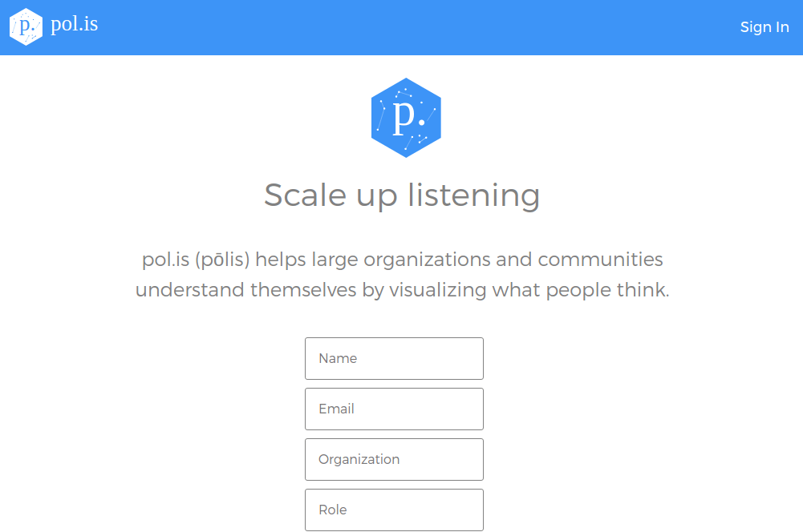
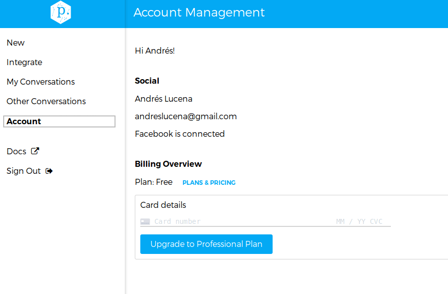
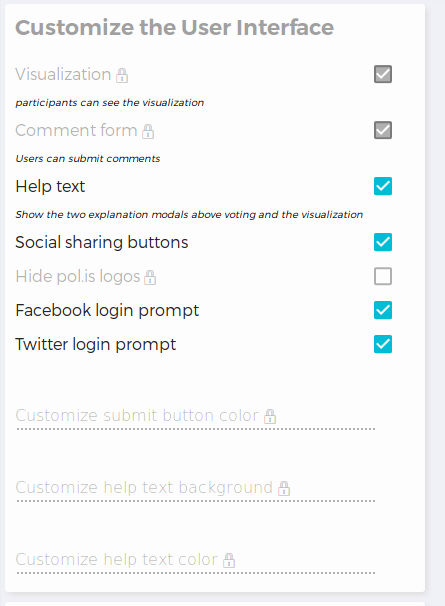
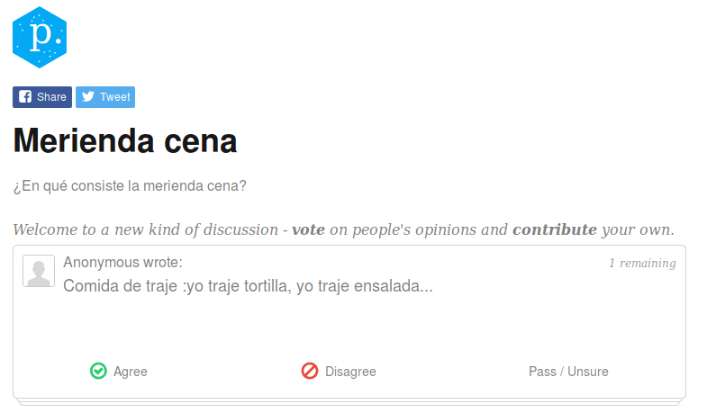
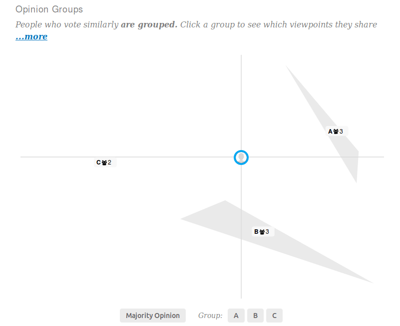
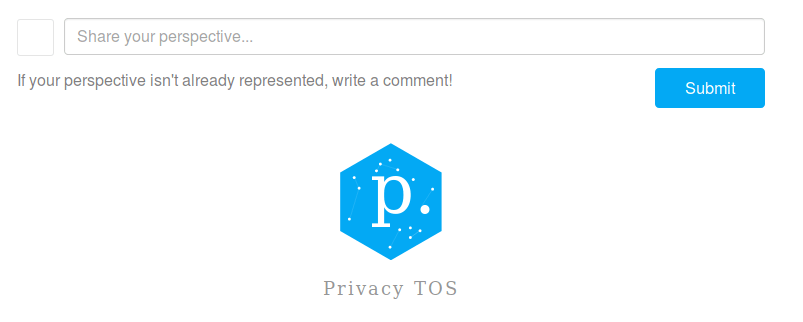
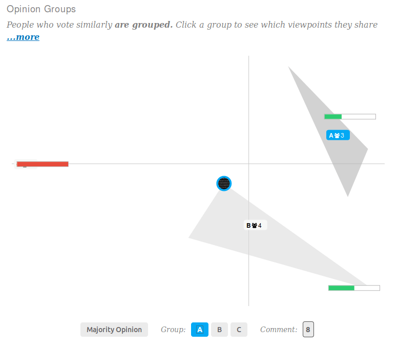

## Anexo G.1 pol.is

**Figura G.1.0:** Portada de [http://pol.is](http://pol.is) 

*Polis es una nueva forma de reunir comentarios abiertos de grandes grupos de personas. Está bien adaptado para reunir información orgánica y auténtica, al mismo tiempo que conserva las opiniones minoritarias.* (NOTE:  https://docs.pol.is/welcome/Overview.html  
Texto original: 
Polis is a new way to gather open ended feedback from large groups of people. It is well suited to gathering organic, authentic feedback while retaining minority opinions.)

### G.1.1 Metadatos

<table>
  <tr>
    <td>Nombre</td>
    <td>pol.is</td>
  </tr>
  <tr>
    <td>URL</td>
    <td>https://pol.is </td>
  </tr>
  <tr>
    <td>URL repositorio</td>
    <td>https://github.com/pol-is </td>
  </tr>
  <tr>
    <td>Resumen (Inglés)</td>
    <td>pol.is (pōlis) helps large organizations and communities understand themselves by visualizing what people think.</td>
  </tr>
  <tr>
    <td>Resumen (Castellano)</td>
    <td>pol.is (pōlis) ayuda a grandes organizaciones y comunidades a entenderse a sí mismas visualizando lo que la gente piensa.</td>
  </tr>
  <tr>
    <td>Lenguaje</td>
    <td>Javascript</td>
  </tr>
  <tr>
    <td>Framework</td>
    <td>Node.js</td>
  </tr>
  <tr>
    <td>Fecha primer commit</td>
    <td>Octubre de 2012</td>
  </tr>
  <tr>
    <td>Versión analizada</td>
    <td>No aplica</td>
  </tr>
  <tr>
    <td>Nº de versiones</td>
    <td>0</td>
  </tr>
  <tr>
    <td>Nº de tablas en la BBDD</td>
    <td>No aplica</td>
  </tr>
  <tr>
    <td>Nº de contribuidores</td>
    <td>3</td>
  </tr>
  <tr>
    <td>Nº de stars</td>
    <td>28</td>
  </tr>
  <tr>
    <td>Licencia</td>
    <td> GNU Affero GPL v3</td>
  </tr>
  <tr>
    <td>Mantenido</td>
    <td>Sí</td>
  </tr>
  <tr>
    <td>Diseño responsivo</td>
    <td>Sí</td>
  </tr>
</table>

 

### G.1.2 Funcionalidades 

* Permite hacer una lluvia de ideas (brainstorming) alrededor de un tema. 

* Los usuarios pueden proponer nuevas ideas y priorizarlas a pares

* La priorización puede ser de la forma "estar de acuerdo", “en desacuerdo” o si no estar seguros / pasan

* Permite integrar una Conversación en sitios web externos a través de iframes (NOTE:  Elemento HTML que permite insertar o incrustar un documento HTML dentro de un documento HTML principal. (https://es.wikipedia.org/wiki/Iframe))

* Permite descargar los datos de una Conversación

* Permite hacer informes de una Conversación 

* Permite obtener estadísticas de una Conversación

### G.1.3 Análisis

Ha sido utilizado para un proceso participativo en Taiwan con el objetivo de obtener opiniones de cómo regular la economía colaborativa (Uber y AirBnB) (NOTE:  https://twitter.com/audreyt/status/744450181307850752 ). 

Un caso de estudio es el del periódico neozelandés Scoop, que ha querido saber las opiniones de sus lectores sobre la epidemia de obesidad en el país (NOTE:  https://blog.pol.is/pol-is-case-study-temperature-check-a02dff7cc838  ). 

Entre sus funcionalidades más destacables se encuentra la navegación de por conversaciones, donde se pueden visualizar los consensos acordados entre miles de propuestas (ver Figura G.1.7.16). 

Ofrecen varios servicios:

* instancia de uso público, registrandose en pol.is 

* instancia de pago SaaS (Software as a Service) donde la empresa pol.is se encarga de la instalación y mantenimiento del servidor, con acceso a ciertas funcionalidades 

* instalación en servidores propios (software libre)

### G.1.4 Arquitectura

Aunque el código se haya liberado, y cuenta con un repositorio dedicado a la documentación, así como una web para la misma (NOTE:  http://docs.pol.is/ ), ésta sólo explica el funcionamiento de la herramienta de cara a un usuario. 

Los ficheros README con los que cuentan los distintos repositorios que cuenta la aplicación da fallos al seguir las instrucciones, el más llamativo es el siguiente: 

*/polisServer$ npm install*

*(...)*

*npm WARN remote: Invalid username or password.*

*npm WARN fatal: Authentication failed for 'https://github.com/colinmegill/polisServerBrand.git/'*

*npm WARN*

*npm WARN polis@0.0.0 No license field.*

Al realizar la instalación, busca un repositorio que no existe en GitHub: polisServerBrand. Sin dicho componente el procedimiento de instalación del servidor no funciona. 

En su repositorio principal (PolisServer) cuentan con la siguiente explicación de 5 líneas (NOTE:  https://github.com/pol-is/polisServer  
Texto original: 
# Polis
pol.is an AI powered sentiment gathering platform. More organic than surveys, less effort than focus groups.

If you don't want to deploy your own instance of Polis, you can use our SaaS version [here](https://pol.is/home)
Polis [can be easily embedded](http://docs.pol.is/usage/Embedding.html) on your page as an iframe.), sin explicar el proceso de instalación, algo no estándar en proyectos de software libre: 

*Polis*

*Pol.is una plataforma de reunión de sentimiento impulsado por **AI**. Más orgánico que las encuestas, menos esfuerzo que los grupos focales.*

*Si no desea implementar su propia instancia de Polis, puede utilizar nuestra versión SaaS [aquí] (https://pol.is/home)*

*Polis [se puede incrustar fácilmente] (http://docs.pol.is/usage/Embedding.html) en su página como iframe.*

Al no conseguir instalarlo en un servidor propio y no contar con documentación que recomiende un proceso de despliegue, no se ha podido instalar y analizar la arquitectura del aplicativo. 

### G.1.5 Modelo de datos

Al no conseguir instalarlo en un servidor propio y no contar con documentación que recomiende un proceso de despliegue, no se ha podido instalar y estudiar los modelos de datos del aplicativo. 

### XX G.1.6 Conclusiones 

### G.1.7 Capturas de pantallas 

**Figura G.1.7.1:** Portada de pol.is

**Figura G.1.7.2:** Inicio de sesión

**Figura ****G.1.****7.3:** Registro de usuario

**Figura ****G.1.****7.4:** Portada (con sesión iniciada)

**Figura ****G.1.****7.5:** Integración

**Figura ****G.1.****7.6:** Cuenta de usuario

**Figura ****G.1.****7.7:** Configuración de Conversación I 

**Figura ****G.1.****7.8:** Configuración de Conversación II

**Figura ****G.1.****7.9:** Configuración general III

**Figura ****G.1.****7.10:** Integrar una Conversación en un sitio web externo

**Figura ****G.1.****7.11:** Comentarios recibidos en una Conversación

**Figura G.1.7.12:** Participantes de una Conversación

**Figura G.1.7.13:** Página de Conversación I

**Figura G.1.7.14:** Página de Conversación II

**Figura G.1.7.15:** Página de Conversación III

**Figura G.1.7.16:** Página de Conversación (navegación de Grupos de Opiniones)

**Figura G.1.7.17:** Detalle de panel izquierdo

