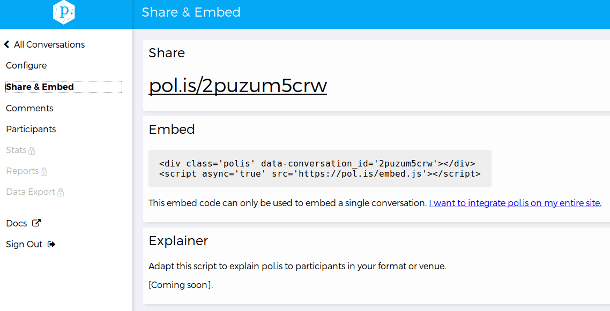

### G.1.7 Capturas de pantallas 

**Figura G.1.7.1:** Portada de pol.is

**Figura G.1.7.2:** Inicio de sesión

**Figura G.1.7.3:** Registro de usuario

**Figura G.1.7.4:** Portada (con sesión iniciada)

**Figura G.1.7.5:** Integración

**Figura G.1.7.6:** Cuenta de usuario

**Figura G.1.7.7:** Configuración de Conversación I 

**Figura G.1.7.8:** Configuración de Conversación II

**Figura G.1.7.9:** Configuración general III

**Figura G.1.7.10:** Integrar una Conversación en un sitio web externo

**Figura G.1.7.11:** Comentarios recibidos en una Conversación

**Figura G.1.7.12:** Participantes de una Conversación

**Figura G.1.7.13:** Página de Conversación I

**Figura G.1.7.14:** Página de Conversación II

**Figura G.1.7.15:** Página de Conversación III

**Figura G.1.7.16:** Página de Conversación (navegación de Grupos de Opiniones)

**Figura G.1.7.17:** Detalle de panel izquierdo

