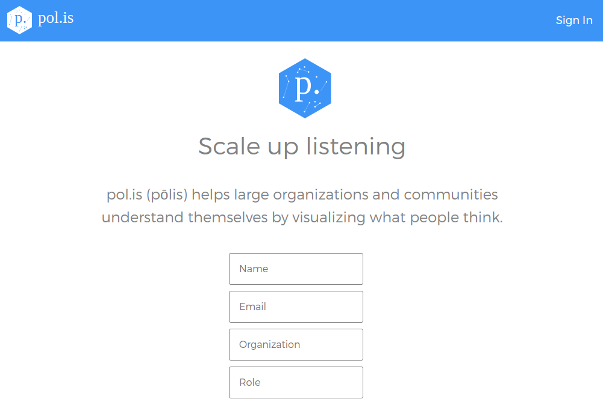

## Anexo G.1 pol.is

**Figura G.1.0:** Portada de [http://pol.is](http://pol.is) 

*Polis es una nueva forma de reunir comentarios abiertos de grandes grupos de personas. Está bien adaptado para reunir información orgánica y auténtica, al mismo tiempo que conserva las opiniones minoritarias.* (NOTE:  https://docs.pol.is/welcome/Overview.html  
Texto original: 
Polis is a new way to gather open ended feedback from large groups of people. It is well suited to gathering organic, authentic feedback while retaining minority opinions.)

