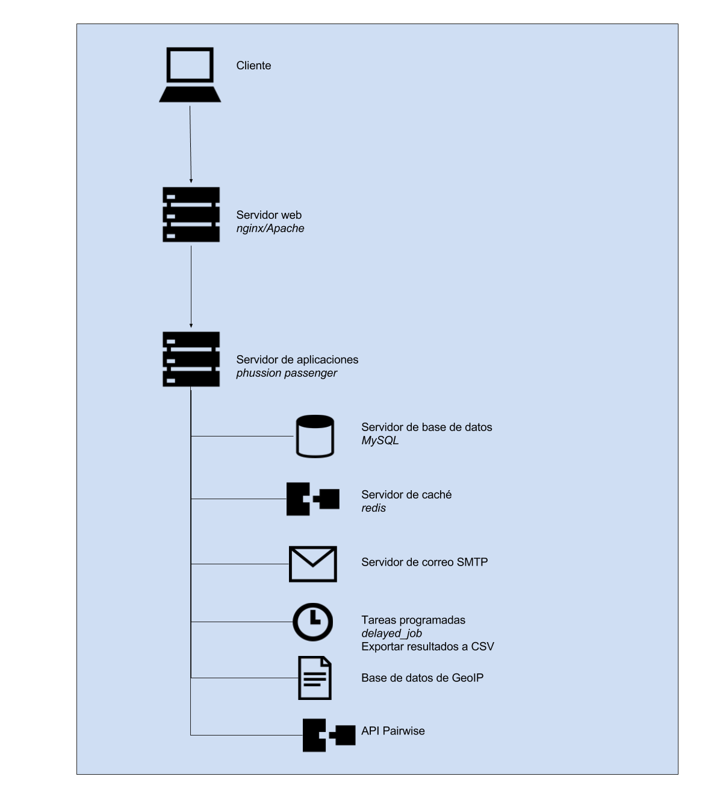

### G.2.4 Arquitectura

Cuenta con dos componentes principales, cada uno en un repositorio separado, allourideas.org y pairwise-api. 

#### allourideas

*All Our Ideas 2.0. Este código funciona en dos sitios **[photocracy.org](http://www.photocracy.org/)** y **[allourideas.org](http://www.allourideas.org/)**.

*El proyecto allourideas.org proporciona al usuario el sitio web para hacer la votación **por parejas**. Este proyecto depende de la API proporcionada por **[pairwise-api](https://github.com/allourideas/pairwise-api)**. Hay varios modelos de **[ActiveResource](http://apidock.com/rails/v2.3.8/ActiveResource/Base)** que se conectan a la **[API pairwise](https://github.com/allourideas/pairwise-api).**[^1]

ActiveResource se trata de una serie de clases para proveer el mapeado de modelos RESTful en aplicaciones Rails.[^2]

#### pairwise

Contiene una ontología para realizar una serie de acciones. Para una mejor comprensión se traduce de la documentación original[^3]:

*Peticiones**: Una petición es un conjunto de opciones. Por ejemplo, si la pregunta es "¿Cuál quieres más?", un ejemplo sería "helado gratis" o "cerveza gratis".*

*Preguntas**: Una pregunta se refiere a un mercado de ideas enteras. Por ejemplo, cuando alguien crea una pregunta está creando una idea de mercado que está hecha de elecciones y votos.*

*Opciones**: **Una Opción es uno de los elementos entre los que la gente está eligiendo.** Ejemplos de opciones son: "helado gratis", "cerveza gratis", "mejores profesores". Las opciones también se pueden definir mediante imágenes, vídeos o archivos de sonido.*

*Visitantes**: Un Visitante es alguien que visita una pregunta.*

*Exportaciones**: Una Exportación es la exportación de datos CSV de los votos, no votos o ideas de una pregunta.*

*Densidades**: Éstos producen gráficos sobre los patrones de avisos que han sido votados. Estos son experimentales y es probable que no quieren usarlos ahora. [experimental*]*

No tiene ningún sistema de temas que permita personalizar su diseño ni cuenta con traducciones. Para su modalidad de mostrar los dos sitios web en simultaneo de photocracy.org y allourideas.org, que podría ser un multitenant (multi-instancia), lo hacen comprobando si en la URL aparece la cadena de texto "photocracy" y en caso positivo se ejecutan una serie de reglas que muestra uno u otro contenido.[^4]

Cuenta con widgets que permiten embeber votaciones.[^5]

**Figura G.2.4.1:** Esquema de arquitectura  de allourideas

[^1]: Texto original: 
All Our Ideas 2.0. This codebase runs two sites photocracy.org and allourideas.org.
The allourideas.org project provides the user-facing website for doing pairwise voting. This project depends on the API provided by pairwise-api. There are several models that are ActiveResource models that connect to the pairwise API.
[^2]: https://apidock.com/rails/v2.3.8/ActiveResource/Base
[^3]: https://github.com/allourideas/pairwise-api/wiki/API-Documentation
[^4]: https://github.com/allourideas/allourideas.org/blob/cacc8e475c8e0458e9e39429eb68a2bee49a0810/app/views/idea_mailer/_signature.text.plain.erb#L1
[^5]: http://blog.allourideas.org/post/912665189/improved-widget-gives-you-more-control
