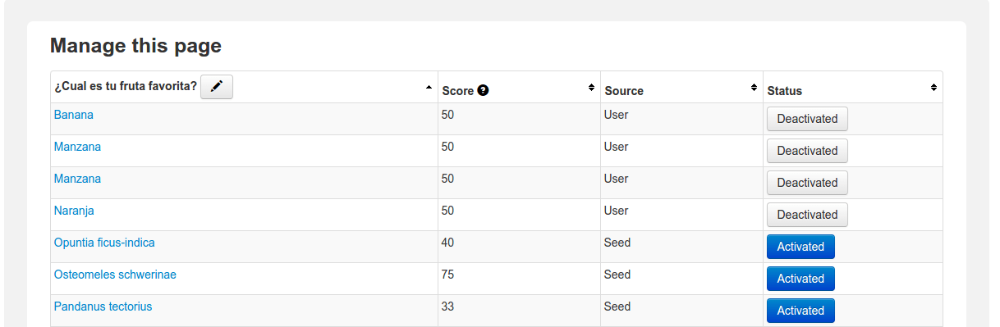

### G.2.7 Capturas de pantallas 

**Figura G.2.7.1: **Portada

**Figura G.2.7.2:** Formulario de creación de encuesta

**Figura G.2.7.3: **Página principal de encuesta (votación)

**Figura G.2.7.4: **Razones para no votar ("No pude decidirme porque…")

**Figura G.2.7.5: **Visualización de los resultados

**Figura G.2.7.6: **Visualización de los resultados: comparativa entre ideas"semilla” y  propuestas

**Figura G.2.7.7: **Visualización de los resultados: número de votos y de ideas propuestas por día

**Figura G.2.7.8: **Página de administración de encuesta: gestión de las opciones de respuesta

**Figura G.2.7.9: **Página de administración de encuesta: gestión de las opciones de respuesta (con ideas propuestas por usuarios)

**Figura G.2.7.7.10: **Página de administración de encuesta: opciones y exportación

