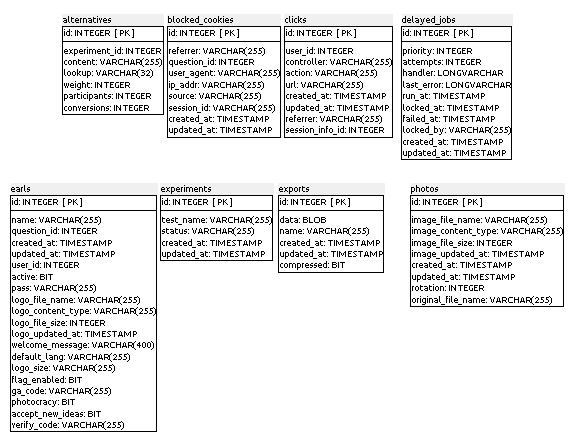
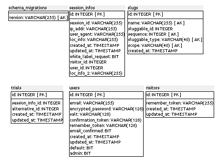
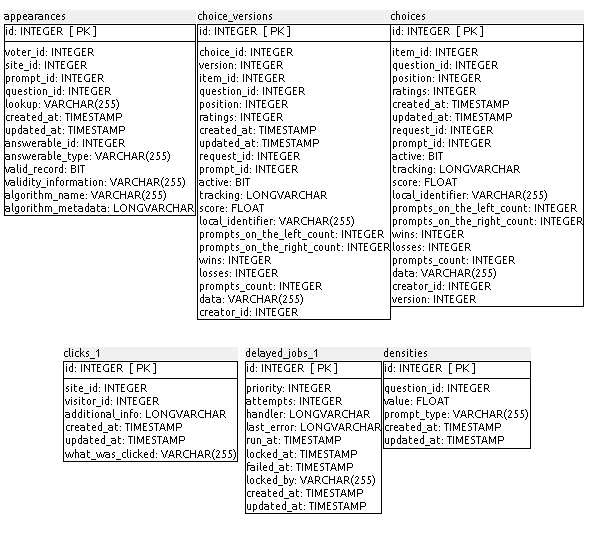
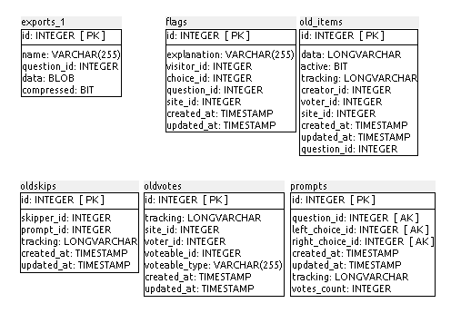
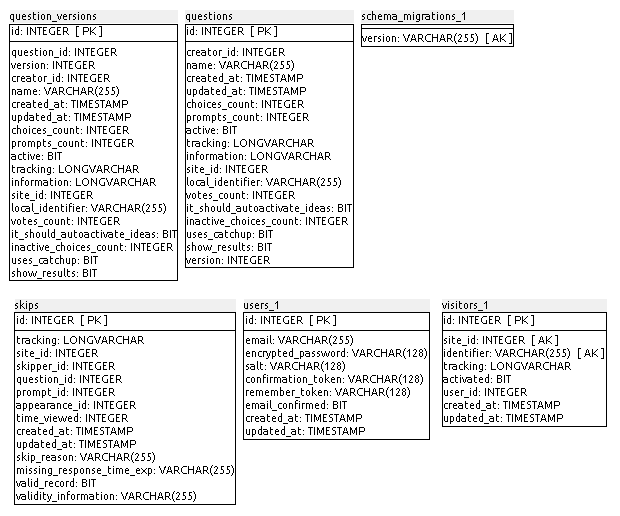
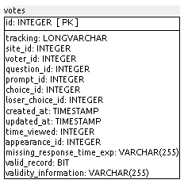

### G.2.5 Modelo de datos

Como se ha comentado anteriormente, al ser dos aplicaciones cuenta con dos bases de datos: 

#### G.2.5.1 Modelos relevantes

En el caso de allourideas, los modelos relevantes son Earls, Users y Photos

En el caso de pairwise-api, los modelos relevantes son Questiosn, QuestionVersions, Choices y ChoicesVersions. 

#### G.2.5.2 Tablas

##### allourideas

Cuenta con 14 tablas:

* alternatives        	 

* blocked_cookies     	 

* clicks              	 

* delayed_jobs        	 

* earls               	 

* experiments         	 

* exports             	 

* photos              	 

* schema_migrations   	 

* session_infos       	 

* slugs               	 

* trials              	 

* users               	 

* visitors      

##### pairwise-api

Cuenta con 19 tablas:

* appearances              	 

* choice_versions          	 

* choices                  	 

* clicks                   	 

* delayed_jobs             	 

* densities                	 

* exports                  	 

* flags                    	 

* old_items                	 

* oldskips                 	 

* oldvotes                 	 

* prompts                  	 

* question_versions        	 

* questions                	 

* schema_migrations        	 

* skips                    	 

* users                    	 

* visitors                 	 

* votes  

#### G.2.5.3 Gráficos UML

##### allourideas

**Figura G.2.5.1: **Esquema de la base de datos de allourideas

**Figura G.2.5.2: **Esquema de la base de datos de allourideas

##### pairwise-api

**Figura G.2.5.3: **Esquema de la base de datos de pairwise-api

**Figura G.2.5.4: **Esquema de la base de datos de pairwise-api

**Figura G.2.5.5: **Esquema de la base de datos de pairwise-api

**Figura G.2.5.6: **Esquema de la base de datos de pairwise-api

