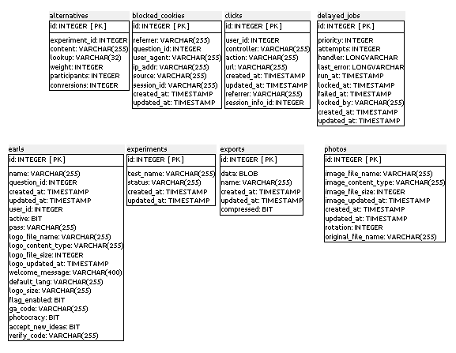
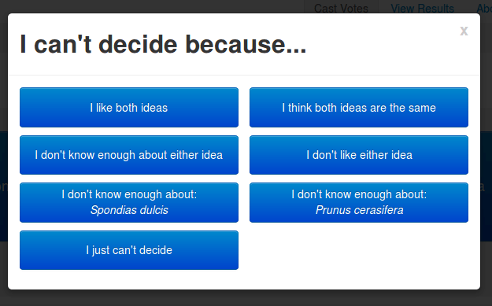
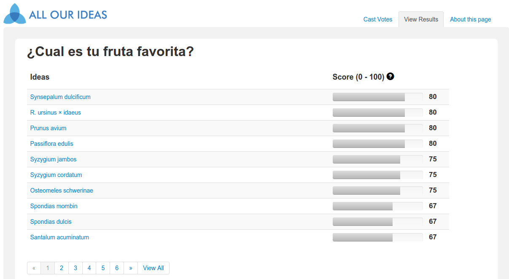
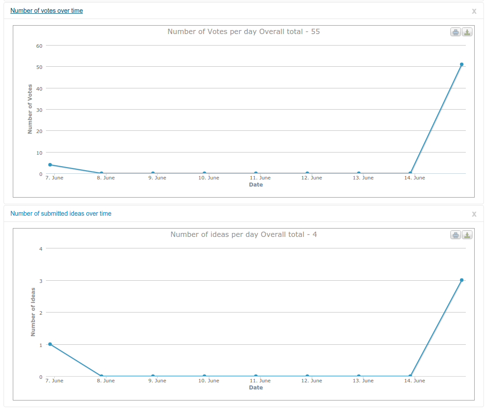

## Anexo G.2 All Our ideas 

### 

**Figura G.2.0: **Portada de [http://allourideas.org/](http://allourideas.org/) 

*Cómo funciona una Encuesta Wiki*

1. *Crear: Empieza con una pregunta y unas ideas semilla, y puedes crear una encuesta wiki en un instante.*

2. *Participa: Los participantes que tu invites disfrutaran nuestro proceso simple de votación y creación de nuevas ideas. *

3. *Descubre: Las mejores ideas se engloban usando nuestro sistema que es abierto, transparente y poderoso. * (NOTE:  Traducido de http://allourideas.org 
Texto original: How a Wiki Survey works
Create: Start with a question and some seed ideas, and you can create a wiki survey in moments.
Participate: The participants you invite will enjoy our simple process of voting and adding new ideas.
Discover: The best ideas will bubble to the top using our system that is open, transparent, and powerful.  )

### G.2.1 Metadatos

<table>
  <tr>
    <td>Nombre</td>
    <td>All Our Ideas</td>
  </tr>
  <tr>
    <td>URL</td>
    <td>http://www.allourideas.org</td>
  </tr>
  <tr>
    <td>URL repositorio</td>
    <td>https://github.com/allourideas/allourideas.org </td>
  </tr>
  <tr>
    <td>Resumen (Inglés)</td>
    <td>Allows groups to collect and priorize information in an open, democratic, and efficient process. </td>
  </tr>
  <tr>
    <td>Resumen (Castellano)</td>
    <td>Permite a grupos recoger y priorizar información en un proceso abierto, democrático y eficiente.</td>
  </tr>
  <tr>
    <td>Lenguaje</td>
    <td>Ruby</td>
  </tr>
  <tr>
    <td>Framework</td>
    <td>Ruby on Rails</td>
  </tr>
  <tr>
    <td>Fecha primer commit</td>
    <td>Julio de 2009</td>
  </tr>
  <tr>
    <td>Versión analizada</td>
    <td>No aplica</td>
  </tr>
  <tr>
    <td>Nº de versiones</td>
    <td>7</td>
  </tr>
  <tr>
    <td>Nº de tablas en la BBDD</td>
    <td>33</td>
  </tr>
  <tr>
    <td>Nº de contribuidores</td>
    <td>11</td>
  </tr>
  <tr>
    <td>Nº de stars</td>
    <td>122</td>
  </tr>
  <tr>
    <td>Licencia</td>
    <td>BSD</td>
  </tr>
  <tr>
    <td>Mantenido</td>
    <td>Sí</td>
  </tr>
  <tr>
    <td>Diseño responsivo</td>
    <td>Sí</td>
  </tr>
</table>

G.2.2 Funcionalidades 

* Permite priorizar decenas de ideas a través de una encuesta, donde el administrador sube ideas "semillas" (respuestas prepopuladas), con la opción de que los usuarios puedan a su vez proponer las suyas. La votación de las mismas se realiza a través de votación a pares.

* Cuenta con apoyo académico por parte del Departamento de Sociología de la Universidad de Princeton.

* Permite cerrar una encuesta para que pueda accederse sólo con una contraseña compartida.

* Permite configurar un mensaje de bienvenida diferente para cada encuesta.

* Soporta multilenguaje granular para cada encuesta.

* Permite diferentes códigos de analíticas web para cada encuesta.

* Permite embeber la encuesta en otros sitios webs.

* Permite agregar un logo a cada encuesta.

* Permite que los usuarios den de alta nuevas respuestas (ideas), con o sin moderación por parte del administrador.

* Permite que el administrador configure si quiere o no permitir nuevas respuestas por parte de los usuarios, si los usuarios pueden denunciar respuestas (ideas) como inapropiadas, permite ocultar los resultados a los visitantes.

* Permite exportar las ideas y votos en formato CSV.

* Cuenta con diseño responsivo y adaptable.

* Cuenta con múltiples opciones de visualización de los resultados: Comparar ideas subidas por el administrador con ideas originales, Nube de palabras de ideas, Mapa de todos los votos, Línea temporal del número de ideas propuestas, sesiones únicas de usuario. 

* Los votos son ilimitados: cada usuario puede votar todas las veces que quiera. 

### G.2.3 Análisis

Aplica el método de la comparación a pares (pair-wise comparison  (NOTE:  https://en.wikipedia.org/wiki/Pairwise_comparison )), donde se comparan múltiples opciones para ver cual es la preferida. 

Entre los múltiples beneficios que tienen este tipo de votación es el de evitar el efecto arrastre o bandwagon  (NOTE:  https://es.wikipedia.org/wiki/Efecto_arrastre ), en el que las personas al ver múltiples opciones terminan escogiendo las que tienen mayor aceptación. 

Otro punto positivo de este tipo de votación es que dificulta que el proceso sea cooptado por un lobby o grupo de presión organizado, como ha ocurrido en el proceso de Open for Questions organizado por la Casa Blanca (Administración de Barack Obama), cuya pregunta más votada ha sido sobre la legalización de la marihuana, ya que la National Organization for the Reform of Marijuana Laws (NORML) ha movilizado a sus simpatizantes para que voten por dicha temática. En el caso de las votaciones con el método de comparación a pares, estos usuarios deberían pasar por muchas otras opciones antes de llegar a la que su organización les ha llamado a votar. 

A nivel gubernamental, se ha utilizado en distintos procesos: 

Por parte del estado de Rio Grande do Sul de Brasil en el contexto del Governador Pregunta  (NOTE:  http://blog.allourideas.org/post/14248022671/governor-genro-tops-president-obama-on-citizen  ): 

*El proceso se inició cuando los ciudadanos sugirieron 1.300 ideas relacionadas con cinco diferentes aspectos de la atención de salud (por ejemplo, el acceso a la atención, la salud familiar). A continuación, la oficina del gobernador puso en marcha una importante campaña de difusión pública para alentar a los residentes a priorizar estas ideas a través de un proceso de votación en línea. Para ampliar la participación, hubo actos públicos e incluso una "furgoneta de votación" con ordenadores conectados a Internet que llegaron a todo el Estado. En tan sólo 30 días, Governador Pregunta recogió 120.000 votos, y estos votos se utilizaron para seleccionar las 10 mejores ideas de cada una de las cinco categorías. *

Cuenta con una API  (NOTE:  https://github.com/allourideas/pairwise-api ) dónde aplicaciones externas pueden crear preguntas, ideas, presentar elecciones binarias y analizar los resultados, a través de distintos métodos  (NOTE:  https://github.com/allourideas/pairwise-api/wiki/Using-The-API ):

* usando un cliente para la API de ejemplo.

* creando una aplicación Rails para actuar como cliente.

* operando una instalación propoia del código de allourideas.org

* creando una aplicación en cualquier lenguaje que se comunica con la API a través del protocolo HTTP: 

En Calgary (Canada) se ha utilizado para la priorización y propuesta de qué servicios de la ciudad tienen más valor para los ciudadanos.  (NOTE:  http://www.calgarycitynews.com/2011/04/which-city-services-matter-most.html)

Se ha utilizado para involucrar a los  ciudadanos en la preparación de  PlaNYC, el plan de sostenibilidad a largo plazo de la ciudad de New York, a través de la pregunta "¿Qué crees que es mejor para tener una ciudad de New York más verde y mejor?"  (NOTE:  http://blog.allourideas.org/post/6326304438/making-new-york-greener-and-greater  ). De las diez ideas más votadas, ocho fueron propuestas por la ciudadanía. 

A nivel de integración se recomienda estudiar el aplicativo pairwise-api  (NOTE:  https://github.com/allourideas/pairwise-api ) en caso de considerarlo interesante para algún proceso que cuente con cientos o miles de propuestas que deban priorizarse. 

### G.2.4 Arquitectura

Cuenta con dos componentes principales, cada uno en un repositorio separado, allourideas.org y pairwise-api. 

#### allourideas

*All Our Ideas 2.0. Este código funciona en dos sitios**[ photocracy.or*g](http://www.photocracy.org/)* y**[ allourideas.or*g](http://www.allourideas.org/)*.*

*El proyecto allourideas.org proporciona al usuario el sitio web para hacer la votación **por parejas**. Este proyecto depende de la API proporcionada por **[pairwise-ap*i](https://github.com/allourideas/pairwise-api)*. Hay varios modelos que son modelos **[ActiveResourc*e](http://apidock.com/rails/v2.3.8/ActiveResource/Base)* que se conectan a la **[API pairwis*e](https://github.com/allourideas/pairwise-api)*.* (NOTE:  Texto original: 
All Our Ideas 2.0. This codebase runs two sites photocracy.org and allourideas.org.
The allourideas.org project provides the user-facing website for doing pairwise voting. This project depends on the API provided by pairwise-api. There are several models that are ActiveResource models that connect to the pairwise API.)

 

ActiveResource se trata de una serie de clases para proveer el mapeado de modelos RESTful en aplicaciones Rails.  (NOTE:  https://apidock.com/rails/v2.3.8/ActiveResource/Base  )

#### pairwise

Contiene una ontología para realizar una serie de acciones. Para una mejor comprensión se traduce de la documentación original (NOTE:  https://github.com/allourideas/pairwise-api/wiki/API-Documentation ):

*Peticiones**: Una petición es un conjunto de opciones. Por ejemplo, si la pregunta es "¿Cuál quieres más?", un ejemplo sería "helado gratis" o "cerveza gratis".*

*Preguntas**: Una pregunta se refiere a un mercado de ideas enteras. Por ejemplo, cuando alguien crea una pregunta está creando una idea de mercado que está hecha de elecciones y votos.*

*Opciones**: **Una Opción es uno de los elementos entre los que la gente está eligiendo.** Ejemplos de opciones son: "helado gratis", "cerveza gratis", "mejores profesores". Las opciones también se pueden definir mediante imágenes, vídeos o archivos de sonido.*

*Visitantes**: Un Visitante es alguien que visita una pregunta.*

*Exportaciones**: Una Exportación es la exportación de datos CSV de los votos, no votos o ideas de una pregunta.*

*Densidades**: Éstos producen gráficos sobre los patrones de avisos que han sido votados. Estos son experimentales y es probable que no quieren usarlos ahora. [experimental*]*

No tiene ningún sistema de temas que permita personalizar su diseño ni cuenta con traducciones. Para su modalidad de mostrar los dos sitios web en simultaneo de photocracy.org y allourideas.org, que podría ser un multitenant (multi-instancia), lo hacen comprobando si en la URL aparece la cadena de texto "photocracy" y en caso positivo se ejecutan una serie de reglas que muestra uno u otro contenido.  (NOTE:  https://github.com/allourideas/allourideas.org/blob/cacc8e475c8e0458e9e39429eb68a2bee49a0810/app/views/idea_mailer/_signature.text.plain.erb#L1)

Cuenta con widgets que permiten embeber votaciones.  (NOTE:  http://blog.allourideas.org/post/912665189/improved-widget-gives-you-more-control)

**Figura G.2.4.1: **Esquema de arquitectura  de allourideas

### G.2.5 Modelo de datos

Como se ha comentado anteriormente, al ser dos aplicaciones cuenta con dos bases de datos: 

#### G.2.5.1 Modelos relevantes

En el caso de allourideas, los modelos relevantes son Earls, Users y Photos

En el caso de pairwise-api, los modelos relevantes son Questiosn, QuestionVersions, Choices y ChoicesVersions. 

#### G.2.5.2 Tablas

##### allourideas

Cuenta con 14 tablas:

* alternatives        	 

* blocked_cookies     	 

* clicks              	 

* delayed_jobs        	 

* earls               	 

* experiments         	 

* exports             	 

* photos              	 

* schema_migrations   	 

* session_infos       	 

* slugs               	 

* trials              	 

* users               	 

* visitors      

##### pairwise-api

Cuenta con 19 tablas:

* appearances              	 

* choice_versions          	 

* choices                  	 

* clicks                   	 

* delayed_jobs             	 

* densities                	 

* exports                  	 

* flags                    	 

* old_items                	 

* oldskips                 	 

* oldvotes                 	 

* prompts                  	 

* question_versions        	 

* questions                	 

* schema_migrations        	 

* skips                    	 

* users                    	 

* visitors                 	 

* votes  

#### G.2.5.3 Gráficos UML

##### allourideas

**Figura G.2.5.1: **Esquema de la base de datos de allourideas

**Figura G.2.5.2: **Esquema de la base de datos de allourideas

##### pairwise-api

## 

**Figura G.2.5.3: **Esquema de la base de datos de pairwise-api

**Figura G.2.5.4: **Esquema de la base de datos de pairwise-api

**Figura G.2.5.5: **Esquema de la base de datos de pairwise-api

**Figura G.2.5.6: **Esquema de la base de datos de pairwise-api

### X G.2.6 Conclusiones

### G.2.7 Capturas de pantallas 

**Figura G.2.7.1: **Portada

**Figura G.2.7.2:** Formulario de creación de encuesta

**Figura G.2.7.3: **Página principal de encuesta (votación)

**Figura G.2.7.4: **Razones para no votar ("No pude decidirme porque…")

**Figura G.2.7.5: **Visualización de los resultados

**Figura G.2.7.6: **Visualización de los resultados: comparativa entre ideas"semilla” y  propuestas

**Figura G.2.7.7: **Visualización de los resultados: número de votos y de ideas propuestas por día

**Figura G.2.7.8: **Página de administración de encuesta: gestión de las opciones de respuesta

**Figura G.2.7.9: **Página de administración de encuesta: gestión de las opciones de respuesta (con ideas propuestas por usuarios)

**Figura G.2.7.7.10: **Página de administración de encuesta: opciones y exportación

