### H.1.7 Capturas de pantallas 

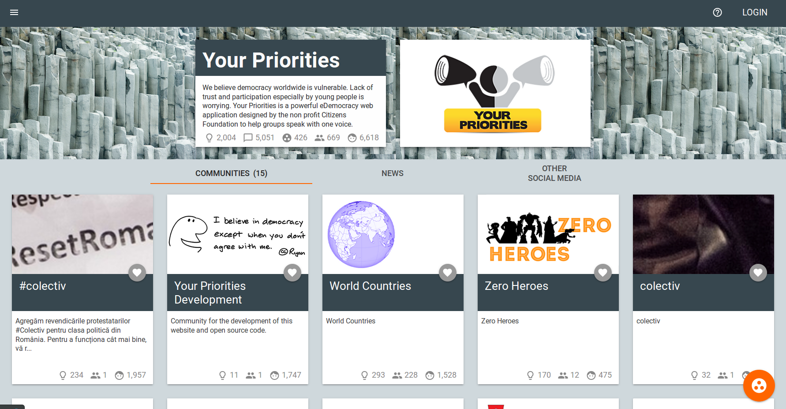

**Figura H.1.7.1: **Portada 

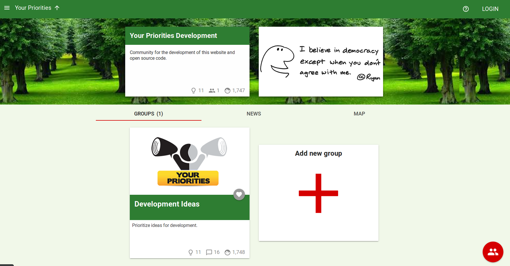

**Figura H.1.7.2: **Página de Comunidad

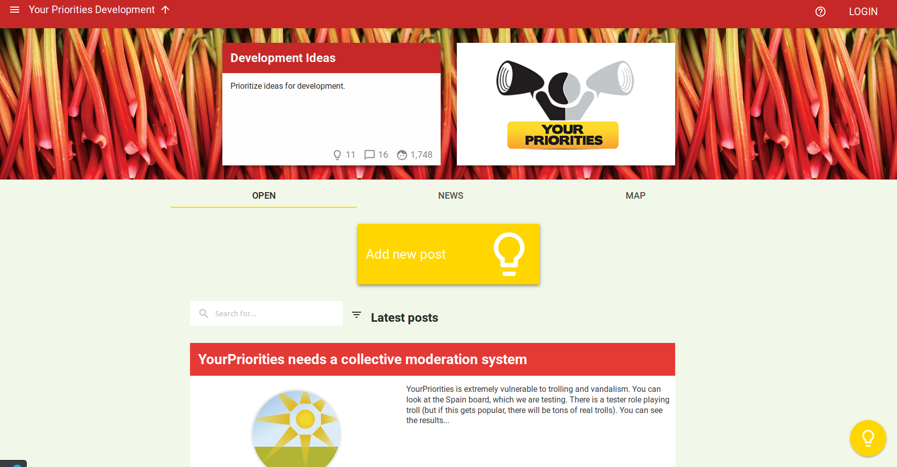

**Figura H.1.7.3: **Página de Grupo

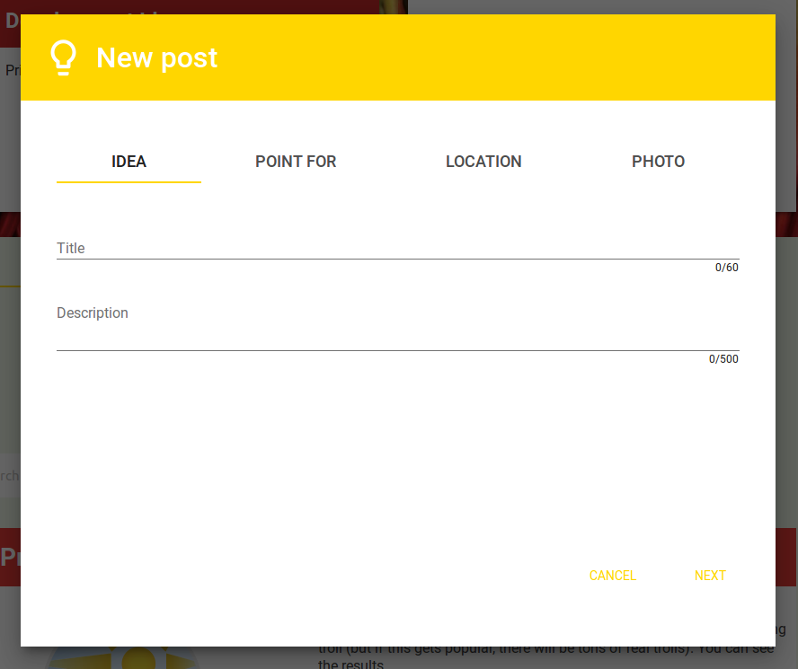

**Figura H.1.7.4: **Formulario de creación de Idea

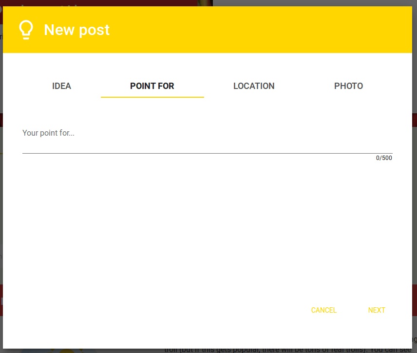

**Figura H.1.7.5:** Formulario de creación de idea (Punto a favor)

**Figura H.1.7.6: **Formulario de creación de Idea (Geolocalización)

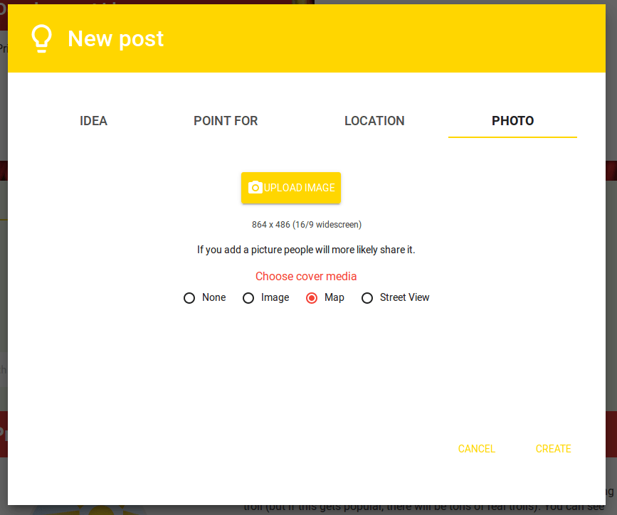

**Figura H.1.7.7: **Formulario de creación de Idea (Foto)

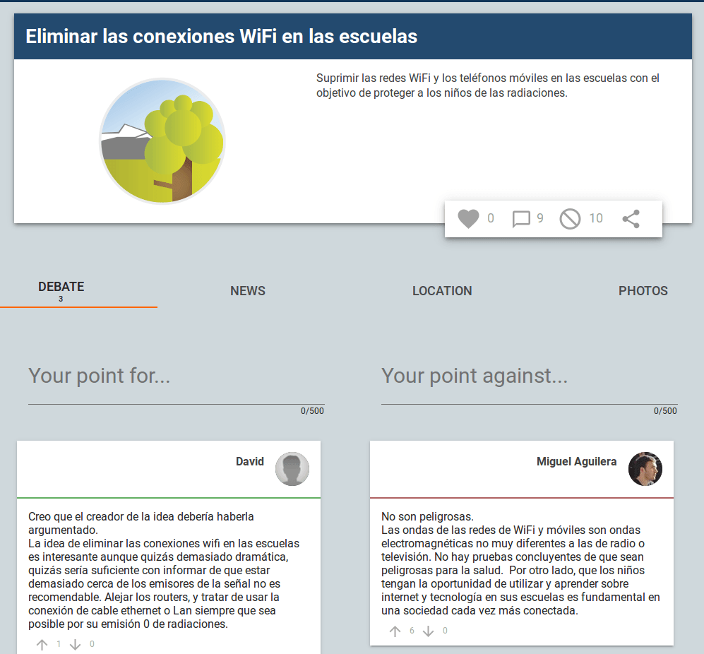

**Figura H.1.7.8: **Página de idea

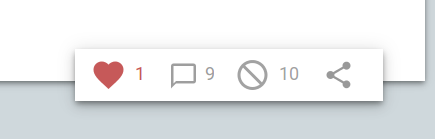

**Figura H.1.7.9: **Detalle de página de idea (voto a favor)

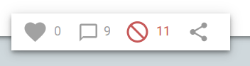

**Figura H.1.7.10:** Detalle de página de idea (voto en contra)

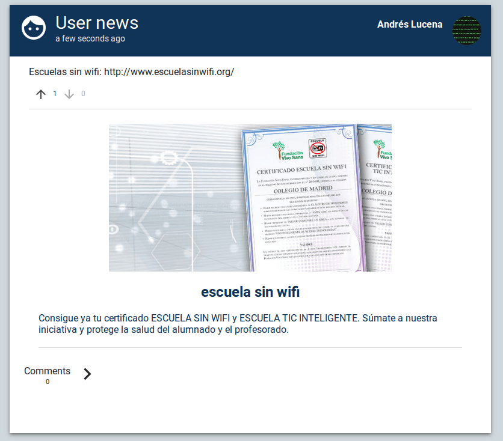

**Figura H.1.7.11: **Página de noticias en ideas

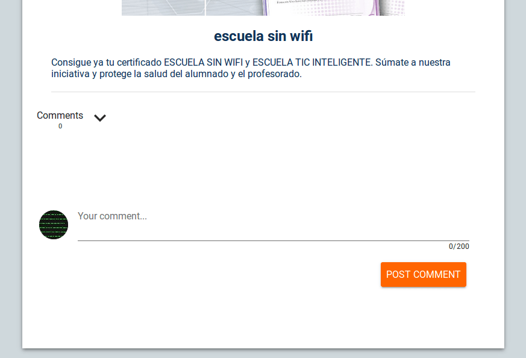

**Figura H.1.7.12: **Página de noticias en ideas, comentarios

**Figura H.1.7.13: **Sección de imágenes en idea

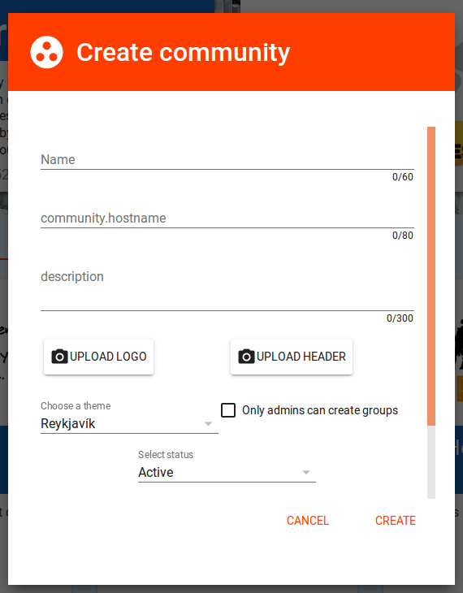

**Figura H.1.7.14: **Formulario de creación de comunidad I

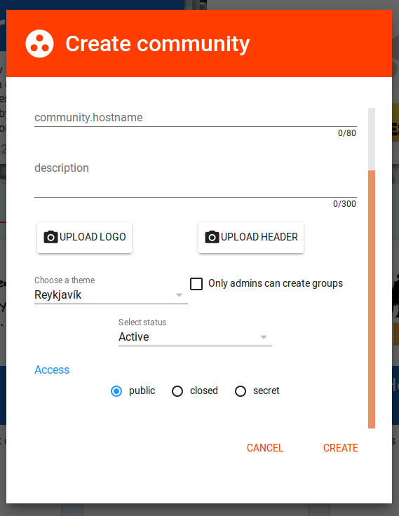

**Figura H.1.7.15: **Formulario de creación de comunidad II

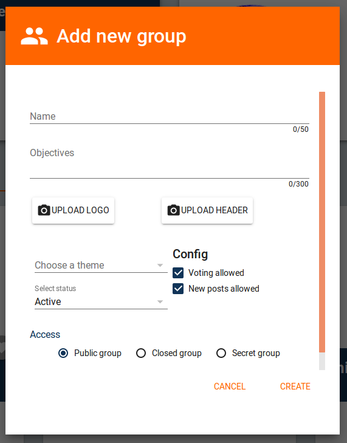

**Figura H.1.7.16: **Formulario de creación de grupo

