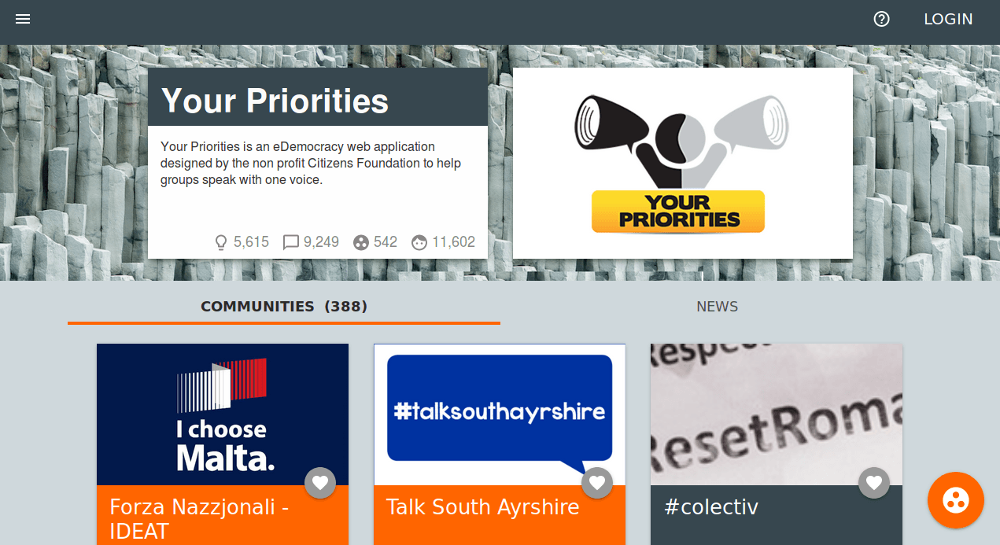

## Anexo H.1 Your Priorities 

### 

**Figura H.1.0:** Portada de [https://yrpri.org/](https://yrpri.org/) 

*Creemos que la democracia en todo el mundo es vulnerable. La falta de confianza y participación especialmente por la gente joven es preocupante. Your Priorities es una aplicación web de Democracia por Internet diseñado por la organización sin ánimo de lucro Citizens Foundation para ayudar a los grupos a hablar con una voz.*[^1]

[^1]: Traducido de https://github.com/rbjarnason/your-priorities/blob/master/app/views/home/world.html.haml
Texto original: We believe democracy worldwide is vulnerable. Lack of trust and participation especially by young people is worrying. Your Priorities is a powerful eDemocracy web application designed by the non profit Citizens Foundation to help groups speak with one voice.

