## Anexo H.1 Your Priorities 

### 

**Figura H.1.0: **Portada de [https://yrpri.org/](https://yrpri.org/) 

*Creemos que la democracia en todo el mundo es vulnerable. La falta de confianza y participación especialmente por la gente joven es preocupante. Your Priorities es una aplicación web de Democracia por Internet diseñado por la organización sin ánimo de lucro Citizens Foundation para ayudar a los grupos a hablar con una voz. * (NOTE:  Traducido de https://github.com/rbjarnason/your-priorities/blob/master/app/views/home/world.html.haml 
Texto original: We believe democracy worldwide is vulnerable. Lack of trust and participation especially by young people is worrying. Your Priorities is a powerful eDemocracy web application designed by the non profit Citizens Foundation to help groups speak with one voice.)

### H.1.1 Metadatos

<table>
  <tr>
    <td>Nombre</td>
    <td>Your Priorities</td>
  </tr>
  <tr>
    <td>URL</td>
    <td>https://yrpri.org/ </td>
  </tr>
  <tr>
    <td>URL repositorio</td>
    <td>https://github.com/rbjarnason/your-priorities-app/ </td>
  </tr>
  <tr>
    <td>Resumen (Inglés)</td>
    <td>Citizens participation application</td>
  </tr>
  <tr>
    <td>Resumen (Castellano)</td>
    <td>Aplicación para la participación ciudadana</td>
  </tr>
  <tr>
    <td>Lenguaje</td>
    <td>Javascript</td>
  </tr>
  <tr>
    <td>Framework</td>
    <td>Node.js</td>
  </tr>
  <tr>
    <td>Fecha primer commit</td>
    <td>Agosto de 2014</td>
  </tr>
  <tr>
    <td>Versión analizada</td>
    <td>No aplica</td>
  </tr>
  <tr>
    <td>Nº de tablas en la BBDD</td>
    <td>No aplica</td>
  </tr>
  <tr>
    <td>Nº de contribuidores</td>
    <td>2</td>
  </tr>
  <tr>
    <td>Nº de stars</td>
    <td>19</td>
  </tr>
  <tr>
    <td>Licencia</td>
    <td>BSD</td>
  </tr>
  <tr>
    <td>Mantenido</td>
    <td>Sí</td>
  </tr>
  <tr>
    <td>Diseño responsivo</td>
    <td>Sí</td>
  </tr>
</table>

 

### H.1.2 Funcionalidades 

* Permite que los usuarios creen una Idea, y se debata con puntos a favor y en contra. Cada idea y argumentos puede votarse de forma positiva o negativa.

* Los usuarios pueden agregar noticias a una Idea, y estas a su vez pueden votarse de forma positiva o negativa.

* Una Idea puede tener una localización y múltiples fotos.

* Permite tener distintas comunidades en la misma instalación y que estas a su vez tengan grupos.

* Permite controlar la granularidad de notificaciones: si se quiere recibir avisos de actualizaciones en los posts que ha creado el usuario, que ha dado al like (me gusta), en los argumentos o puntos que ha creado, así como la frecuencia de cada una. También permite recibir notificaciones para las comunidades o grupos a los que pertenece el usuario.

### H.1.3 Análisis

Cuenta con un mecanismo de Machine Learning (Aprendizaje Automático) para recomendar contenido a los usuarios. 

Se lleva utilizando en sus múltiples versiones desde el 2011 en Reykjavik, Islandia, donde las propuestas más votadas son llevadas a la administración. De las 257 ideas presentadas se han aceptado 165.  (NOTE:  http://www.citizens.is/portfolio/better-reykjavik-connects-citizens-and-administration-all-year-round/ )

Se ha utilizado en el 2013 en Estonia, donde en 3000 personas en tres semanas han hecho 2000 propuestas, de las cuales las 15 mejor valoradas se han presentado al Parlamento, de las cuales 7 han sido adoptadas como leyes (3 sin modificaciones y 4 modificadas o combinadas con otras leyes).  (NOTE:  http://www.citizens.is/portfolio/estonian-laws-changed/ )

Se ha utilizado por el Servicio Nacional de Salud (NHS) del Reino Unido para involucrar a los ciudadanos y ayudar a la gente a identificar y discutir asuntos que el NHS debería estar hablando.  (NOTE:  http://www.citizens.is/portfolio/national-health-service-nhs/)

Forma parte del proyecto europeo d-cent, que ha desarrollado la "nueva generación de herramientas de código abierto, distribuidas y conscientes con la privacidad para la democracia directa y empoderamiento económico"  (NOTE:  “A Europe-wide project developing the next generation of open source, distributed, and privacy-aware tools for direct democracy and economic empowerment.” - http://dcentproject.eu/ ). 

Al ser una dinámica de propuestas que ya se cuentan en decidim, se recomienda estudiar algunas dinámicas y funcionalidades interesantes, como los argumentos a favor y en contra, noticias, fotos, geolocalización, etc. 

### H.1.4 Arquitectura

Se trata de una aplicación web hecha con nodeJS y el framework javascript para frontend Polymer.

Esta se trata de la tercera versión: 

* **Open Active Democracy** (NOTE:  https://github.com/rbjarnason/open-active-democracy ): de 2009 a 2012. Hecha con Ruby on Rails. 

* **Your Priorities** (NOTE:  https://github.com/rbjarnason/your-priorities ): de 2013 a 2016. Hecha con Ruby on Rails. 

* **Your Priorities App** (NOTE:  https://github.com/rbjarnason/your-priorities-app/ ): desde 2016. Hecha con NodeJS. 

A nivel de documentación no cuenta con una explicación exhaustiva de cómo proceder con la instalación inicial. Siguiendo los pasos detallados en el fichero README del proyecto (NOTE:  https://github.com/rbjarnason/your-priorities-app/ ), se concluye la instalación con el siguiente mensaje de error:  

*$ ./start*

*(...)*

* at Function.Promise.bind (/home/ubuntu/your-priorities-app/node_modules/bluebird/js/release/bind.js:65:20)*

*Executing (default): SELECT "id", "name", "hostname", "access", "deleted", "default_locale", "google_analytics_code", "description", "website", "ip_address", "user_agent", "weight", "status", "counter_posts", "counter_points", "counter_groups", "counter_users", "counter_organizations", "only_admins_can_create_groups", "theme_id", "other_social_media_info", "configuration", "created_at", "updated_at", "domain_id", "user_id" FROM "communities" AS "Community" WHERE "Community"."hostname" = 'yrpri.compas' AND "Community"."deleted" = false LIMIT 1;*

*[2017-08-30T16:27:16.309Z]  WARN: your-priorities/1523 on dev-yourpriorities:*

*	Cant find community { user: null,*

*  	context: 'setYpCommunity',*

*  	err: 'Community not found',*

*  	errorStatus: 404 }*

Al no conseguir instalarlo en un servidor propio y no contar con documentación que recomiende un proceso de despliegue, no se ha podido instalar y analizar la arquitectura del aplicativo.

### H.1.5 Modelo de datos

Al no conseguir instalarlo en un servidor propio y no contar con documentación que recomiende un proceso de despliegue, no se ha podido instalar y estudiar los modelos de datos del aplicativo. 

### H.1.6 Conclusiones

No se recomienda su uso fuera de la plataforma pública principal, ya que no cuenta con forma documentada de realizar personalizaciones, así como tampoco cuenta con una comunidad amplia de desarrolladores ni otras instalaciones conocidas actualmente. 

### H.1.7 Capturas de pantallas 

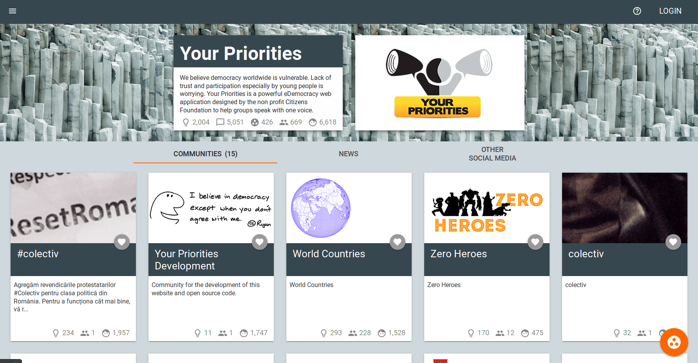

**Figura H.1.7.1: **Portada 

**Figura H.1.7.2: **Página de Comunidad

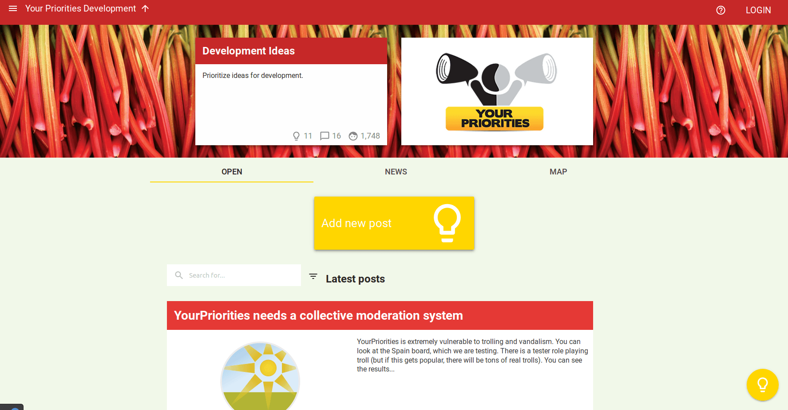

**Figura H.1.7.3: **Página de Grupo

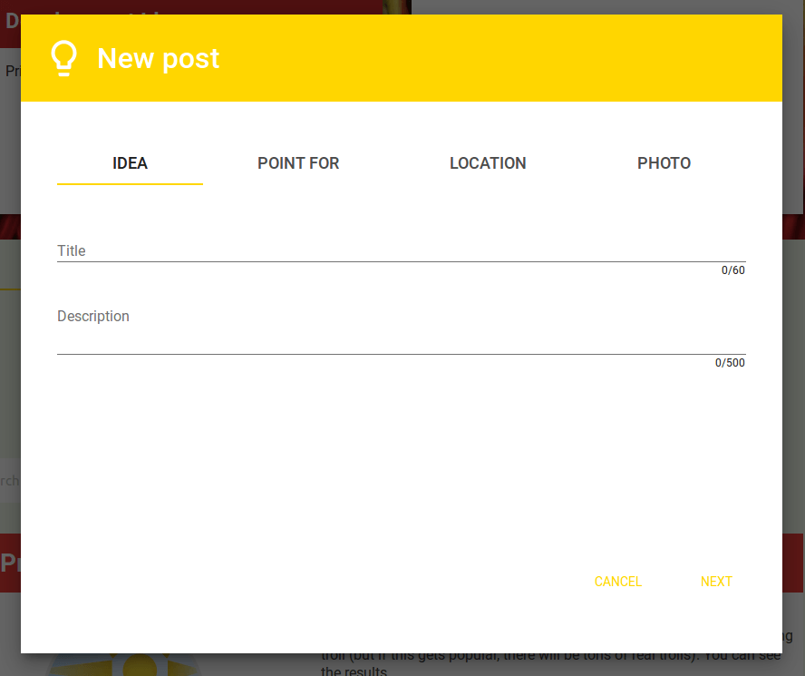

**Figura H.1.7.4: **Formulario de creación de Idea

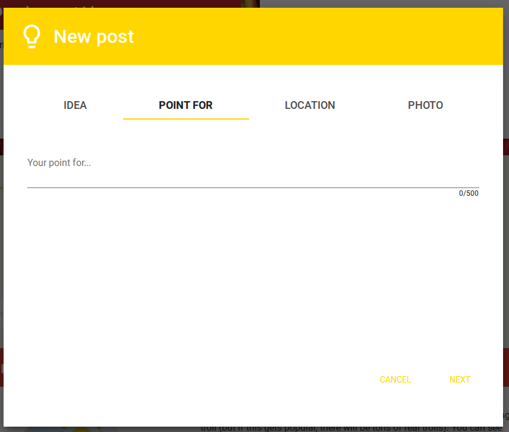

**Figura H.1.7.5:** Formulario de creación de idea (Punto a favor)

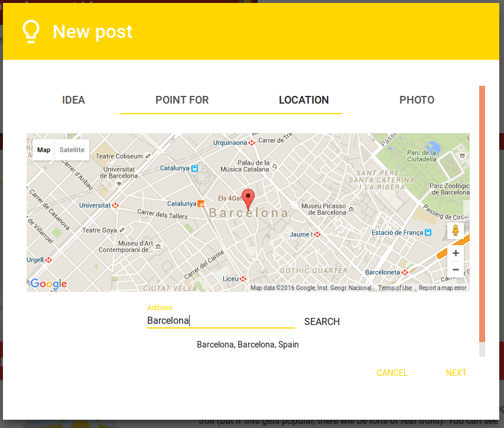

**Figura H.1.7.6: **Formulario de creación de Idea (Geolocalización)

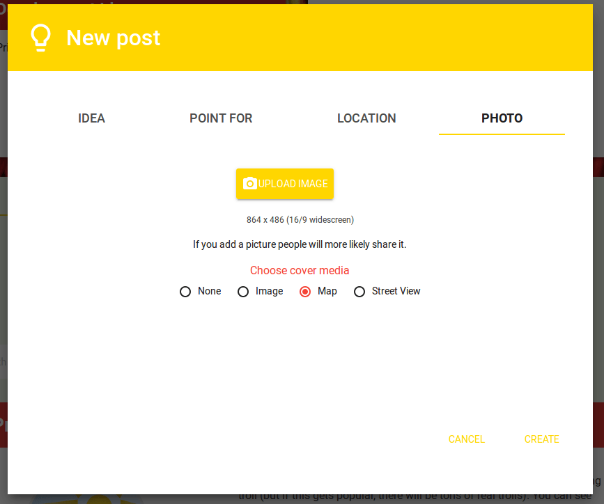

**Figura H.1.7.7: **Formulario de creación de Idea (Foto)

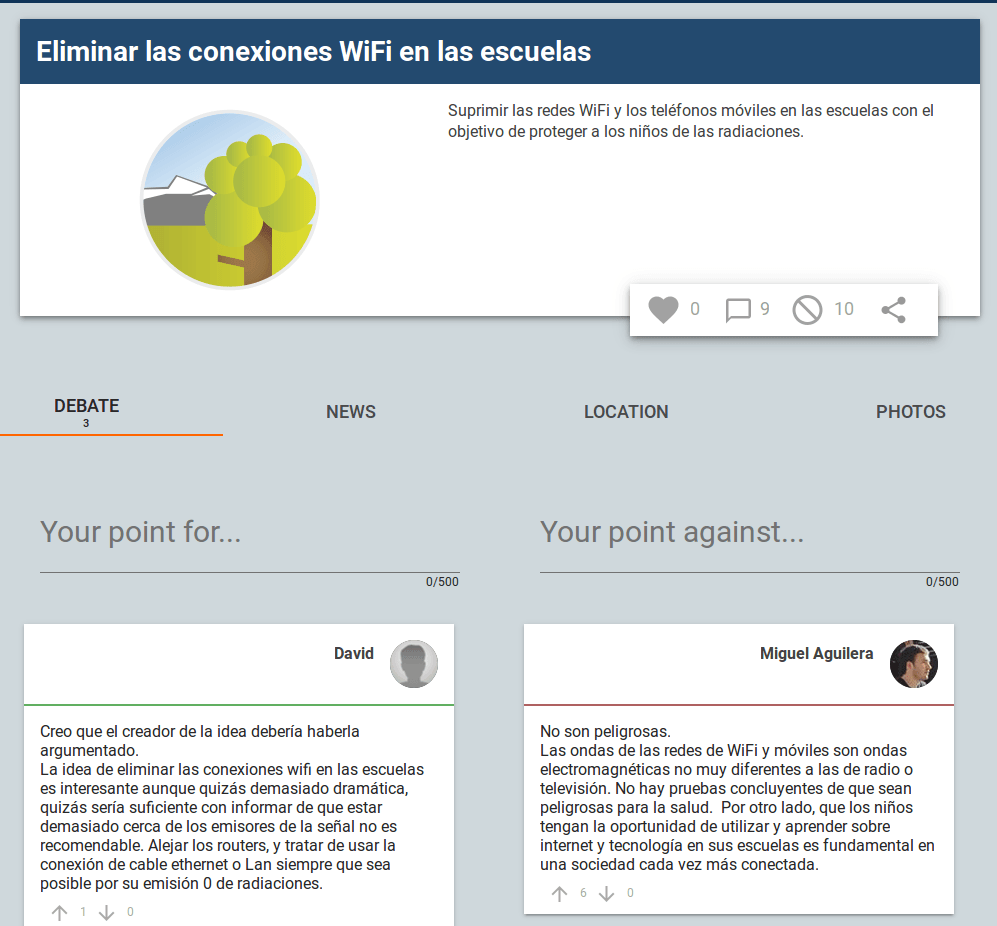

**Figura H.1.7.8: **Página de idea

**Figura H.1.7.9: **Detalle de página de idea (voto a favor)

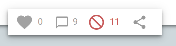

**Figura H.1.7.10:** Detalle de página de idea (voto en contra)

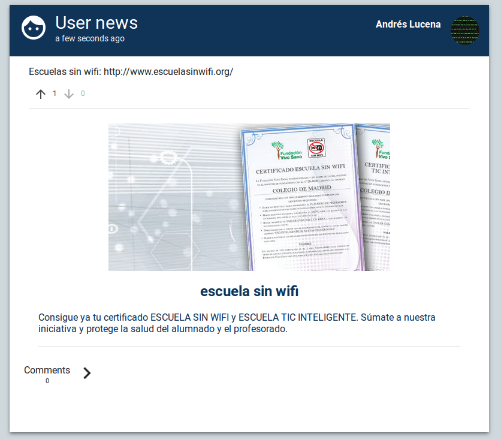

**Figura H.1.7.11: **Página de noticias en ideas

**Figura H.1.7.12: **Página de noticias en ideas, comentarios

**Figura H.1.7.13: **Sección de imágenes en idea

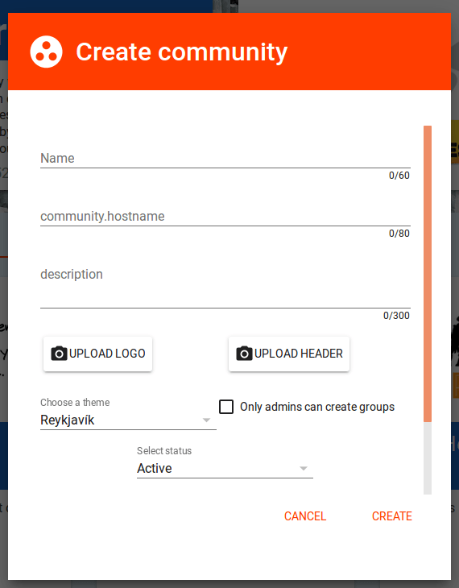

**Figura H.1.7.14: **Formulario de creación de comunidad I

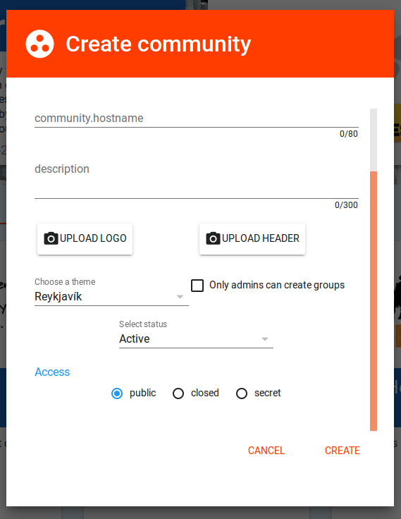

**Figura H.1.7.15: **Formulario de creación de comunidad II

**Figura H.1.7.16: **Formulario de creación de grupo

