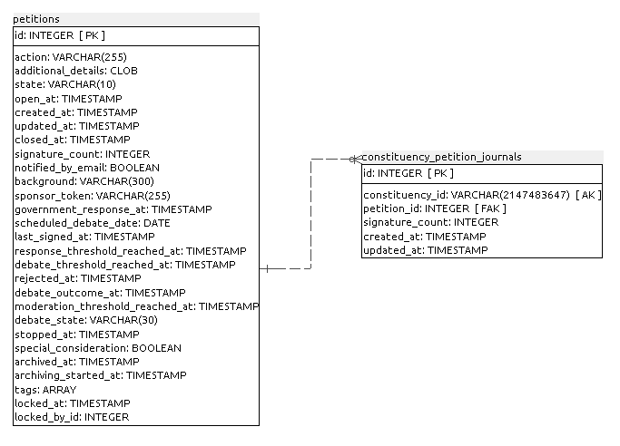
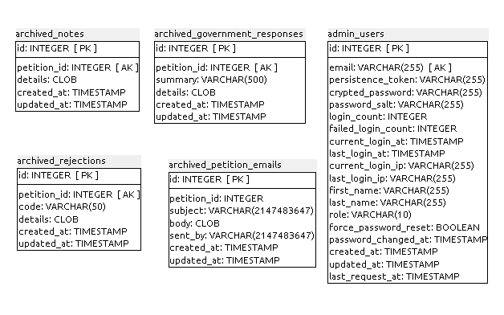
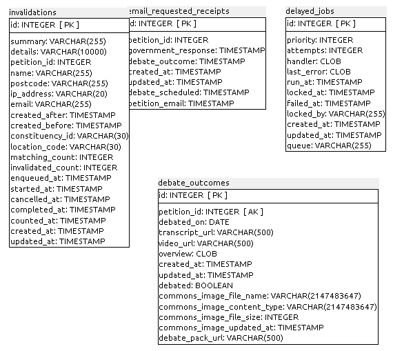
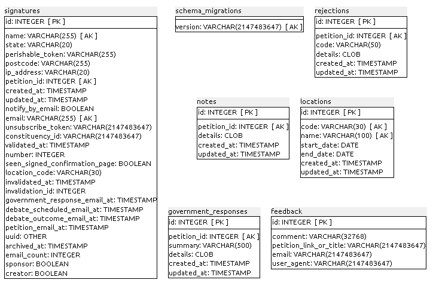
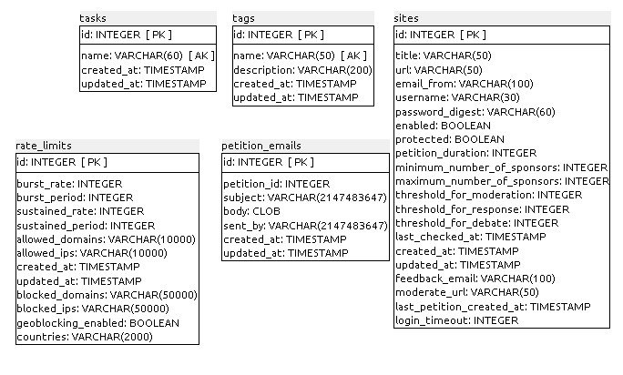
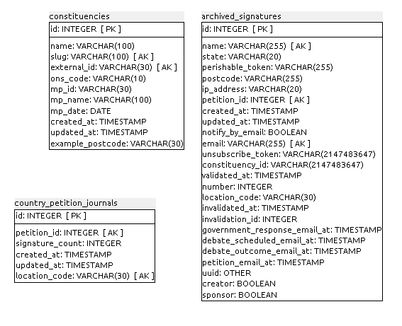
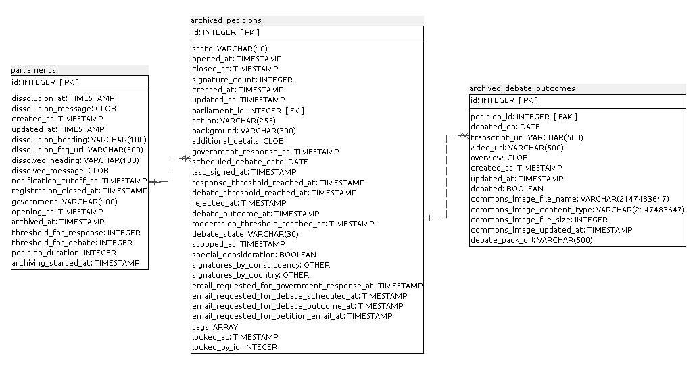

### H.2.5 Modelo de datos

#### H.2.5.1 Modelos relevantes

Los modelos relevantes son Petitions y Signatures. 

#### H.2.5.2 Tablas

Cuenta con 29 tablas:

* admin_users              	 

* archived_debate_outcomes 	 

* archived_government_responses

* archived_notes           	 

* archived_petition_emails 	 

* archived_petitions       	 

* archived_rejections      	 

* archived_signatures      	 

* constituencies           	 

* constituency_petition_journals

* country_petition_journals	 

* debate_outcomes          	 

* delayed_jobs             	 

* email_requested_receipts 	 

* feedback                 	 

* government_responses     	 

* invalidations            	 

* locations                	 

* notes                    	 

* parliaments              	 

* petition_emails          	 

* petitions                	 

* rate_limits              	 

* rejections               	 

* schema_migrations        	 

* signatures               	 

* sites                    	 

* tags                     	 

* tasks                    	 

#### H.2.5.3 Gráficos UML

**Figura H.2.5.1:** Tablas de la base de datos de e-petitions (gov.uk)

**Figura H.2.5.2:** Tablas de la base de datos de e-petitions (gov.uk)

**Figura H.2.5.3:** Tablas de la base de datos de e-petitions (gov.uk)

**Figura H.2.5.4:** Tablas de la base de datos de e-petitions (gov.uk)

**Figura H.2.43:** Tablas de la base de datos de e-petitions (gov.uk)

**Figura H.2.44:** Tablas de la base de datos de e-petitions (gov.uk)

**Figura H.2.45:** Tablas de la base de datos de e-petitions (gov.uk)

