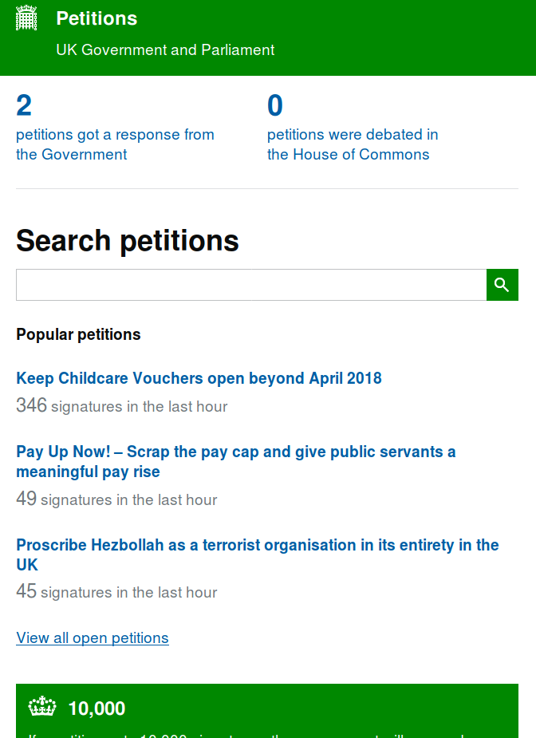

## Anexo H.2 e-petitions (gov.uk)

### 

**Figura H.2.0:** Portada de [https://petition.parliament.uk/](https://petition.parliament.uk/) 

*Crear o firmar una petición que pida un cambio en la ley o en la política gubernamental. Después de 10.000 firmas, las peticiones reciben una respuesta del gobierno. Después de 100.000 firmas, las peticiones se consideran para el debate en el parlamento.* (NOTE:  https://www.gov.uk/petition-government 
Texto original: Create or sign a petition that asks for a change to the law or to government policy. After 10,000 signatures, petitions get a response from the government. After 100,000 signatures, petitions are considered for debate in Parliament.
  )*  *

