## Anexo H.2 e-petitions (gov.uk)

### 

**Figura H.2.0:** Portada de [https://petition.parliament.uk/](https://petition.parliament.uk/) 

*Crear o firmar una petición que pida un cambio en la ley o en la política gubernamental. Después de 10.000 firmas, las peticiones reciben una respuesta del gobierno. Después de 100.000 firmas, las peticiones se consideran para el debate en el parlamento.* (NOTE:  https://www.gov.uk/petition-government 
Texto original: Create or sign a petition that asks for a change to the law or to government policy. After 10,000 signatures, petitions get a response from the government. After 100,000 signatures, petitions are considered for debate in Parliament.
  )*  *

### H.2.1 Metadatos

<table>
  <tr>
    <td>Nombre</td>
    <td>e-petitions</td>
  </tr>
  <tr>
    <td>URL</td>
    <td>https://petition.parliament.uk/ </td>
  </tr>
  <tr>
    <td>URL repositorio</td>
    <td>https://github.com/alphagov/e-petitions </td>
  </tr>
  <tr>
    <td>Resumen (Inglés)</td>
    <td>This is the code base for the UK Government's e-petitions service (https://petition.parliament.uk)</td>
  </tr>
  <tr>
    <td>Resumen (Castellano)</td>
    <td>Este es el código base para el servicio de peticiones electrónicas del Gobierno del Reino Unido (https://petition.parliament.uk)</td>
  </tr>
  <tr>
    <td>Lenguaje</td>
    <td>Ruby</td>
  </tr>
  <tr>
    <td>Framework</td>
    <td>Ruby on Rails</td>
  </tr>
  <tr>
    <td>Fecha primer commit</td>
    <td>Marzo de 2015</td>
  </tr>
  <tr>
    <td>Versión analizada</td>
    <td>1.4.2</td>
  </tr>
  <tr>
    <td>Nº de versiones</td>
    <td>63</td>
  </tr>
  <tr>
    <td>Nº de tablas en la BBDD</td>
    <td>29</td>
  </tr>
  <tr>
    <td>Nº de contribuidores</td>
    <td>29</td>
  </tr>
  <tr>
    <td>Nº de stars</td>
    <td>136</td>
  </tr>
  <tr>
    <td>Licencia</td>
    <td> MIT</td>
  </tr>
  <tr>
    <td>Mantenido</td>
    <td>Sí</td>
  </tr>
  <tr>
    <td>Diseño responsivo</td>
    <td>Sí</td>
  </tr>
</table>

### H.2.2 Funcionalidades 

* Permite a un usuario no registrado crear una petición, sólo facilitando su correo electrónico, nombre, nacionalidad y código postal. 

* Internamente realiza comprobaciones de geolocalización de direcciones IP para comprobar que los usuarios se encuentren en el país requerido por el reglamento (Reino Unido). 

* Permite configurar en el panel de administrador distintas variables (por ejemplo el número mínimo de firmas que debe conseguir una petición para ser elevada al Parlamento) 

* Al crearse una propuesta, la envía por correo electrónico al creador que debe conseguir el apoyo de otras 5 personas para que esta se publique en la web y pueda comenzar a recabar apoyos. 

* Comprueba en el asistente de creación de propuestas si hay propuestas similares a la creada para evitar duplicaciones. 

### H.2.3 Análisis

Hay varias listas de peticiones que permiten ver los distintos estados por los que pueden pasar: 

* Todas las peticiones

* Peticiones abiertas 

* Peticiones cerradas

* Peticiones rechazadas

* A la espera de la respuesta del gobierno

* Respuestas del Gobierno

* En espera de un debate en el Parlamento

* Debatido en el Parlamento

* No debatido en el Parlamento

Es llamativo el sistema de verificación de apoyos, una serie de comprobaciones e invalidaciones que, por ejemplo, permite contabilizar apoyos geolocalizados por rangos de  direcciones IP.

### H.2.4 Arquitectura

Se trata de una arquitectura monolítica hecha con el framework de programación Ruby on Rails. No parece estar pensada para ser extendida por otras entidades que no sean los desarrolladores originales, aunque cuenta con un mínimo de personalización. 

**Figura H.2.4.1:** Arquitectura de servidores de e-petitions (gov.uk)

### H.2.5 Modelo de datos

#### H.2.5.1 Modelos relevantes

Los modelos relevantes son Petitions y Signatures. 

#### H.2.5.2 Tablas

Cuenta con 29 tablas:

* admin_users              	 

* archived_debate_outcomes 	 

* archived_government_responses

* archived_notes           	 

* archived_petition_emails 	 

* archived_petitions       	 

* archived_rejections      	 

* archived_signatures      	 

* constituencies           	 

* constituency_petition_journals

* country_petition_journals	 

* debate_outcomes          	 

* delayed_jobs             	 

* email_requested_receipts 	 

* feedback                 	 

* government_responses     	 

* invalidations            	 

* locations                	 

* notes                    	 

* parliaments              	 

* petition_emails          	 

* petitions                	 

* rate_limits              	 

* rejections               	 

* schema_migrations        	 

* signatures               	 

* sites                    	 

* tags                     	 

* tasks                    	 

#### H.2.5.3 Gráficos UML

**Figura H.2.5.1:** Tablas de la base de datos de e-petitions (gov.uk)

**Figura H.2.5.2:** Tablas de la base de datos de e-petitions (gov.uk)

**Figura H.2.5.3:** Tablas de la base de datos de e-petitions (gov.uk)

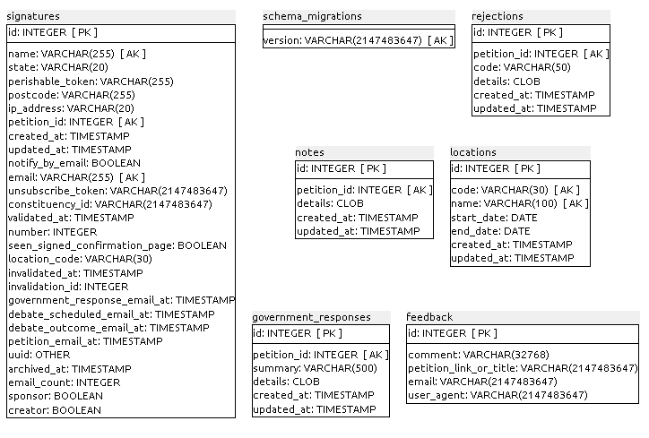

**Figura H.2.5.4:** Tablas de la base de datos de e-petitions (gov.uk)

**Figura H.2.43:** Tablas de la base de datos de e-petitions (gov.uk)

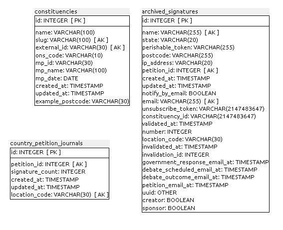

**Figura H.2.44:** Tablas de la base de datos de e-petitions (gov.uk)

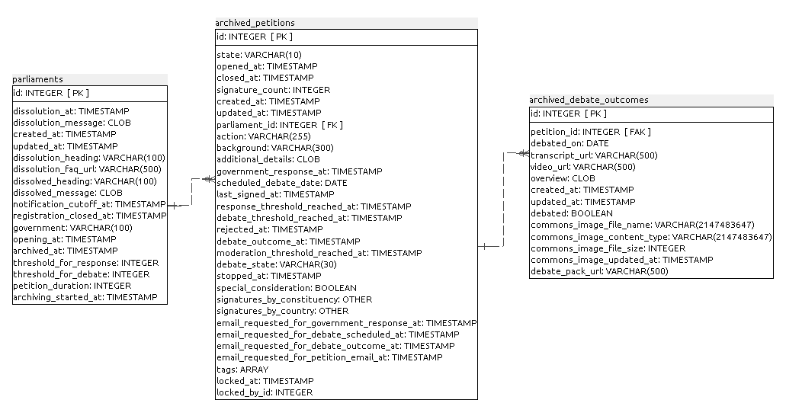

**Figura H.2.45:** Tablas de la base de datos de e-petitions (gov.uk)

### H.2.6 Conclusiones

No se recomienda su uso, al ser un aplicativo cuyo único caso de uso ha sido el parlamento del Reino Unido. Así mismo no cuenta con soporte para personalización a nivel de imagen, ni textos, por lo que su mantenimiento y posterior actualización sería compleja de realizar según transcurran los desarrollos paralelos. 

### H.2.7 Capturas de pantallas 

**Figura H.2.7.1:** Portada

**Figura H.2.7.2:** Formulario de creación de propuestas

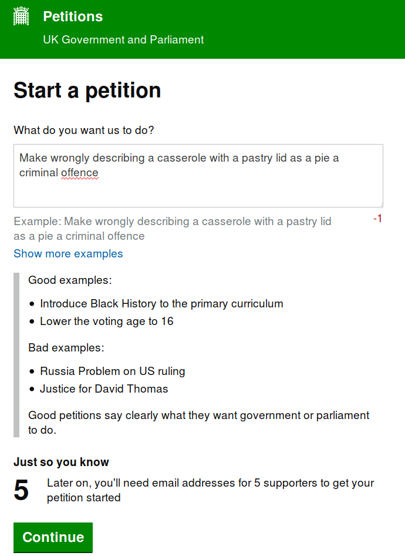

**Figura H.2.7.3:** Explicación de ejemplos de propuestas

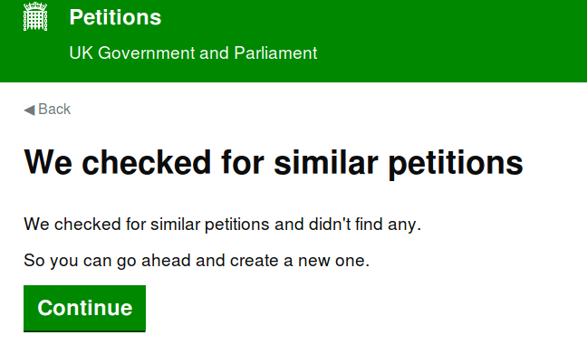

**Figura H.2.7.4:** Búsqueda de propuestas similares

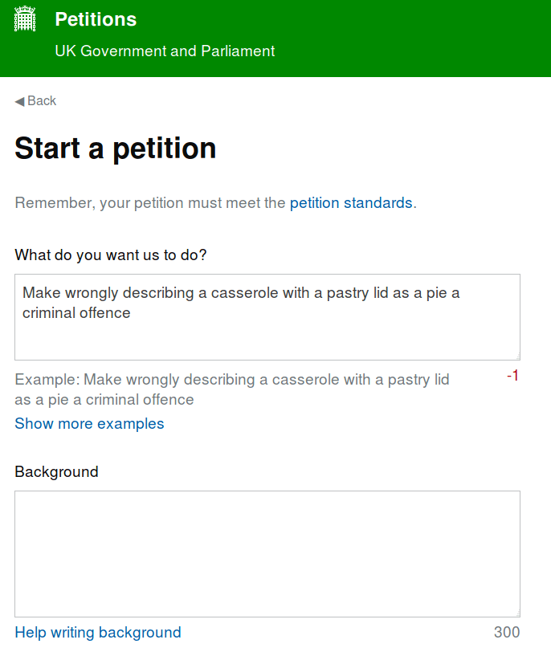

**Figura H.2.7.7.5:** Formulario extendido de creación de propuestas I

**Figura H.2.7.6:** Formulario extendido de creación de propuestas II

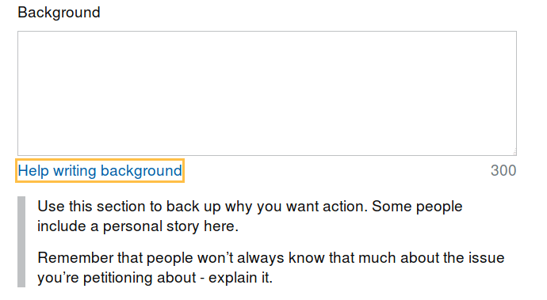

**Figura H.2.7.7:** Formulario extendido de creación de propuestas III (Explicación de antecedentes) 

**Figura H.2.7.8:** Explicación de motivos por el que rechazar una propuesta I

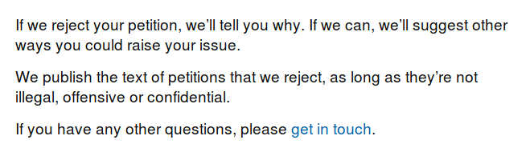

**Figura H.2.7.9:** Explicación de motivos por el que rechazar una propuesta II

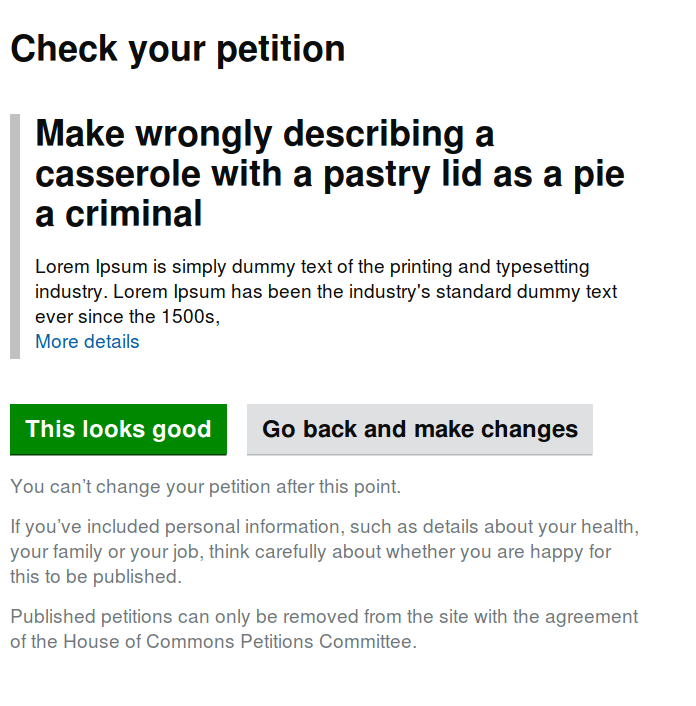

**Figura H.2.7.10:** Borrador de propuesta

**Figura H.2.7.11:** Formulario de apoyo a una propuesta I

**Figura H.2.7.12:** Formulario de apoyo a una propuesta II

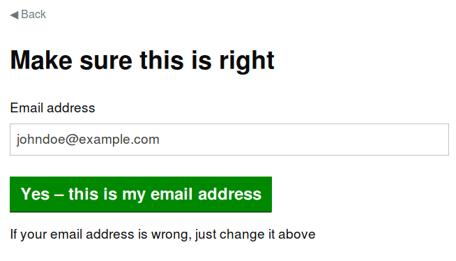

**Figura H.2.7.13:** Formulario de apoyo a una propuesta (comprobación de correo electrónico)

**Figura H.2.7.14:** Mensaje final del proceso de creación de propuestas

Conseguir 5 apoyos más a una propuesta para su publicación

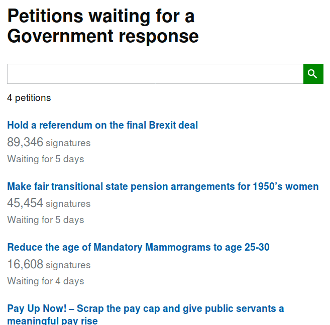

**Figura H.2.7.15:** Peticiones esperando respuesta del Parlamento

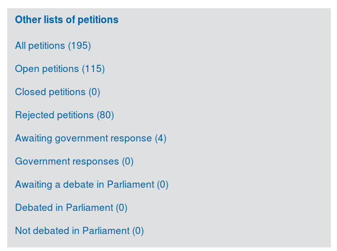

**Figura H.2.7.16:** Otros listados de peticiones

### 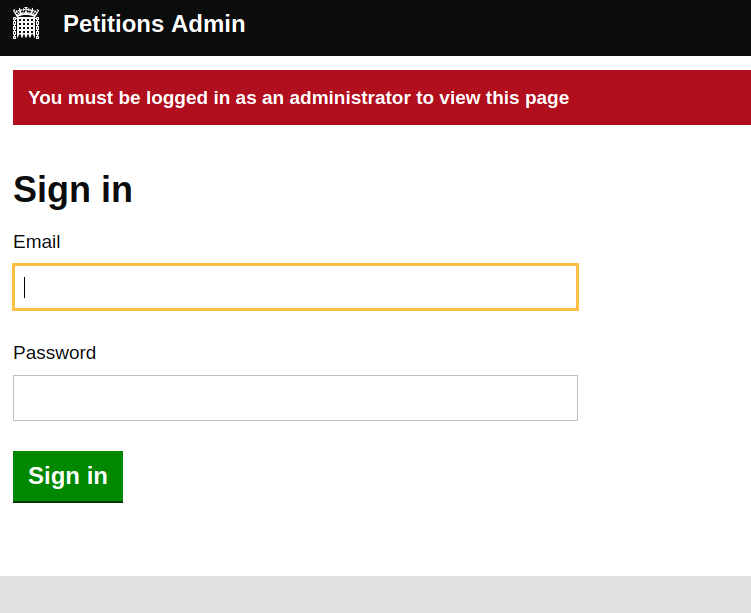

**Figura H.2.7.17:** Administrador: formulario de inicio de sesión

**Figura H.2.7.18:** Administrador: formulario de cambio de contraseña posterior al primer inicio de sesión 

**Figura H.2.7.19:** Administrador: panel de estadísticas 

**Figura H.2.7.20:** Administrador: configuración general del sitio 

**Figura H.2.7.21:** Administrador: configuración general de las peticiones

**Figura H.2.7.22:** Administrador: configuración general de las moderaciones

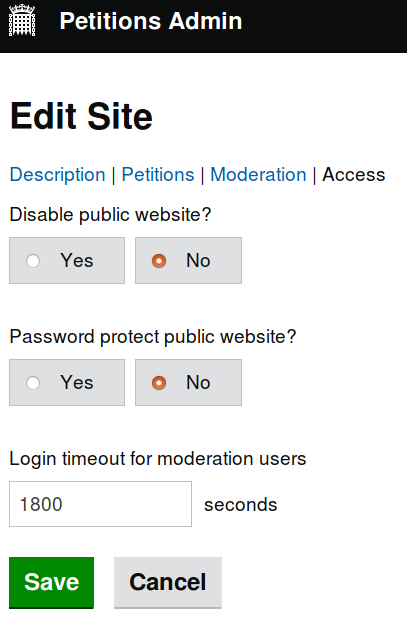

**Figura H.2.7.23:** Administrador: configuración general de los accesos

**Figura H.2.7.24:** Administrador: configuración de inicio y fin de 

periodo de gobierno y disolución de las peticiones I

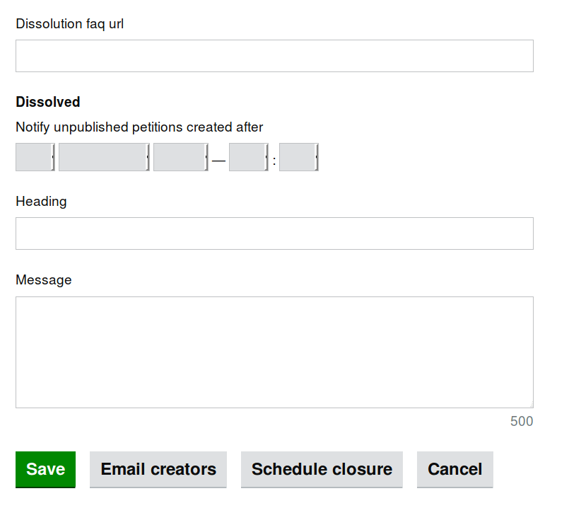

**Figura H.2.7.25:** Administrador: configuración de inicio y fin de 

periodo de gobierno y disolución de las peticiones II

**Figura H.2.7.26:** Administrador: invalidaciones de firmas

**Figura H.2.7.27:** Administrador: formulario de invalidaciones I

**Figura H.2.7.28:** Administrador: formulario de invalidaciones II

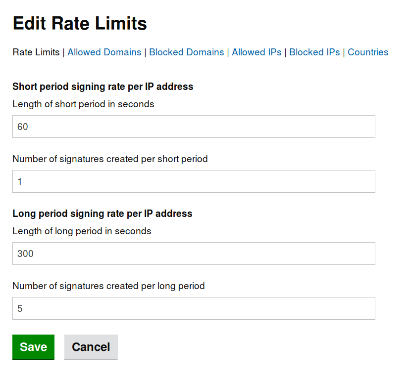

**Figura H.2.7.29:** Administrador: edición de limitaciones de periodos temporales

**Figura H.2.7.30:** Administrador: edición de limitaciones de dominios permitidos

**Figura H.2.7.31:** Administrador: gestión de etiquetas

**Figura H.2.7.32:** Administrador: gestión de usuarios 

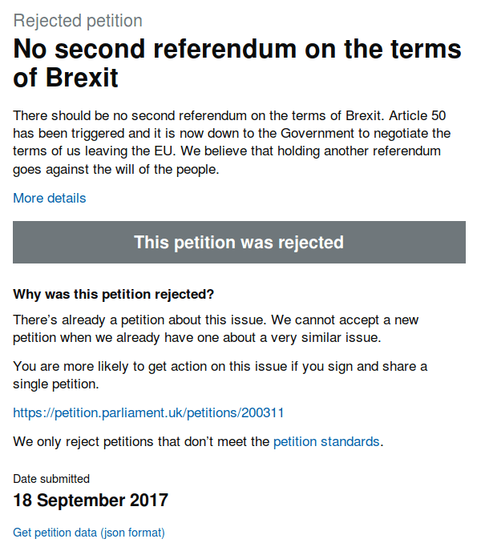

**Figura H.2.7.33:** Ejemplo de petición rechazada

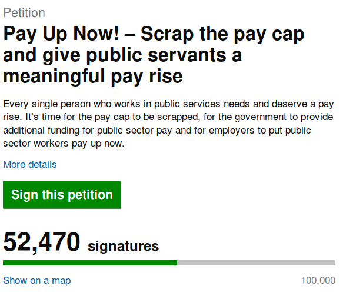

**Figura H.2.7.34:** Ejemplo de petición a firmar I

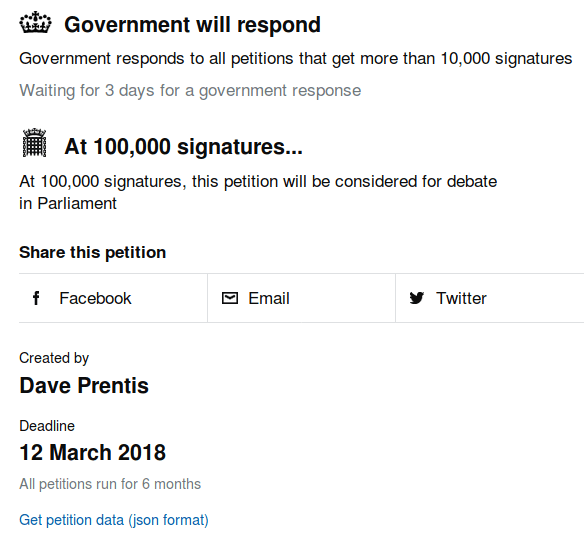

**Figura H.2.7.35:** Ejemplo de petición a firmar II

**Figura H.2.7.36:** Ejemplo de petición archivada I

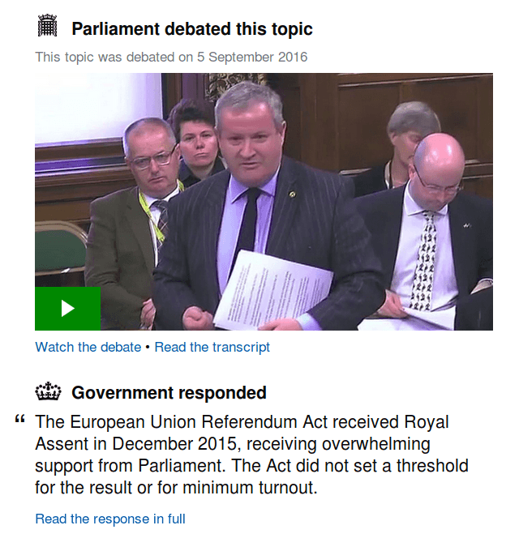.

**Figura H.2.7.37:** Ejemplo de petición archivada II

