### I.1.7 Capturas de pantallas 

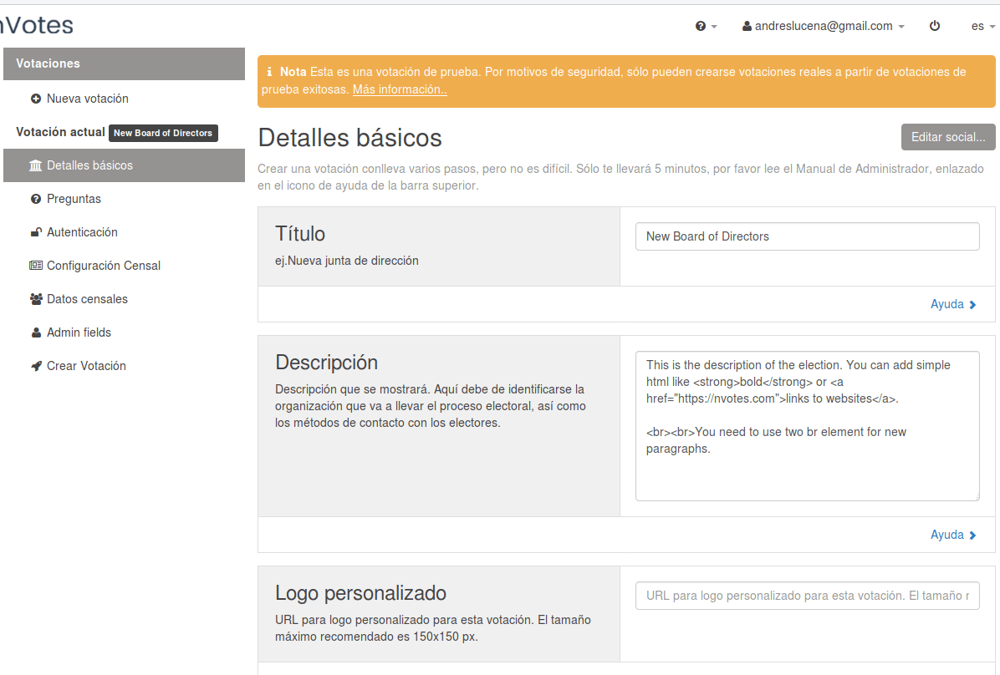

**Figura I.1.7.1:** Administrador: creación de una nueva votación I

**Figura I.1.7.2:** Administrador: creación de una nueva votación II

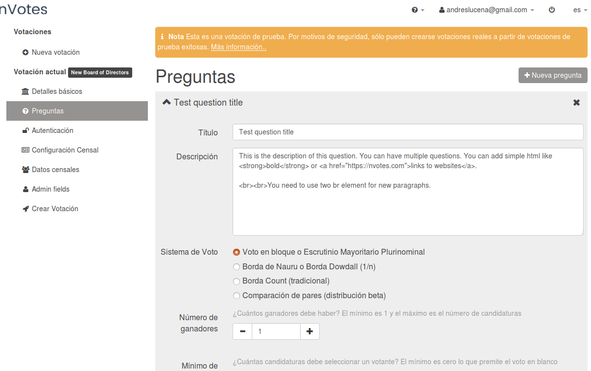

**Figura I.1.7.3:** Administrador: configuración de preguntas I

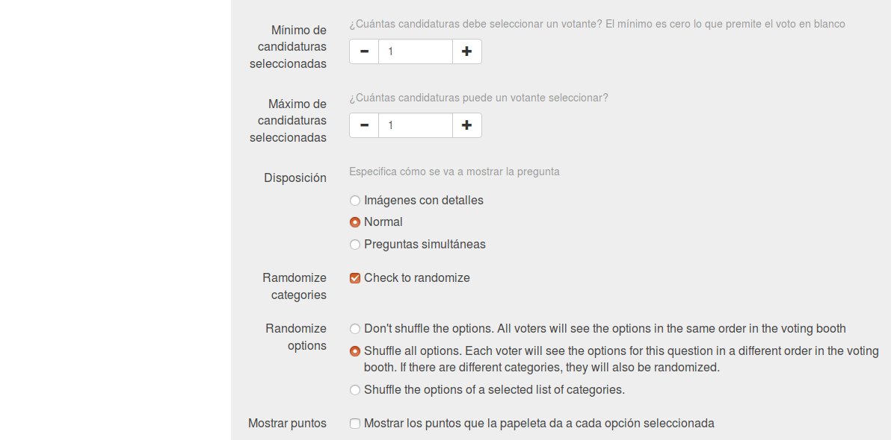

**Figura I.1.7.4:** Administrador: configuración de preguntas II

**Figura I.1.7.5:** Administrador: configuración de preguntas III

**Figura I.1.7.6:** Administrador: configuración de censo de votantes

**Figura I.1.7.7:** Administrador: configuración de registro I

**Figura I.1.7.8:** Administrador: configuración de registro II

**Figura I.1.7.9:** Administrador: gestión de datos censales

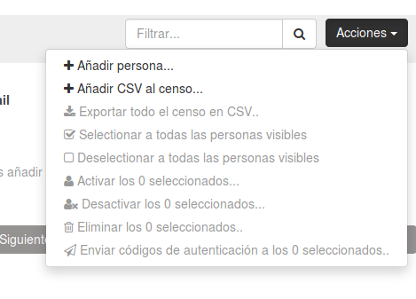

**Figura I.1.7.10:** Administrador: gestión de datos censales (detalle de acciones)

**Figura I.1.7.11:** Administrador: gestión de censo

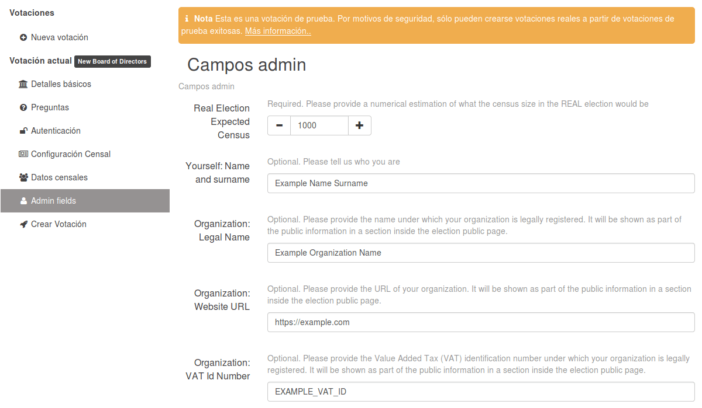

**Figura I.1.7.12:** Administrador: gestión de campos de administrador I

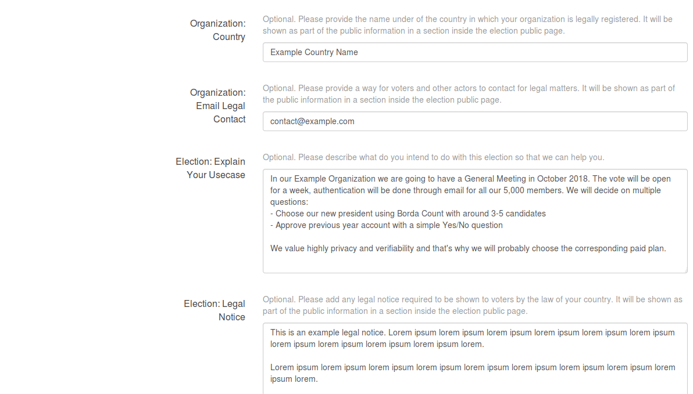

**Figura I.1.7.13:** Administrador: gestión de campos de administrador II

**Figura I.1.7.14:** Administrador: gestión de campos de administrador III

**Figura I.1.7.15:** Administrador: confirmación de configuración de votación

**Figura I.1.7.16:** Administrador: confirmación de configuración de votación

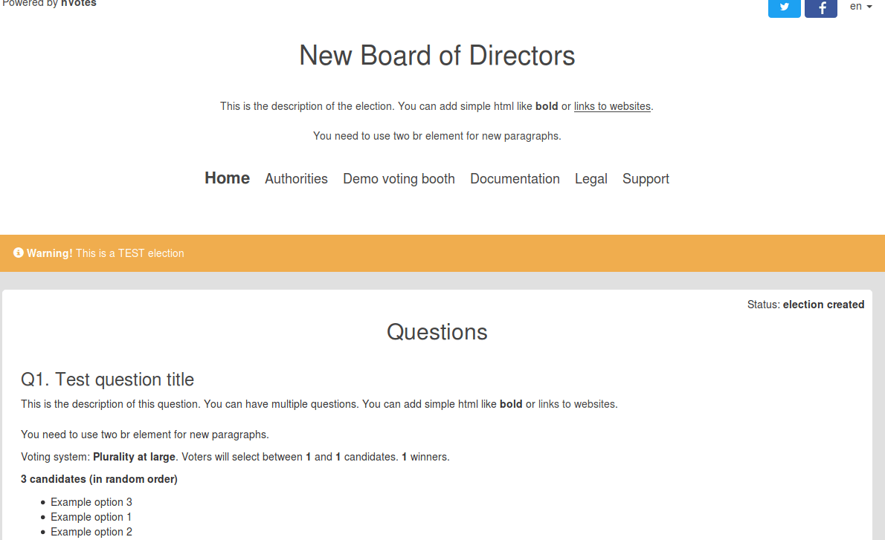

**Figura I.1.7.17:** Administrador: prueba de cabina de votación

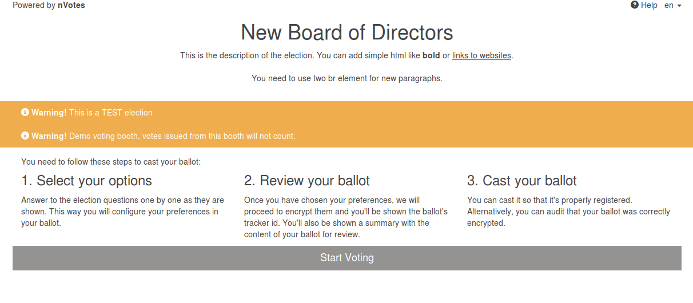

**Figura I.1.7.18:** Cabina de votación, paso I

**Figura I.1.7.19:** Cabina de votación, paso II

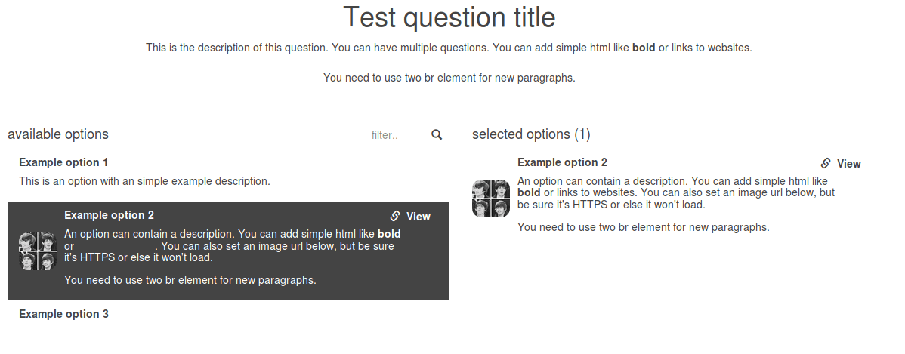

**Figura I.1.7.20:** Cabina de votación, selección de respuesta

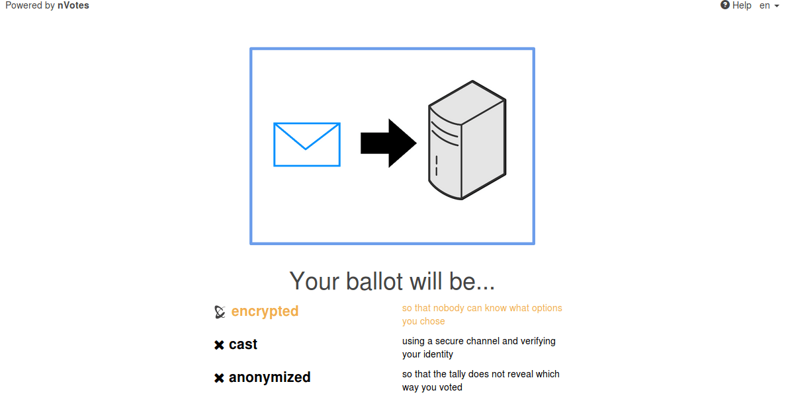

**Figura I.1.7.21:** Cabina de votación, encriptación de respuesta

**Figura I.1.7.22:** Cabina de votación, paso III (confirmación de elección)

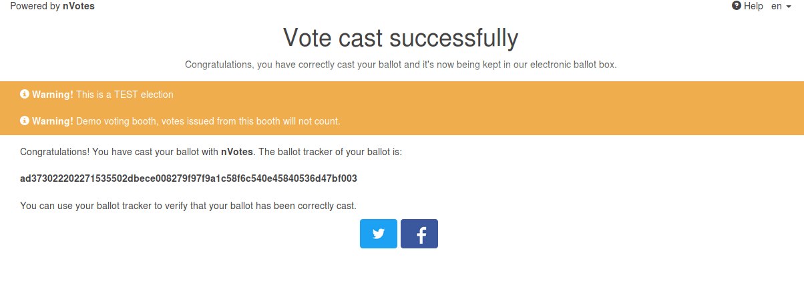

**Figura I.1.7.23:** Cabina de votación, confirmación de voto

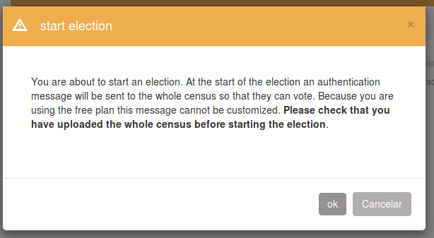

**Figura I.1.7.24:** Administrador: confirmación para comenzar votación

**Figura I.1.7.25:** Administrador: segunda confirmación para comenzar votación

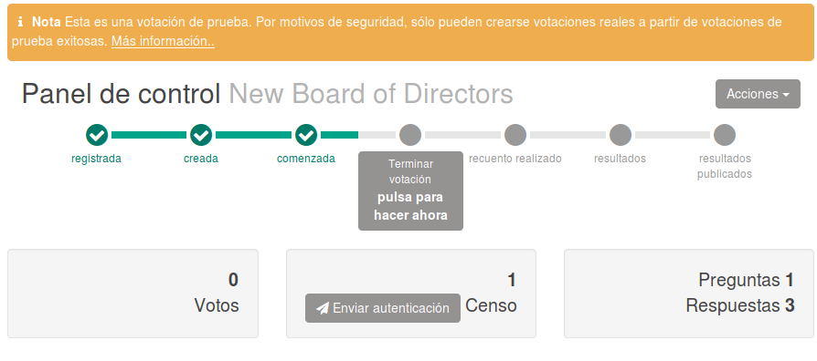

**Figura I.1.7.26:** Administrador: votación en curso

**Figura I.1.7.27:** Información de autoridades

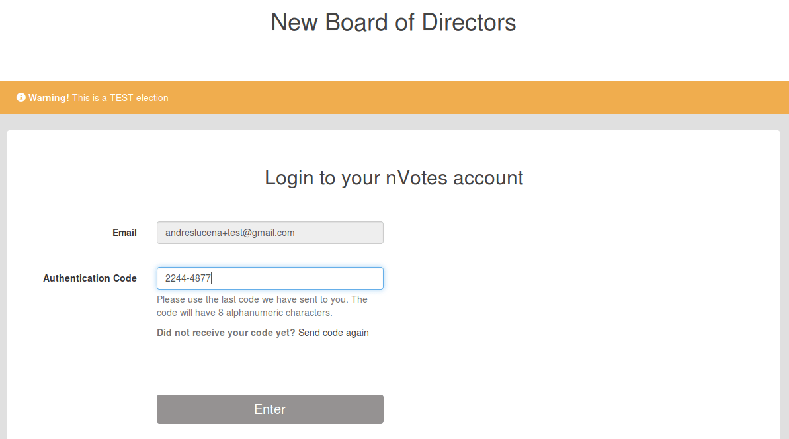

**Figura I.1.7.28:** Cabina de votación: código de confirmación por SMS

**Figura I.1.7.29:** Localizador de papeleta electoral

**Figura I.1.7.30:** Localizador de papeleta electoral (papeleta localizada)

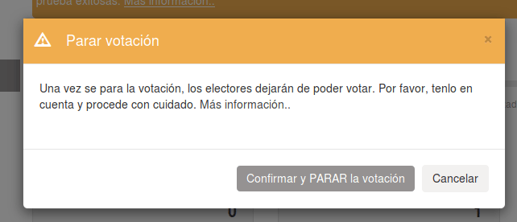

**Figura I.1.7.31:** Administrador: confirmación de parada de votación

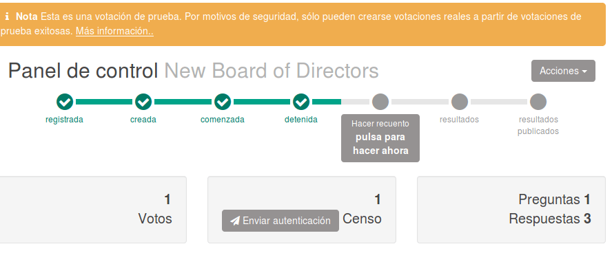

**Figura I.1.7.32:** Administrador: comenzar el recuento de votos

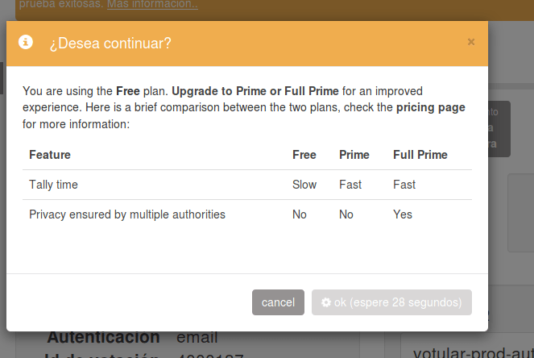

**Figura I.1.7.33:** Administrador: confirmación para comenzar recuento de votos

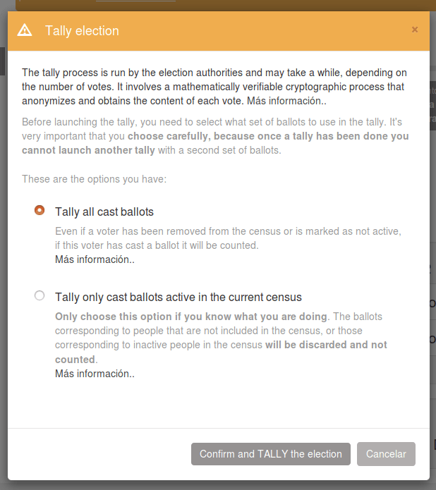

**Figura I.1.7.34:** Administrador: opciones para recuento de votos

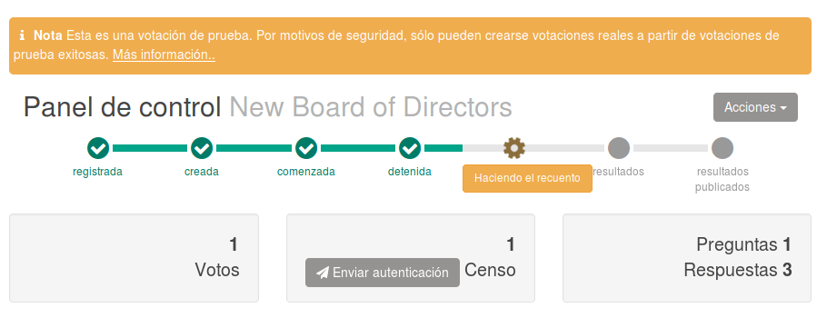

**Figura I.1.7.35:** Administrador: proceso de recuento de votos

**Figura I.1.7.36:** Administrador: fin de la votación

  

