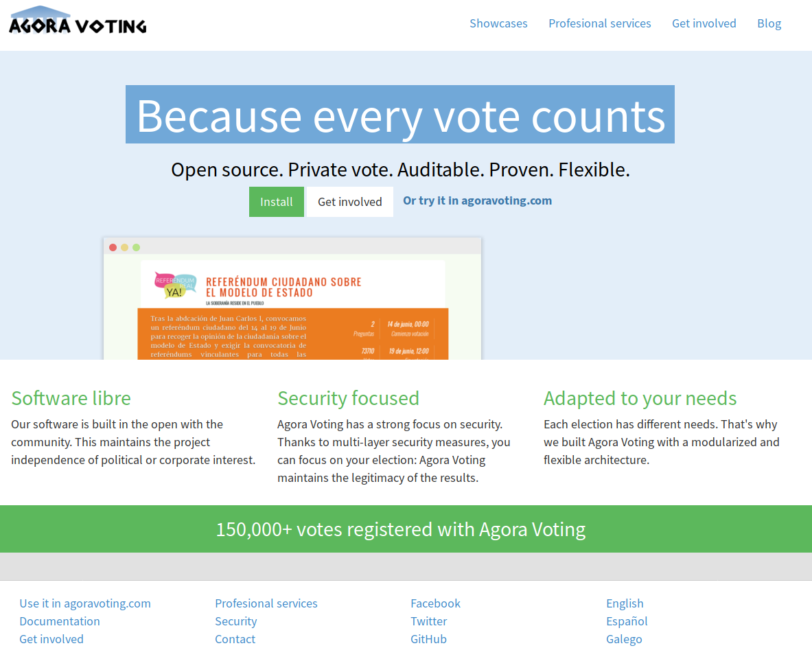

## Anexo I.1 Agora Voting

**Figura I.1.0:** Portada de [http://agoravoting.org](http://agoravoting.org) 

* **_Software libre_**: Nuestro software está construido en abierto con la comunidad. Esto mantiene la independencia del proyecto respecto a cualquier interés político o corporativo.*

* **_Centrado en la seguridad_**: Agora Voting tiene un fuerte enfoque en la seguridad. Gracias a las medidas de seguridad de varias capas, puede centrarse en su elección: Agora Voting mantiene la legitimidad de los resultados.*

* **_Adaptado a sus necesidades_**: Cada elección tiene necesidades diferentes. Es por eso que construimos Agora Voting con una arquitectura modular y flexible.*[^1] 

[^1]: http://agoravoting.org/ 
Texto original: 
Software libre: Our software is built in the open with the community. This maintains the project independence of political or corporate interest.
Security focused: Agora Voting has a strong focus on security. Thanks to multi-layer security measures, you can focus on your election: Agora Voting maintains the legitimacy of the results.
Adapted to your needs: Each election has different needs. That's why we built Agora Voting with a modularized and flexible architecture.

