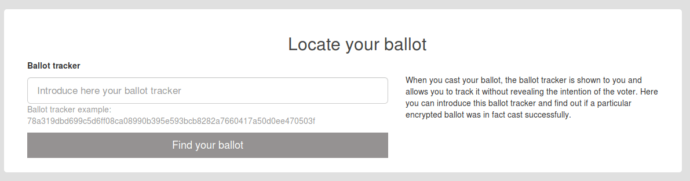

## Anexo I.1 Agora Voting

**Figura I.1.0:** Portada de [http://agoravoting.org](http://agoravoting.org) 

**_Software libre_***: Nuestro software está construido en abierto con la comunidad. Esto mantiene la independencia del proyecto respecto a cualquier interés político o corporativo.*

**_Centrado en la seguridad_***: Agora Voting tiene un fuerte enfoque en la seguridad. Gracias a las medidas de seguridad de varias capas, puede centrarse en su elección: Agora Voting mantiene la legitimidad de los resultados.*

**_Adaptado a sus necesidades_***: Cada elección tiene necesidades diferentes. Es por eso que construimos Agora Voting con una arquitectura modular y flexible.* (NOTE:  http://agoravoting.org/ 
Texto original: 
Software libre: Our software is built in the open with the community. This maintains the project independence of political or corporate interest.
Security focused: Agora Voting has a strong focus on security. Thanks to multi-layer security measures, you can focus on your election: Agora Voting maintains the legitimacy of the results.
Adapted to your needs: Each election has different needs. That's why we built Agora Voting with a modularized and flexible architecture.)

### I.1.1 Metadatos

<table>
  <tr>
    <td>Nombre</td>
    <td>Agora Voting</td>
  </tr>
  <tr>
    <td>URL</td>
    <td>http://agoravoting.org </td>
  </tr>
  <tr>
    <td>URL repositorio</td>
    <td>https://github.com/agoravoting </td>
  </tr>
  <tr>
    <td>Resumen (Inglés)</td>
    <td>Because every vote counts. Open source. Private vote. Auditable. Proven. Flexible.</td>
  </tr>
  <tr>
    <td>Resumen (Castellano)</td>
    <td>Porque cada voto cuenta. Código abierto. Voto privado Auditable. Probado. Flexible.</td>
  </tr>
  <tr>
    <td>Lenguaje</td>
    <td>Javascript</td>
  </tr>
  <tr>
    <td>Framework</td>
    <td>Node.js</td>
  </tr>
  <tr>
    <td>Fecha primer commit</td>
    <td>Octubre de 2015</td>
  </tr>
  <tr>
    <td>Versión analizada</td>
    <td>Disponible en producción a Septiembre de 2017</td>
  </tr>
  <tr>
    <td>Nº de versiones</td>
    <td>12</td>
  </tr>
  <tr>
    <td>Nº de tablas</td>
    <td>No aplica</td>
  </tr>
  <tr>
    <td>Nº de contribuidores</td>
    <td>4</td>
  </tr>
  <tr>
    <td>Nº de stars</td>
    <td>12</td>
  </tr>
  <tr>
    <td>Tablas</td>
    <td>No aplica</td>
  </tr>
  <tr>
    <td>Licencia</td>
    <td> GNU Affero GPL v3</td>
  </tr>
  <tr>
    <td>Mantenido</td>
    <td>Si</td>
  </tr>
  <tr>
    <td>Diseño responsivo</td>
    <td>Sí</td>
  </tr>
</table>

###  I.1.2 Funcionalidades 

* Permite crear una votación con una o más preguntas y con una o más opciones de respuesta por cada pregunta.

* Permite configurar distintas opciones de escrutinio: 

    * Voto en bloque o Escrutinio Mayoritario Plurinacional 

    * Borda de Nauru o Borda Dowdall (1/n) 

    * Borda Count (tradicional) 

    * Comparación de pares 

* Permite configurar un minimo y maximo de candidaturas seleccionadas

* Permite configurar distintas formas de cómo se mostrarán las preguntas: 

    * Imágenes con detalles

    * Normal 

    * Preguntas simultaneas

* Permite mostrar las opciones de respuestas de forma aleatoria, así como las categorías de las preguntas 

* Permite distintas opciones de autenticación: 

    * Correo electrónico

    * SMS 

* Permite personalizar el correo electrónico que se enviará a los votantes para acceder a la votación 

* Permite tener el registro cerrado o abierto: 

    * Cerrado: Censo generado por administradores

    * Abierto: Censo generado por administradores pero permitiendo a los usuarios registrarse para la votación 

* Permite configurar campos extras para el registro de usuario

* Permite gestionar el censo de usuarios 

* Permite añadir a votantes de forma masiva al censo a través de un CSV 

* Permite configurar información del administrador: nombre, URL de su web, número de participantes estimados, país, correo de contacto, texto legal, texto de explicación, texto para soporte 

* Permite duplicar una votación 

* Permite realizar una votación de prueba antes de publicar la votación real. 

* Permite agregar un enlace y una foto a las opciones de respuesta 

* Permite localizar la papeleta  electoral y confirmar que se haya emitido el voto 

### I.1.3 Análisis

Ha sido utilizado por numerosas organizaciones e instituciones públicas, entre ellas: 

* Asociación Profesional de Cuerpos Superiores de Sistemas y Tecnologías de la Información de las Administraciones Públicas.

* Asociación de Cirujanos de España

* Diputación de Barcelona

* Col·legi d'Enginyers Graduats i Enginyers Tècnics Industrials de Barcelona. 

* Eurochild

* Concello de Lugo  

* Ayuntamiento de Madrid 

* Unión de Policía Municipal de Madrid 

* Oak House School

* Som Energia Cooperativa

* SV Norway

* UNED Universidad Nacional de Eduación a Distancia 

### I.1.4 Arquitectura

Aunque el código se haya liberado y cuenta con documentación de cómo trabajar con la herramienta (NOTE:  https://github.com/agoravoting/agora-dev-box/blob/master/doc/devel_deployment.md ), no hemos sido capaces de configurar la aplicación, ya que requiere de muchos recursos, al levantar tres aplicaciones en simultáneo (agora, auth1 y auth2), y tener una dependencia en VirtualBox, un software de gestión de máquinas virtuales, en vez de ser compatible con contenedores virtuales (al estilo de LXC o Docker). 

Al no conseguir instalarlo en un servidor propio y no contar con documentación que recomiende un proceso de despliegue, no se ha podido instalar y analizar la arquitectura del aplicativo. 

 

### I.1.5 Modelo de datos

Al no conseguir instalarlo en un servidor propio y no contar con documentación que recomiende un proceso de despliegue, no se ha podido instalar y estudiar los modelos de datos del aplicativo. 

  

### I.1.6 Conclusiones y recomendaciones

Se recomienda su uso por la cantidad de funcionalidades con las que cuenta así como por la diversidad de métodos de uso e instalación con los que cuenta. 

A nivel de arquitectura, se considera el uso de vagrant para instalar y hacer funcionar la plataforma no apto para poder desplegarse sin inconvenientes en la mayoría de los servidores y ordenadores de desarrolladores, ya que como mínimo se necesitan 4GB de memoria RAM al ser máquinas virtuales que hacen falta configurar utilizando VirtualBox. Se recomienda el uso de tecnologías similares a Docker ya que podría funcionar de forma más ligera. 

### I.1.7 Capturas de pantallas 

**Figura I.1.7.1:** Administrador: creación de una nueva votación I

**Figura I.1.7.2:** Administrador: creación de una nueva votación II

**Figura I.1.7.3:** Administrador: configuración de preguntas I

**Figura I.1.7.4:** Administrador: configuración de preguntas II

**Figura I.1.7.5:** Administrador: configuración de preguntas III

**Figura I.1.7.6:** Administrador: configuración de censo de votantes

**Figura I.1.7.7:** Administrador: configuración de registro I

**Figura I.1.7.8:** Administrador: configuración de registro II

**Figura I.1.7.9:** Administrador: gestión de datos censales

**Figura I.1.7.10:** Administrador: gestión de datos censales (detalle de acciones)

**Figura I.1.7.11:** Administrador: gestión de censo

**Figura I.1.7.12:** Administrador: gestión de campos de administrador I

**Figura I.1.7.13:** Administrador: gestión de campos de administrador II

**Figura I.1.7.14:** Administrador: gestión de campos de administrador III

**Figura I.1.7.15:** Administrador: confirmación de configuración de votación

**Figura I.1.7.16:** Administrador: confirmación de configuración de votación

**Figura I.1.7.17:** Administrador: prueba de cabina de votación

**Figura I.1.7.18:** Cabina de votación, paso I

**Figura I.1.7.19:** Cabina de votación, paso II

**Figura I.1.7.20:** Cabina de votación, selección de respuesta

**Figura I.1.7.21:** Cabina de votación, encriptación de respuesta

**Figura I.1.7.22:** Cabina de votación, paso III (confirmación de elección)

**Figura I.1.7.23:** Cabina de votación, confirmación de voto

**Figura I.1.7.24:** Administrador: confirmación para comenzar votación

**Figura I.1.7.25:** Administrador: segunda confirmación para comenzar votación

**Figura I.1.7.26:** Administrador: votación en curso

**Figura I.1.7.27:** Información de autoridades

**Figura I.1.7.28:** Cabina de votación: código de confirmación por SMS

**Figura I.1.7.29:** Localizador de papeleta electoral

**Figura I.1.7.30:** Localizador de papeleta electoral (papeleta localizada)

**Figura I.1.7.31:** Administrador: confirmación de parada de votación

**Figura I.1.7.32:** Administrador: comenzar el recuento de votos

**Figura I.1.7.33:** Administrador: confirmación para comenzar recuento de votos

**Figura I.1.7.34:** Administrador: opciones para recuento de votos

**Figura I.1.7.35:** Administrador: proceso de recuento de votos

**Figura I.1.7.36:** Administrador: fin de la votación

###  

