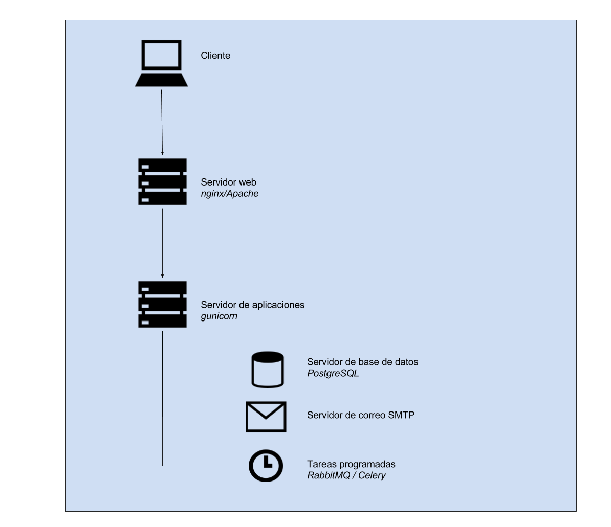

### I.2.4 Arquitectura

Se trata de una aplicación escrita en Python con el framework Django.

No cuenta con soporte de personalización, ni de módulos, ni de localizaciones.  

**Figura I.2.4.1:** Arquitectura de servidores de Helios Voting

