### I.2.7 Capturas de pantallas 

**Figura I.2.7.1:** Portada con sesión iniciada

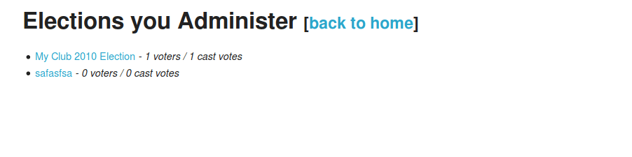

**Figura I.2.7.2:** Listado de elecciones

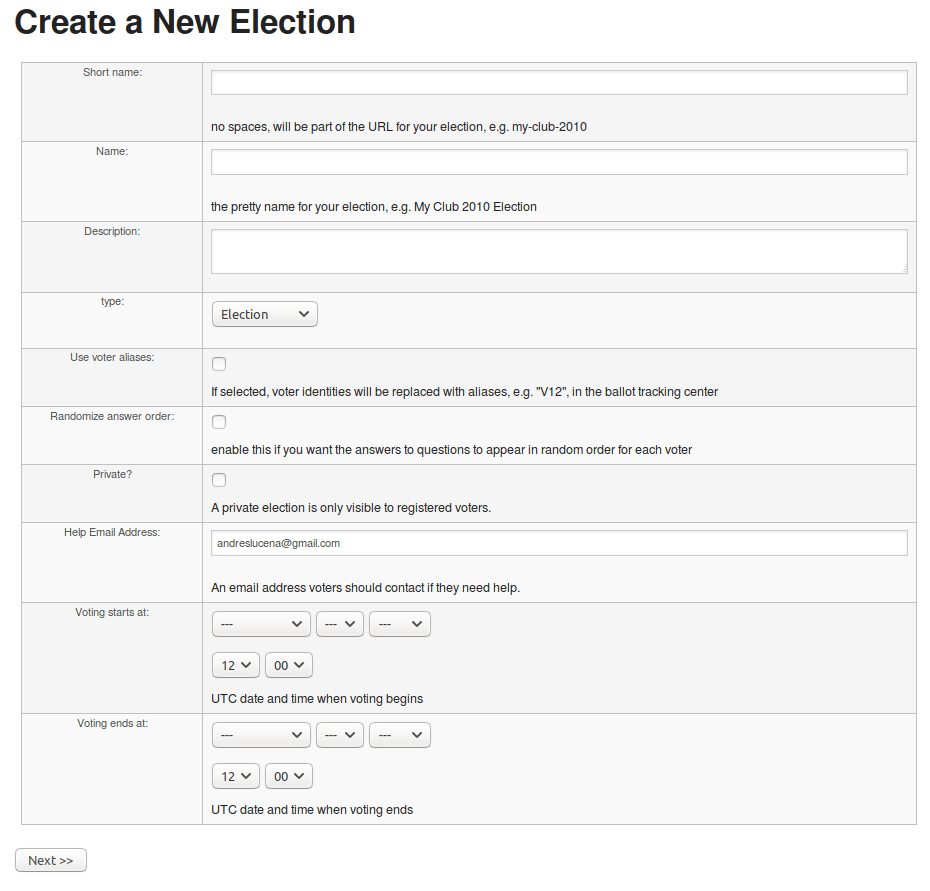

**Figura I.2.7.3:** Administrador: creación de una elección nueva

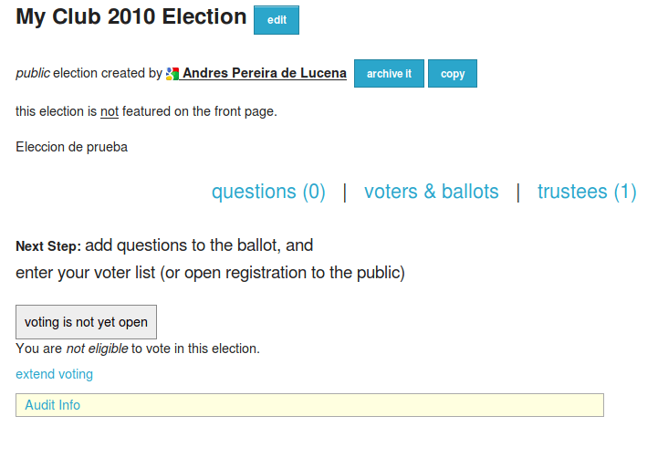

**Figura I.2.7.4:** Administrador: configuración de la elección

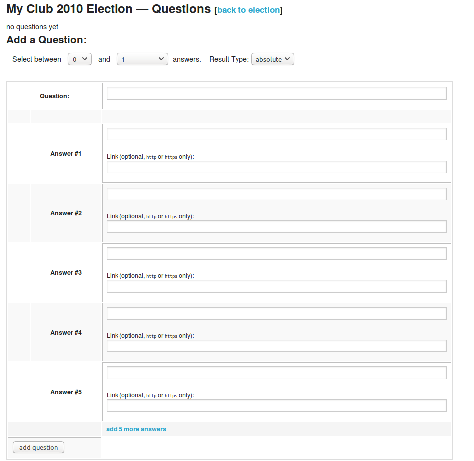

**Figura I.2.7.5:** Administrador: configuración de preguntas y respuestas

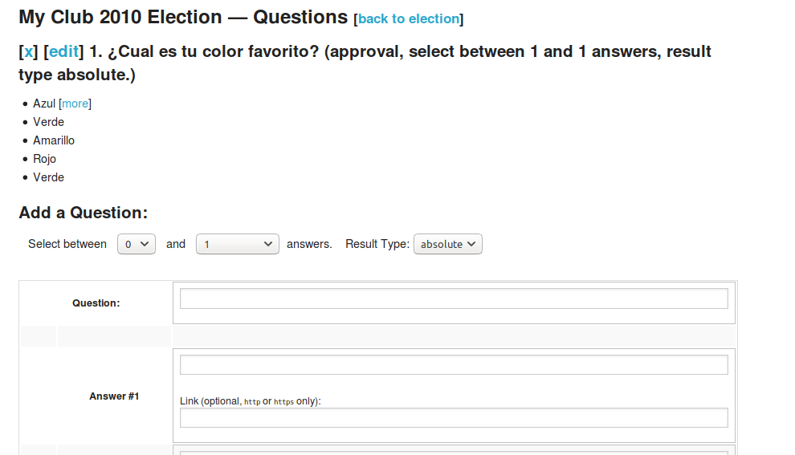

**Figura I.2.7.6:** Administrador: configuración de preguntas

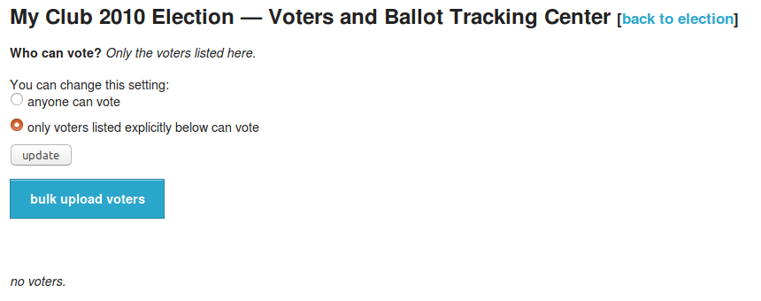

**Figura I.2.7.7:** Administrador: configuración de censo para una votación

**Figura I.2.7.8:** Administrador: subida masiva de censo de votantes (por CSV)

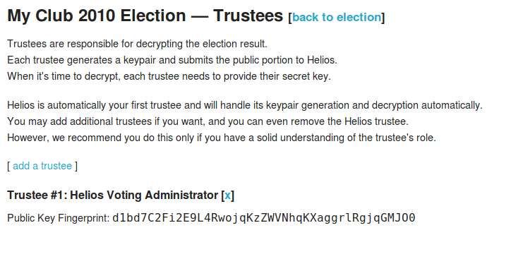

**Figura I.2.7.9:** Administrador: agregar nuevo fideicomisario

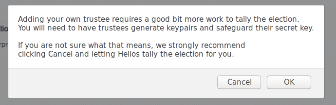

**Figura I.2.7.10:** Administrador: aceptar crear nuevo fideicomisario

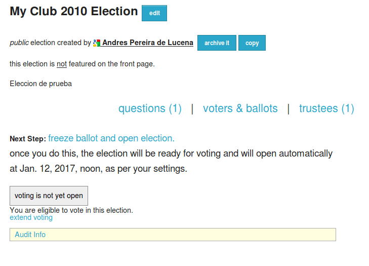

**Figura I.2.7.11:** Administrador: comenzar votación

**Figura I.2.7.12:** Administrador: aceptar comienzo de votación (no permite cambiar preguntas)

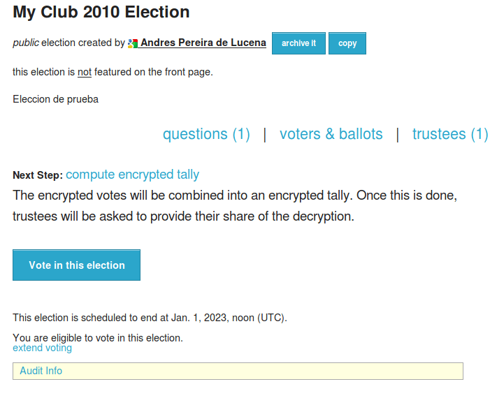

**Figura I.2.7.13:** Administrador: abierto periodo de votaciones

**Figura I.2.7.14:** Cabina de votación, paso 0

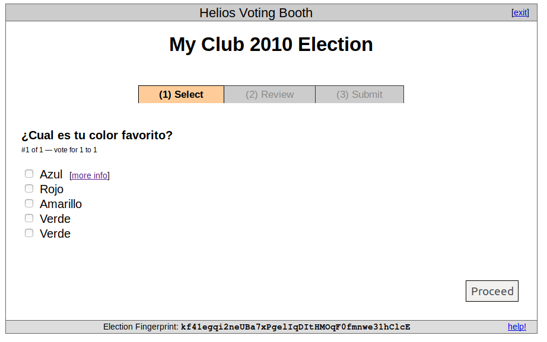

**Figura I.2.7.15:** Cabina de votación, paso 1

**Figura I.2.7.16:** Cabina de votación, paso 1 (respuesta seleccionada)

**Figura I.2.7.17:** Cabina de votación, paso 2 (confirmación de voto)

**Figura I.2.7.18:** Cabina de votación, paso 3 (enviando voto)

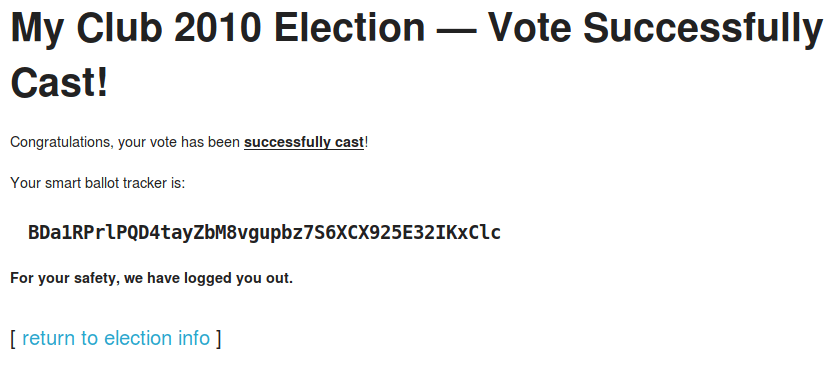

**Figura I.2.7.19:** Cabina de votación: voto enviado 

**Figura I.2.7.20:** Administrador: votación en curso

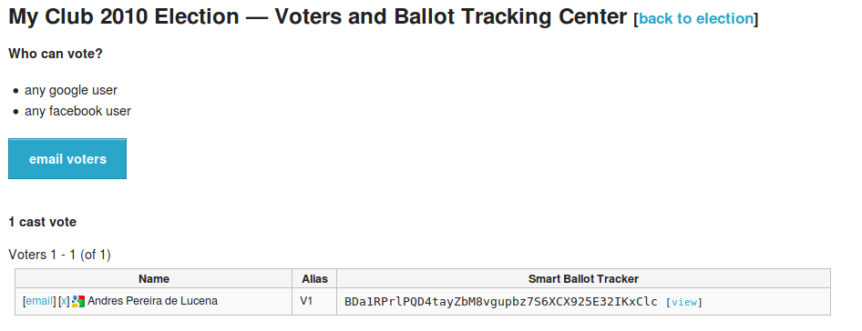

**Figura I.2.7.21:** Administrador: gestión de votantes

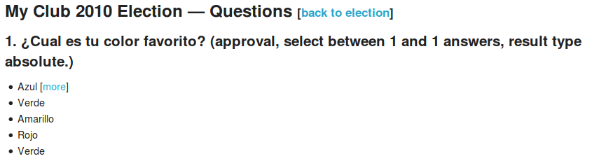

**Figura I.2.7.22:** Administrador: revisión de preguntas en votación en curso

**Figura I.2.7.23:** Administrador: revisión de fideicomisarios en votación en curso

**Figura I.2.7.24:** Administrador: confirmación para comenzar recuento de votos I

**Figura I.2.7.25:** Administrador: confirmación para comenzar recuento de votos II

**Figura I.2.7.25:** Administrador: recuento de votos en curso

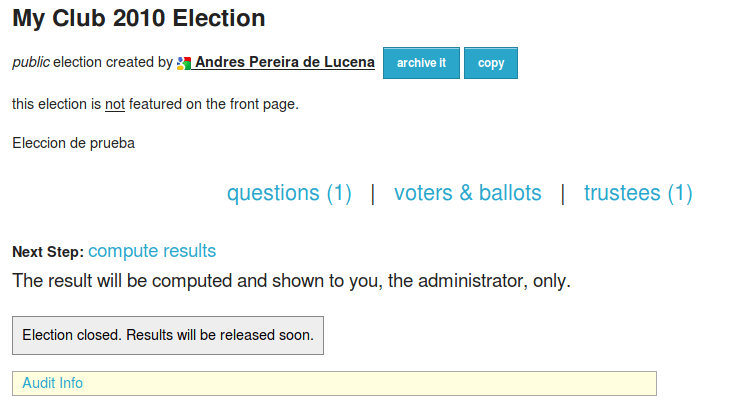

**Figura I.2.7.26:** Administrador: computar resultados de votación (recuento de votos o escrutinio)

**Figura I.2.7.27:** Administrador: información de auditoría de votación

**Figura I.2.7.28:** Administrador: confirmación de computación de resultado

**Figura I.2.7.29:** Administrador: resultado de la votación

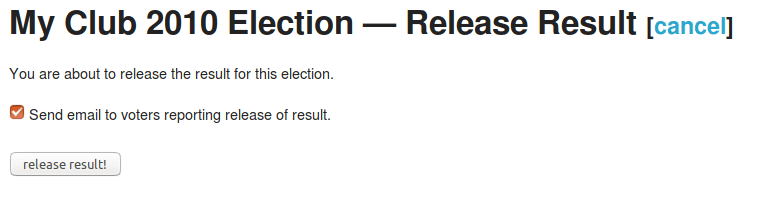

**Figura I.2.7.30:** Administrador: envío de correo electrónico a votantes con los resultados

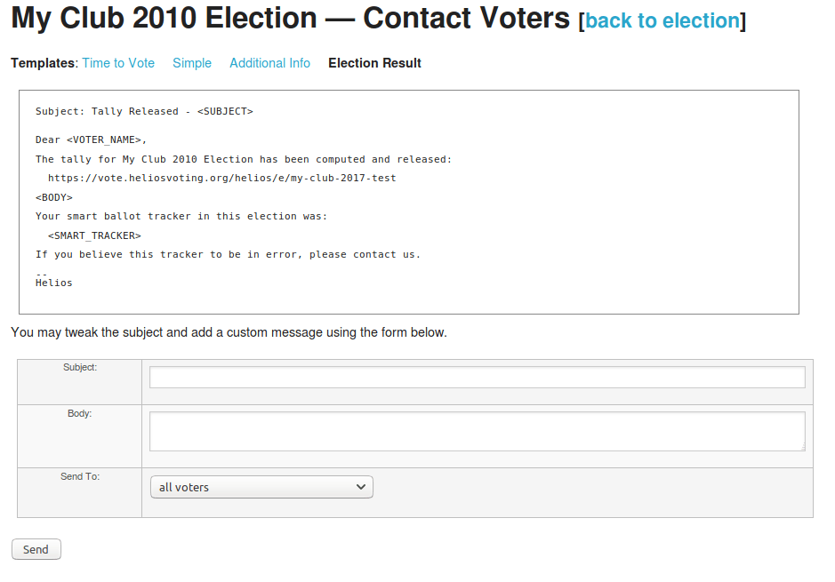

**Figura I.2.7.31:** Administrador: gestión de contacto de votantes - resultado de la votación

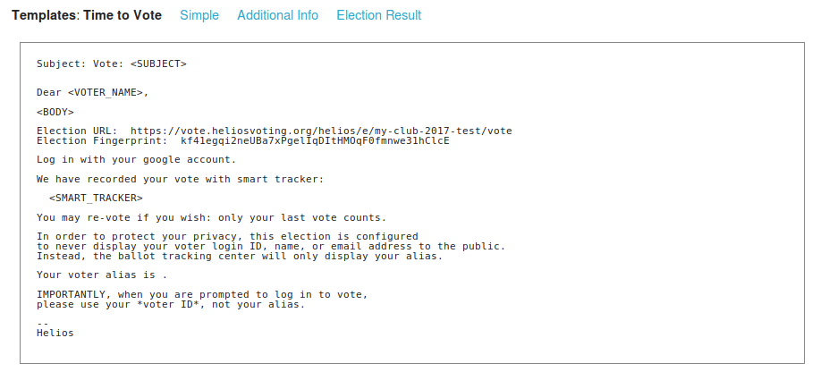

**Figura I.2.7.32:** Administrador: gestión de contacto de votantes - comienzo de la votación

**Figura I.2.7.33:** Administrador: gestión de contacto de votantes - correo simple

**Figura I.2.7.7.****34****:** Administrador: gestión de contacto de votantes - información adicional 

