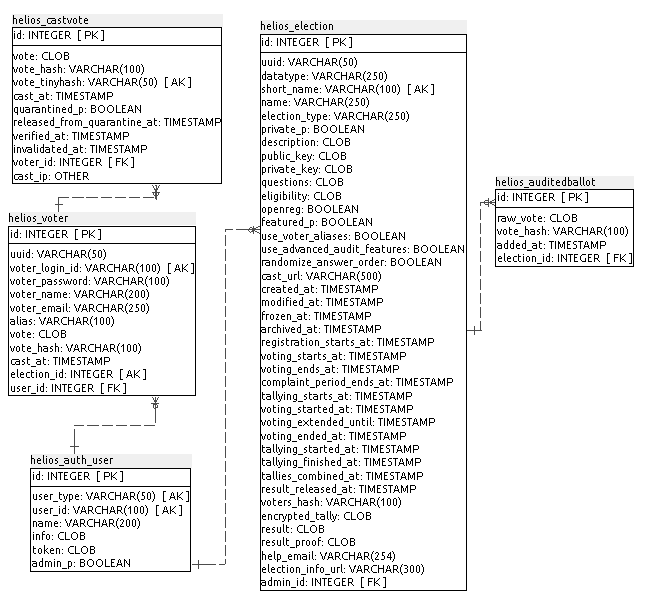
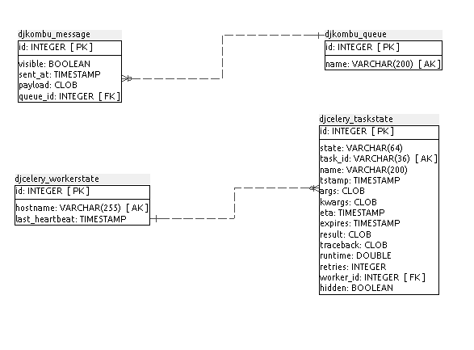
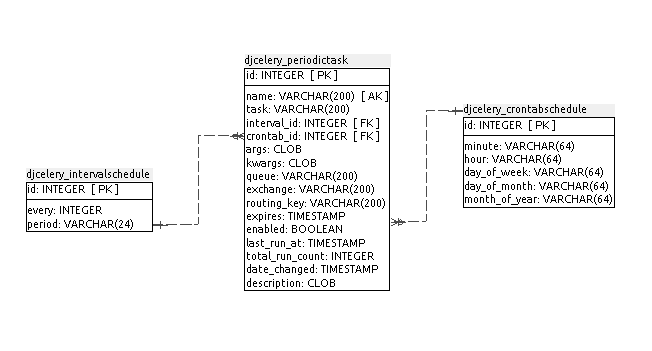
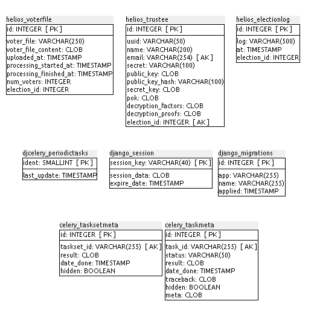

### I.2.5 Modelo de datos

#### I.2.5.1 Modelos relevantes

Los modelos relevantes son HeliosElection, HeliosVoter y HeliosTrustee.

#### I.2.5.2 Tablas

Cuenta con 20 tablas:

* celery_taskmeta 

* celery_tasksetmeta

* django_migrations

* django_session

* djcelery_crontabschedule

* djcelery_intervalschedule

* djcelery_periodictask

* djcelery_periodictasks

* djcelery_taskstate

* djcelery_workerstate	 

* djkombu_message     	 

* djkombu_queue       	 

* helios_auditedballot	 

* helios_auth_user    	 

* helios_castvote     	 

* helios_election     	 

* helios_electionlog  	 

* helios_trustee      	 

* helios_voter        	 

* helios_voterfile 

#### I.2.5.3 Gráficos UML

**Figura I.2.5.1:** Tablas de la base de datos de Helios Voting

**Figura I.2.5.2:** Tablas de la base de datos de Helios Voting

**Figura I.2.5.3:** Tablas de la base de datos de Helios Voting

**Figura I.2.5.4:** Tablas de la base de datos de Helios Voting

