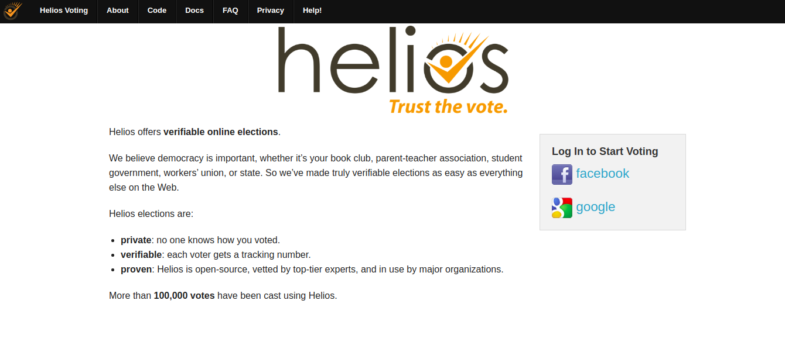

## I.2 Helios Voting

**Figura I.2.0:** Portada de [http://heliosvoting.org](http://heliosvoting.org)

*Helios ofrece **elecciones** en línea verificables.*

*Creemos que la democracia es importante, ya sea su club de lectura, asociación de padres y maestros, gobierno estudiantil, sindicato de trabajadores o estado. Así que hemos hecho elecciones verdaderamente verificables tan fácil como todo lo demás en la Web.*

*Las elecciones de Helios son:*

* *privadas: nadie sabe cómo votaste.*

* *verificables: cada votante obtiene un número de seguimiento.*

* *probadas: Helios es de código abierto, revisado por expertos de primer nivel, y en uso por las principales organizaciones.*

*Más de 100.000 votos han sido emitidos usando Helios.*[^1]

[^1]: https://heliosvoting.org/
Texto original: 
Helios offers verifiable online elections.
We believe democracy is important, whether it’s your book club, parent-teacher association, student government, workers’ union, or state. So we’ve made truly verifiable elections as easy as everything else on the Web.
Helios elections are:
private: no one knows how you voted.
verifiable: each voter gets a tracking number.
proven: Helios is open-source, vetted by top-tier experts, and in use by major organizations.
More than 100,000 votes have been cast using Helios.
