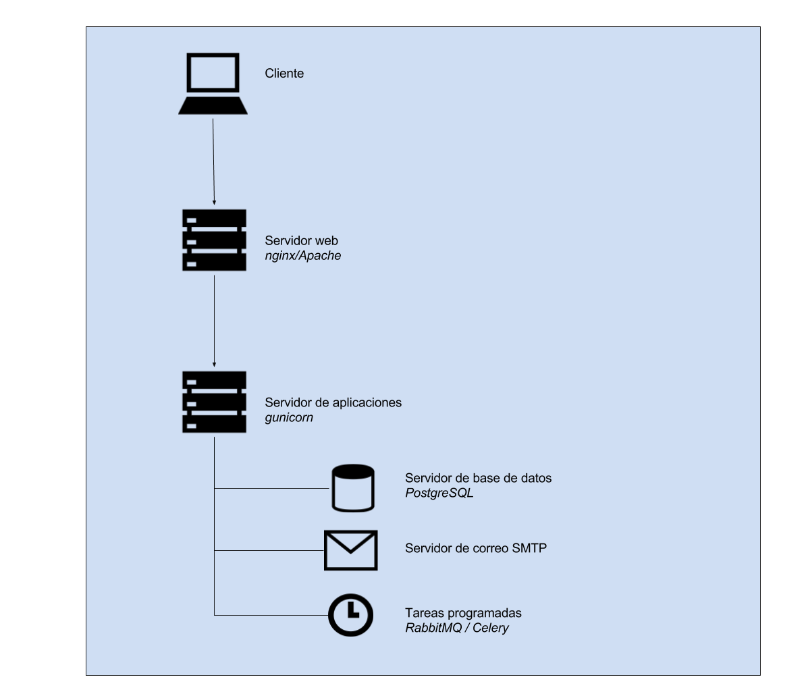
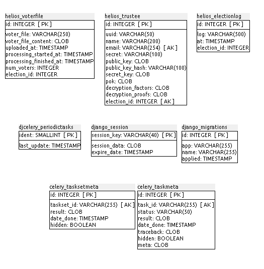
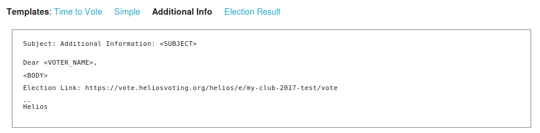

## I.2 Helios Voting

**Figura I.2.0:** Portada de [http://heliosvoting.org](http://heliosvoting.org)

*Helios ofrece **elecciones** en línea verificables.*

*Creemos que la democracia es importante, ya sea su club de lectura, asociación de padres y maestros, gobierno estudiantil, sindicato de trabajadores o estado. Así que hemos hecho elecciones verdaderamente verificables tan fácil como todo lo demás en la Web.*

*Las elecciones de Helios son:*

* * privadas: nadie sabe cómo votaste.*

* * verificables: cada votante obtiene un número de seguimiento.*

* * probadas: Helios es de código abierto, revisado por expertos de primer nivel, y en uso por las principales organizaciones.*

*Más de 100.000 votos han sido emitidos usando Helios.* (NOTE:  https://heliosvoting.org/
Texto original: 
Helios offers verifiable online elections.
We believe democracy is important, whether it’s your book club, parent-teacher association, student government, workers’ union, or state. So we’ve made truly verifiable elections as easy as everything else on the Web.
Helios elections are:
private: no one knows how you voted.
verifiable: each voter gets a tracking number.
proven: Helios is open-source, vetted by top-tier experts, and in use by major organizations.
More than 100,000 votes have been cast using Helios.)

### I.2.1 Metadatos

<table>
  <tr>
    <td>Nombre</td>
    <td>Helios Voting</td>
  </tr>
  <tr>
    <td>URL</td>
    <td>https://heliosvoting.org/ </td>
  </tr>
  <tr>
    <td>URL repositorio</td>
    <td>https://github.com/benadida/helios-server </td>
  </tr>
  <tr>
    <td>Resumen (Inglés)</td>
    <td>Helios is an end-to-end verifiable voting system.</td>
  </tr>
  <tr>
    <td>Resumen (Castellano)</td>
    <td>Helios es un sistema de votación verificable de extremo a extremo.</td>
  </tr>
  <tr>
    <td>Lenguaje</td>
    <td>Python</td>
  </tr>
  <tr>
    <td>Framework</td>
    <td>Django</td>
  </tr>
  <tr>
    <td>Fecha primer commit</td>
    <td>Julio de 2009</td>
  </tr>
  <tr>
    <td>Versión analizada</td>
    <td>No aplica</td>
  </tr>
  <tr>
    <td>Nº de versiones</td>
    <td>22</td>
  </tr>
  <tr>
    <td>Nº de tablas en la DDBB</td>
    <td>20</td>
  </tr>
  <tr>
    <td>Nº de contribuidores</td>
    <td>13</td>
  </tr>
  <tr>
    <td>Nº de stars</td>
    <td>299</td>
  </tr>
  <tr>
    <td>Licencia</td>
    <td> Apache 2.0</td>
  </tr>
  <tr>
    <td>Mantenido</td>
    <td>Si</td>
  </tr>
  <tr>
    <td>Diseño responsivo</td>
    <td>Sí</td>
  </tr>
</table>

 

### I.2.2 Funcionalidades 

* Permite crear una votación con una o más preguntas y con una o más opciones de respuesta por cada pregunta.

* Permite configurar un minimo y maximo de opciones de respuesta seleccionadas

* Permite mostrar las opciones de respuestas de forma aleatoria

* Permite distintas opciones de autenticación: 

    * cuenta de Google

    * cuenta de Facebook 

* Permite personalizar el correo electrónico que se enviará a los votantes para acceder a la votación 

* Permite tener el registro cerrado o abierto: 

    * Cerrado: Censo generado por administradores

    * Abierto: Censo generado por administradores pero permitiendo a los usuarios registrarse para esta votación 

* Permite gestionar el censo de usuarios 

* Permite añadir a votantes de forma masiva al censo a través de un CSV 

* Permite duplicar una votación 

* Permite agregar un enlace a las opciones de respuesta 

* Permite localizar la papeleta electoral y confirmar que se haya emitido el voto 

### I.2.3 Análisis

El autor original, Ben Adida, es un investigador de la universidad Harvard, donde ha publicado varios artículos académicos sobre voto online encriptado (NOTE:  http://ben.adida.net/research/ ). 

Se ha usado para algunas elecciones, principalmente en el 2010: 

* Por la IACR (International Association for Crypto Research) para la elección de su Junta Directiva. 

* Por el Princeton Undergraduate Student Government (EEUU) 

* Por la Université Catholique de Louvain (Bélgica) para la elección de su Presidente.

En sus preguntas frecuentes mencionan que no recomiendan utilizar Helios Voting para elecciones importantes (NOTE:  https://heliosvoting.org/faq 
Texto original: 
Should we start using Helios for public-office elections? Maybe US President 2016?
No, you should not. Online elections are appropriate when one does not expect a large attempt at defrauding or coercing voters. For some elections, notably US Federal and State elections, the stakes are too high, and we recommend against capturing votes over the Internet. This has nothing to do with Helios itself: we just don’t trust that people’s home computers are secure enough to withstand significant attacks.
If you’d like to use a truly verifiable voting system for your public-office election, we recommend an in-person election. Helios could be adapted to the in-person, precinct voting setting, but we have not done this work yet, and we intend to focus on online elections first):

*¿Deberíamos empezar a usar Helios para elecciones en las oficinas públicas? Tal vez el presidente de EE.UU. 2016?*

*No, no deberías. Las elecciones en línea son apropiadas cuando uno no espera un gran intento de defraudar o coaccionar a los votantes. Para algunas elecciones, en particular las elecciones federales y estatales de Estados Unidos, las apuestas son demasiado altas, y no se recomienda el voto a través de Internet. Esto no tiene nada que ver con Helios en sí: simplemente no confío en que las computadoras personales de las personas sean lo suficientemente seguras para soportar ataques significativos.*

*Si desea utilizar un sistema de votación verdaderamente verificable para su elección en las elecciones públicas, recomendamos una elección en persona. Helios podría adaptarse a las elecciones en persona, pero todavía no hemos hecho este trabajo, y tenemos la intención de centrarnos primero en las elecciones en línea *

### I.2.4 Arquitectura

Se trata de una aplicación escrita en Python con el framework Django.

No cuenta con soporte de personalización, ni de módulos, ni de localizaciones.  

**Figura I.2.4.1:** Arquitectura de servidores de Helios Voting

### I.2.5 Modelo de datos

#### I.2.5.1 Modelos relevantes

Los modelos relevantes son HeliosElection, HeliosVoter y HeliosTrustee.

#### I.2.5.2 Tablas

Cuenta con 20 tablas:

* celery_taskmeta 

* celery_tasksetmeta

* django_migrations

* django_session

* djcelery_crontabschedule

* djcelery_intervalschedule

* djcelery_periodictask

* djcelery_periodictasks

* djcelery_taskstate

* djcelery_workerstate	 

* djkombu_message     	 

* djkombu_queue       	 

* helios_auditedballot	 

* helios_auth_user    	 

* helios_castvote     	 

* helios_election     	 

* helios_electionlog  	 

* helios_trustee      	 

* helios_voter        	 

* helios_voterfile 

#### I.2.5.3 Gráficos UML

**Figura I.2.5.1:** Tablas de la base de datos de Helios Voting

**Figura I.2.5.2:** Tablas de la base de datos de Helios Voting

**Figura I.2.5.3:** Tablas de la base de datos de Helios Voting

**Figura I.2.5.4:** Tablas de la base de datos de Helios Voting

### I.2.6 Conclusiones y recomendaciones

No se recomienda su uso por la falta de funcionalidades con respecto al otro aplicativo de tipo de voto electrónico por Internet comparado en el marco de este informe (Agora Voting). 

### I.2.7 Capturas de pantallas 

**Figura I.2.7.1:** Portada con sesión iniciada

**Figura I.2.7.2:** Listado de elecciones

**Figura I.2.7.3:** Administrador: creación de una elección nueva

**Figura I.2.7.4:** Administrador: configuración de la elección

**Figura I.2.7.5:** Administrador: configuración de preguntas y respuestas

**Figura I.2.7.6:** Administrador: configuración de preguntas

**Figura I.2.7.7:** Administrador: configuración de censo para una votación

**Figura I.2.7.8:** Administrador: subida masiva de censo de votantes (por CSV)

**Figura I.2.7.9:** Administrador: agregar nuevo fideicomisario

**Figura I.2.7.10:** Administrador: aceptar crear nuevo fideicomisario

**Figura I.2.7.11:** Administrador: comenzar votación

**Figura I.2.7.12:** Administrador: aceptar comienzo de votación (no permite cambiar preguntas)

**Figura I.2.7.13:** Administrador: abierto periodo de votaciones

**Figura I.2.7.14:** Cabina de votación, paso 0

**Figura I.2.7.15:** Cabina de votación, paso 1

**Figura I.2.7.16:** Cabina de votación, paso 1 (respuesta seleccionada)

**Figura I.2.7.17:** Cabina de votación, paso 2 (confirmación de voto)

**Figura I.2.7.18:** Cabina de votación, paso 3 (enviando voto)

**Figura I.2.7.19:** Cabina de votación: voto enviado 

**Figura I.2.7.20:** Administrador: votación en curso

**Figura I.2.7.21:** Administrador: gestión de votantes

**Figura I.2.7.22:** Administrador: revisión de preguntas en votación en curso

**Figura I.2.7.23:** Administrador: revisión de fideicomisarios en votación en curso

**Figura I.2.7.24:** Administrador: confirmación para comenzar recuento de votos I

**Figura I.2.7.25:** Administrador: confirmación para comenzar recuento de votos II

**Figura I.2.7.25:** Administrador: recuento de votos en curso

**Figura I.2.7.26:** Administrador: computar resultados de votación (recuento de votos o escrutinio)

**Figura I.2.7.27:** Administrador: información de auditoría de votación

**Figura I.2.7.28:** Administrador: confirmación de computación de resultado

**Figura I.2.7.29:** Administrador: resultado de la votación

**Figura I.2.7.30:** Administrador: envío de correo electrónico a votantes con los resultados

**Figura I.2.7.31:** Administrador: gestión de contacto de votantes - resultado de la votación

**Figura I.2.7.32:** Administrador: gestión de contacto de votantes - comienzo de la votación

**Figura I.2.7.33:** Administrador: gestión de contacto de votantes - correo simple

**Figura I.2.7.7.****34****:** Administrador: gestión de contacto de votantes - información adicional 

###  

