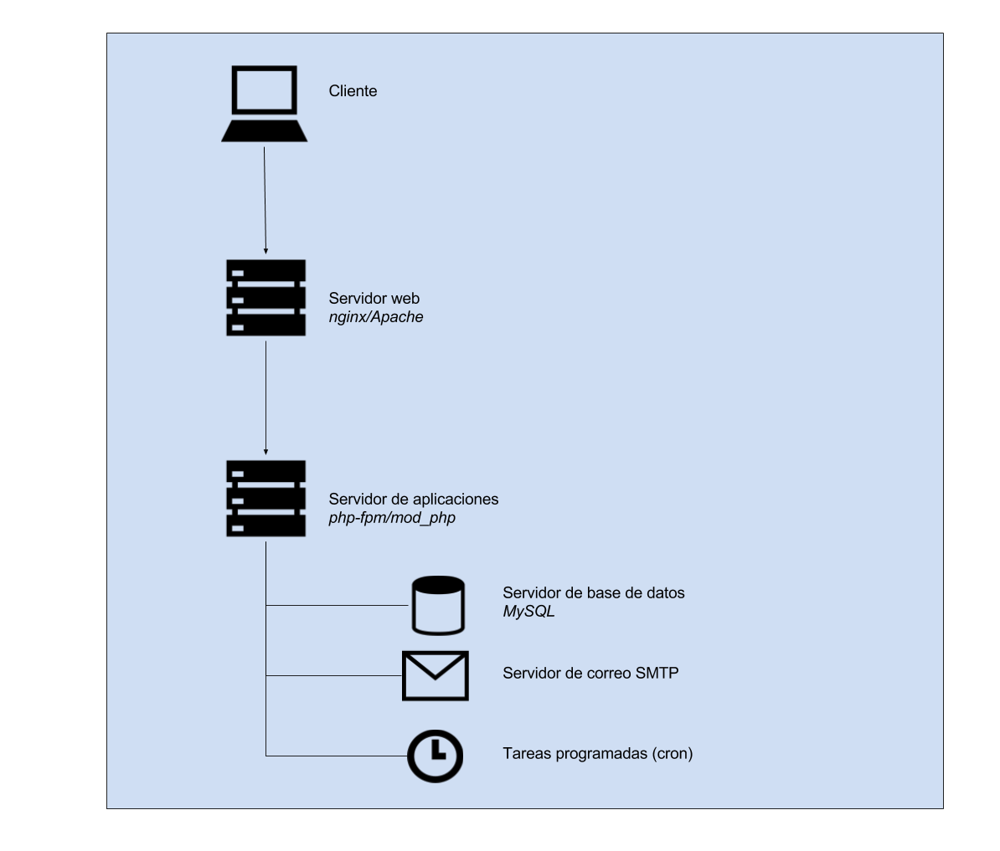

### J.1.4 Arquitectura

A nivel de Arquitectura cuenta con varias similitudes con Decidim, al ser un framework que soporta plugins que extienden la aplicación. 

Su instalación es relativamente sencilla, al requerir un servidor web que soporte PHP y MySQL. 

**Figura J.1.4.1:** Esquema de arquitectura de servicios de Elgg

