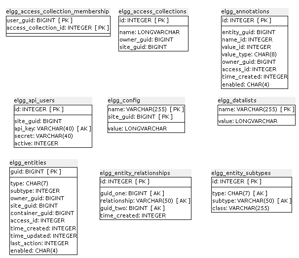
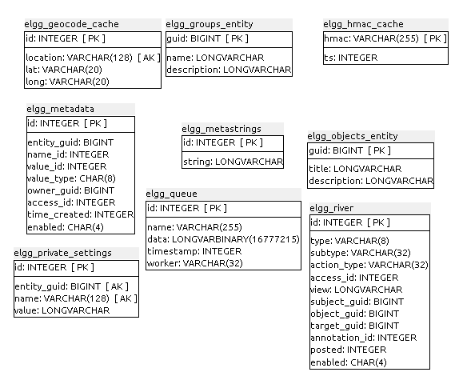
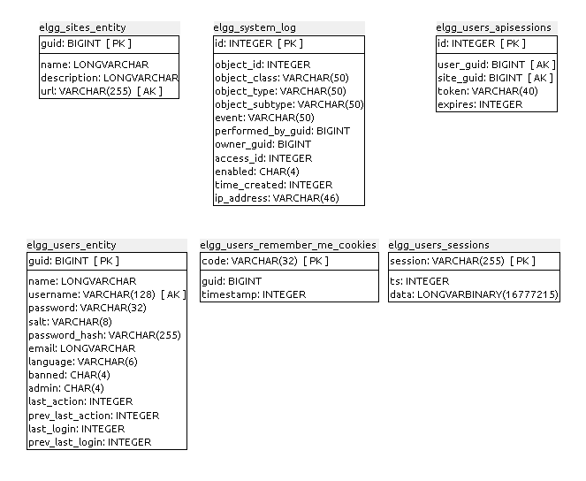

### J.1.5 Modelo de datos

#### J.1.5.1 Modelos relevantes 

Los principales modelos son Entities y Metadata. 

#### J.1.5.2 Tablas

Cuenta con 24 tablas: 

* elgg_access_collection_membership

* elgg_access_collections  

* elgg_annotations  

* elgg_api_users  

* elgg_config  

* elgg_datalists  

* elgg_entities  

* elgg_entity_relationships  

* elgg_entity_subtypes  

* elgg_geocode_cache  

* elgg_groups_entity  

* elgg_hmac_cache  

* elgg_metadata  

* elgg_metastrings  

* elgg_objects_entity  

* elgg_private_settings  

* elgg_queue  

* elgg_river  

* elgg_sites_entity  

* elgg_system_log  

* elgg_users_apisessions  

* elgg_users_entity  

* elgg_users_remember_me_cookies    

* elgg_users_sessions  

#### J.1.5.3 Gráficos UML

**Figura J.1.5.1:** Tablas de la base de datos de Elgg

**Figura J.1.5.2:** Tablas de la base de datos de Elgg

**Figura J.1.5.3:** Tablas de la base de datos de Elgg

