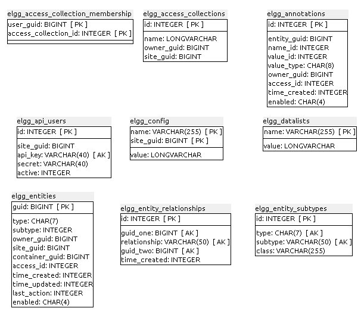
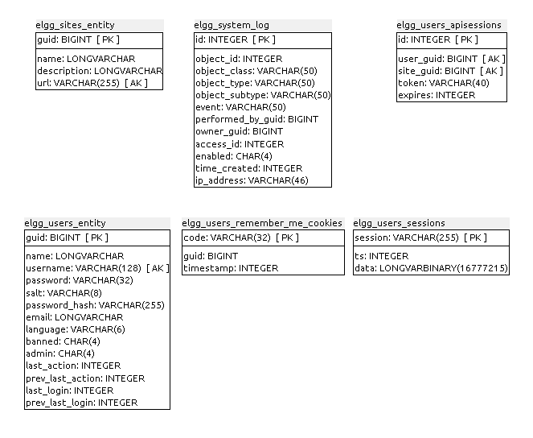
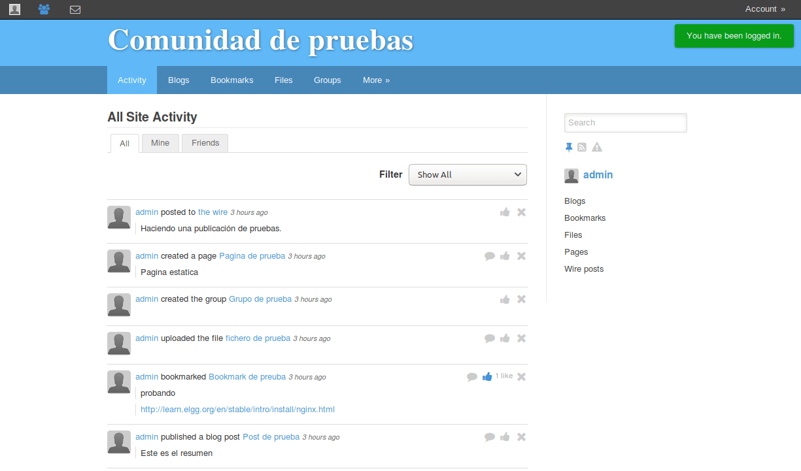
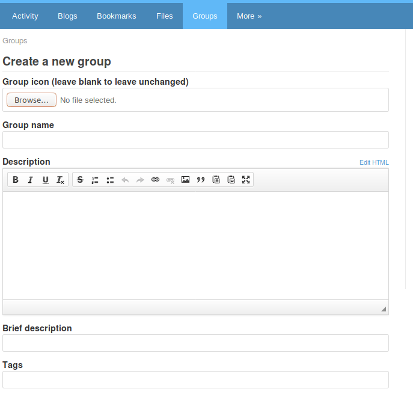
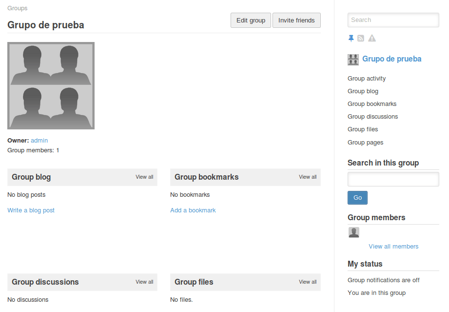
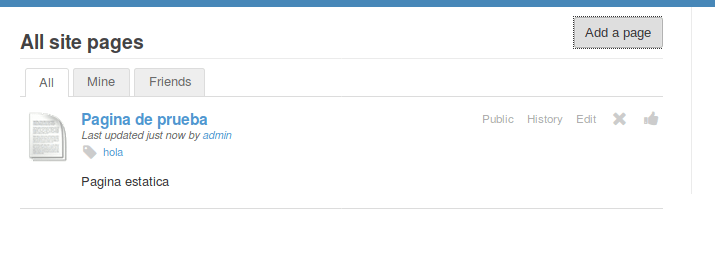
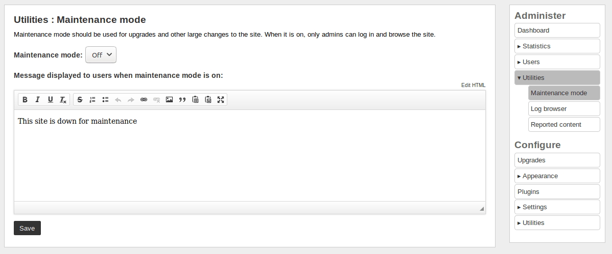

## Anexo J.1 Elgg

### 

**Figura J.1.0:** Portada de elgg.org

*Elgg es un galardonado motor de red social de código abierto que proporciona un marco sólido en el que construir todo tipo de entornos sociales, desde una red social de campus universitario para su universidad o escuela o una plataforma interna de colaboración para su organización a través de herramientas de comunicación para su empresa y sus clientes.* (NOTE:  https://elgg.org/ 
Texto original:  Elgg is an award-winning open source social networking engine that provides a robust framework on which to build all kinds of social environments, from a campus wide social network for your university, school or college or an internal collaborative platform for your organization through to a brand-building communications tool for your company and its clients. )

### J.1.1 Metadatos

<table>
  <tr>
    <td>Nombre</td>
    <td>Elgg</td>
  </tr>
  <tr>
    <td>URL</td>
    <td>https://elgg.org/ </td>
  </tr>
  <tr>
    <td>URL repositorio</td>
    <td>https://github.com/elgg/elgg </td>
  </tr>
  <tr>
    <td>Resumen (Inglés)</td>
    <td>Elgg is an open source rapid development framework for socially aware web applications.</td>
  </tr>
  <tr>
    <td>Resumen (Castellano)</td>
    <td>Elgg es un framework de desarrollo rápido de código abierto para aplicaciones web socialmente conscientes.</td>
  </tr>
  <tr>
    <td>Lenguaje</td>
    <td>PHP</td>
  </tr>
  <tr>
    <td>Framework</td>
    <td>No aplica</td>
  </tr>
  <tr>
    <td>Fecha primer commit</td>
    <td>Febrero de 2008</td>
  </tr>
  <tr>
    <td>Versión analizada </td>
    <td>2.3.3</td>
  </tr>
  <tr>
    <td>Nº de versiones</td>
    <td>144</td>
  </tr>
  <tr>
    <td>Nº de tablas en la BBDD</td>
    <td>24</td>
  </tr>
  <tr>
    <td>Nº de contribuidores</td>
    <td>75</td>
  </tr>
  <tr>
    <td>Nº de stars</td>
    <td>1064</td>
  </tr>
  <tr>
    <td>Licencia</td>
    <td> MIT / GPLv2</td>
  </tr>
  <tr>
    <td>Mantenido</td>
    <td>Sí</td>
  </tr>
  <tr>
    <td>Diseño responsivo</td>
    <td>Sí</td>
  </tr>
</table>

 

### J.1.2 Funcionalidades 

* Una vez se encuentra instalado en un servidor web con soporte de PHP, cuenta con un asistente que va guiando al usuario durante el proceso de configuración inicial de la aplicación, comprobando las dependencias de PHP, instalación de la base de datos MySQL, y metadatos de administración (nombre del sitio, correo electrónico del administrador, URL del sitio, datos de acceso del usuario administrador, etc.)

* Es un framework que funciona a través de complementos o módulos (*plugins*), algunos de los cuales vienen activados por defecto. El alcance de este informe se centrará en los que vienen activados por defecto en una instalación base.  

* Permite gestionar varios tipos de contenidos (llamados Entities o Entidades) como Blog (Bitácora), Bookmarks (Enlaces, Marcadores o Favoritos), Files (Ficheros), Groups (Grupos, que a su vez permiten tener asociados distintos tipos de Entidades).

* Cuenta con soporte de etiquetas

* Permite configurar distintos niveles de acceso con cierta granularidad (Público o Privado)

* Cuenta con mensajería privada entre usuarios

* Cuenta con un panel de administración con distintas posibilidades: estadísticas, gestión de usuarios, registro de acciones de usuarios, activación de modo de mantenimiento, moderación de contenidos reportados por usuarios, gestión de los menús superiores, agregar campos de usuarios, gestión de widgets, gestión de plugins, etc.

### J.1.3 Análisis

Es una red social que permite configurarse de forma privada o pública y cuya 

organización está basada en los Grupos.

Funciona a través de plugins, algunos de los cuales vienen activados en la instalación por defecto

Permite tener varias funcionalidades asociadas tanto a un usuario como a un grupo: Blog (Bitácora), Enlaces (Bookmarks), Foros, Ficheros, Páginas, etc. 

Gran parte de la navegación gira alrededor de la última actividad de la plataforma. Por ejemplo, la URL /activity es la primera acción que ve un usuario al iniciar sesión

Con fines documentales, la siguiente tabla cuenta con los plugins con los que viene instalado por defecto, su descripción (en inglés y castellano) y el estado por defecto (si se encuentra o no activo). 

<table>
  <tr>
    <td>Nombre del plugin</td>
    <td>Descripción (Inglés)</td>
    <td>Descripción (Castellano)</td>
    <td>Estado por defecto</td>
  </tr>
  <tr>
    <td>Blog</td>
    <td>Adds blogging capabilities to Elgg.</td>
    <td>Agrega capacidades de blogs a Elgg.</td>
    <td>Activo</td>
  </tr>
  <tr>
    <td>Bookmarks</td>
    <td>Adds the ability for users to bookmark internal and external sites.</td>
    <td>Añade la capacidad de los usuarios para guardar sitios internos y externos.</td>
    <td>Activo</td>
  </tr>
  <tr>
    <td>CKEditor</td>
    <td>Integrates the popular rich text editor CKEditor.</td>
    <td>Integra el popular editor de texto enriquecido CKEditor.</td>
    <td>Activo</td>
  </tr>
  <tr>
    <td>Discussions</td>
    <td>Provides discussion forum support for Elgg</td>
    <td>Proporciona soporte de foro de discusión para Elgg</td>
    <td>Activo</td>
  </tr>
  <tr>
    <td>File</td>
    <td>Adds file sharing to Elgg</td>
    <td>Agrega compartir archivos a Elgg</td>
    <td>Activo</td>
  </tr>
  <tr>
    <td>Garbage Collector</td>
    <td>Perform database cleanup tasks</td>
    <td>Realizar tareas de limpieza de base de datos</td>
    <td>Activo</td>
  </tr>
  <tr>
    <td>Groups</td>
    <td>Provides group support for Elgg</td>
    <td>Proporciona soporte de grupos para Elgg</td>
    <td>Activo</td>
  </tr>
  <tr>
    <td>HTMLawed</td>
    <td>Provides security filtering. Running a site with this plugin disabled is extremely insecure. DO NOT DISABLE.</td>
    <td>Proporciona filtrado de seguridad. Ejecutar un sitio con este complemento deshabilitado es extremadamente inseguro. NO DESACTIVAR.</td>
    <td>Activo</td>
  </tr>
  <tr>
    <td>Invite Friends</td>
    <td>Adds the ability for users to invite friends through email.</td>
    <td>Añade la capacidad de los usuarios para invitar a amigos a través de correo electrónico.</td>
    <td>Activo</td>
  </tr>
  <tr>
    <td>Likes</td>
    <td>Enables users to like content on the site.</td>
    <td>Permite a los usuarios marcar contenido en el sitio como "me gusta" (like) </td>
    <td>Activo</td>
  </tr>
  <tr>
    <td>Log Browser</td>
    <td>Browse the system event log</td>
    <td>Examinar el registro de sucesos del sistema</td>
    <td>Activo</td>
  </tr>
  <tr>
    <td>Log Rotate</td>
    <td>Rotate the system log at specific intervals</td>
    <td>Rota el registro del sistema a intervalos específicos</td>
    <td>Activo</td>
  </tr>
  <tr>
    <td>Members</td>
    <td>Provides a public list of the members of your site</td>
    <td>Proporciona una lista pública de los miembros de su sitio</td>
    <td>Activo</td>
  </tr>
  <tr>
    <td>Message Board</td>
    <td>Enables users to put a message board widget on their profile for other users to post comments.</td>
    <td>Permite a los usuarios colocar un widget de tablero de mensajes en su perfil para que otros usuarios puedan publicar comentarios.</td>
    <td>Activo</td>
  </tr>
  <tr>
    <td>Messages</td>
    <td>Adds the ability for users to send private messages to each other.</td>
    <td>Añade la capacidad para que los usuarios se envíen mensajes privados entre sí.</td>
    <td>Activo</td>
  </tr>
  <tr>
    <td>Notifications</td>
    <td>Adds support for managing subscriptions for user and group notifications</td>
    <td>Añade soporte para administrar suscripciones para notificaciones de usuarios y grupos</td>
    <td>Activo</td>
  </tr>
  <tr>
    <td>Pages</td>
    <td>Collaborative editing tool. Enables users to create pages similar to a wiki without having to know wiki syntax.</td>
    <td>Herramienta de edición colaborativa. Permite a los usuarios crear páginas similares a una wiki sin tener que conocer la sintaxis wiki.</td>
    <td>Activo</td>
  </tr>
  <tr>
    <td>Profile</td>
    <td>Adds user profiles.</td>
    <td>Agrega perfiles de usuario.</td>
    <td>Activo</td>
  </tr>
  <tr>
    <td>Reported Content</td>
    <td>Adds the option for users to report content and for admins to investigate it.</td>
    <td>Añade la opción para que los usuarios puedan informar el contenido y para que los administradores lo investiguen.</td>
    <td>Activo</td>
  </tr>
  <tr>
    <td>Search</td>
    <td>Adds a search capability</td>
    <td>Agrega capacidad de búsqueda</td>
    <td>Activo</td>
  </tr>
  <tr>
    <td>The Wire</td>
    <td>Microblogging for Elgg</td>
    <td>Microblogging para Elgg</td>
    <td>Activo</td>
  </tr>
  <tr>
    <td>User Validation by Email</td>
    <td>Simple user account validation through email.</td>
    <td>Validación sencilla de la cuenta de usuario a través del correo electrónico.</td>
    <td>Activo</td>
  </tr>
  <tr>
    <td>Aalborg Theme</td>
    <td>Responsive Elgg theme</td>
    <td>Tema de Elgg responsivo</td>
    <td>Activo</td>
  </tr>
  <tr>
    <td>Front Page Demo</td>
    <td>A demonstration of how to customize your site's homepage.</td>
    <td>Una demostración de cómo personalizar la página principal de su sitio.</td>
    <td>Desactivado</td>
  </tr>
  <tr>
    <td>User Dashboard</td>
    <td>A widget-based dashboard for your users</td>
    <td>Un panel de control basado en widgets para los usuarios</td>
    <td>Desactivado</td>
  </tr>
  <tr>
    <td>Elgg Developer Tools</td>
    <td>A set of tools for writing plugins and themes. It is recommended that you have this plugin at the top of the plugin l</td>
    <td>Un conjunto de herramientas para escribir plugins y temas. Se recomienda que tenga este complemento en la parte superior del plugin l</td>
    <td>Desactivado</td>
  </tr>
  <tr>
    <td>Diagnostics</td>
    <td>Elgg diagnostics tool</td>
    <td>Herramienta de diagnóstico Elgg</td>
    <td>Desactivado</td>
  </tr>
  <tr>
    <td>Embed</td>
    <td>Allows users to easily upload and embed media into text areas. Requires a plugin for uploading files.</td>
    <td>Permite a los usuarios cargar e insertar fácilmente medios en áreas de texto. Requiere un complemento para cargar archivos.</td>
    <td>Desactivado</td>
  </tr>
  <tr>
    <td>Site Pages</td>
    <td>Create simple web pages for about, contact, privacy, and terms.</td>
    <td>Permite crear páginas web simples para información, contacto, privacidad y términos.</td>
    <td>Desactivado</td>
  </tr>
  <tr>
    <td>Legacy URL Support</td>
    <td>Provides support for URLs used in previous versions of Elgg</td>
    <td>Proporciona soporte para URLs usadas en versiones anteriores de Elgg</td>
    <td>Desactivado</td>
  </tr>
  <tr>
    <td>Tag Cloud</td>
    <td>Tag cloud related functionality</td>
    <td>Funcionalidad relacionada con la nube de etiquetas</td>
    <td>Desactivado</td>
  </tr>
  <tr>
    <td>Site Notifications</td>
    <td>Internal site notifications. See README for more details.</td>
    <td>Notificaciones internas del sitio. Vea el fichero README para más detalles.</td>
    <td>Desactivado</td>
  </tr>
  <tr>
    <td>Twitter API</td>
    <td>Allows users to log in with their Twitter account and provides access to the Twitter API. Missing dependencies.</td>
    <td>Permite a los usuarios iniciar sesión con su cuenta de Twitter y proporciona acceso a la API de Twitter. Faltan dependencias.</td>
    <td>Desactivado</td>
  </tr>
  <tr>
    <td>Web services</td>
    <td>Provides a framework for building RPC web services.</td>
    <td>Proporciona un marco para la creación de servicios web RPC.</td>
    <td>Desactivado</td>
  </tr>
  <tr>
    <td>Data views for web services</td>
    <td>Provides data formats for Elgg web services like xml and serialized php. Also supports ical for calendar events.</td>
    <td>Proporciona formatos de datos para servicios web Elgg como xml y php serializado. También es compatible con eventos de calendario.</td>
    <td>Desactivado</td>
  </tr>
  <tr>
    <td>Login As</td>
    <td>Allows admin users to login as another user.</td>
    <td>Permite a los usuarios administradores iniciar sesión como otro usuario.</td>
    <td>Desactivado</td>
  </tr>
</table>

### J.1.4 Arquitectura

A nivel de Arquitectura cuenta con varias similitudes con Decidim, al ser un framework que soporta plugins que extienden la aplicación. 

Su instalación es relativamente sencilla, al requerir un servidor web que soporte PHP y MySQL. 

# 

**Figura J.1.4.1:** Esquema de arquitectura de servicios de Elgg

### J.1.5 Modelo de datos

#### J.1.5.1 Modelos relevantes 

Los principales modelos son Entities y Metadata. 

#### J.1.5.2 Tablas

Cuenta con 24 tablas: 

* elgg_access_collection_membership

* elgg_access_collections  

* elgg_annotations  

* elgg_api_users  

* elgg_config  

* elgg_datalists  

* elgg_entities  

* elgg_entity_relationships  

* elgg_entity_subtypes  

* elgg_geocode_cache  

* elgg_groups_entity  

* elgg_hmac_cache  

* elgg_metadata  

* elgg_metastrings  

* elgg_objects_entity  

* elgg_private_settings  

* elgg_queue  

* elgg_river  

* elgg_sites_entity  

* elgg_system_log  

* elgg_users_apisessions  

* elgg_users_entity  

* elgg_users_remember_me_cookies    

* elgg_users_sessions  

#### J.1.5.3 Gráficos UML

**Figura J.1.5.1:** Tablas de la base de datos de Elgg

**Figura J.1.5.2:** Tablas de la base de datos de Elgg

**Figura J.1.5.3:** Tablas de la base de datos de Elgg

### J.1.6 Conclusiones

Por su versatilidad, tamaño de su comunidad, popularidad, documentación y cantidad de plugins se recomienda su uso en los casos que se requieran dinámicas de colaboración interna, especialmente cuando el equipo de desarrolladores sepan utilizar el lenguaje de programación PHP. 

Como recomendación adicional se recuerda que cuenta tanto con soporte para plugins externos así como para utilizar temas propios, por lo que habría que utilizar las APIs propuestas por los desarrolladores, facilitando su posterior actualización y mantenimiento. 

### J.1.7 Capturas de pantallas 

**Figura J.1.7.1:** Asistente de instalación I

###  

**Figura J.1.7.2:** Asistente de instalación II

**Figura J.1.7.3:** Asistente de instalación III

**Figura J.1.7.4:** Asistente de instalación IV

**Figura J.1.7.5:** Asistente de instalación V

**Figura J.1.7.6:** Portada inicial con sesión iniciada (sin contenidos)

**Figura J.1.7.7:** Portada con contenidos (usuario anónimo)

**Figura J.1.7.8:** Portada con contenidos (sesión iniciada)

 

**Figura J.1.7.9:** Publicación de entrada en blog (bitácora) personal I

**Figura J.1.7.10:** Formulario de publicación de entrada en blog (bitácora) personal II

**Figura J.1.7.11:** Entrada de blog (bitácora)

**Figura J.1.7.12:** Listado de entradas de blog (bitácora)

**Figura J.1.7.13:** Formulario de entrada de nuevo marcador (enlace)

**Figura J.1.7.14:** Página de marcador (enlace)

**Figura J.1.7.15:** Listado de marcadores (enlaces)

**Figura J.1.7.16:** Formulario de subida de ficheros

**Figura J.1.7.17:** Listado de ficheros

**Figura J.1.7.18:** Formulario de creación de grupos I

**Figura J.1.7.19:** Formulario de creación de grupos II

**Figura J.1.7.20:** Página de grupo I

**Figura J.1.7.21:** Página de grupo II

**Figura J.1.7.22:** Página de grupo III (detalle de barra lateral)

**Figura J.1.7.23:** Página de membresías

**Figura J.1.7.24:** Formulario de creación de página nueva

**Figura J.1.7.25:** Listado de todas las páginas

**Figura J.1.7.26:** Página

**Figura J.1.7.27:** Listado de todos los telegramas (wires) I

**Figura J.1.7.28:** Listado de todos los telegramas (wires) II

**Figura J.1.7.28:** Perfil de usuario

**Figura J.1.7.29:** Edición de perfil de usuario I

**Figura J.1.7.30:** Edición de perfil de usuario II

**Figura J.1.7.31:** Amigos de un usuario

**Figura J.1.7.32:** Mensajería privada 

**Figura J.1.7.33:** Configuraciones de un perfil de usuario

**Figura J.1.7.34:** Centro de mando de Administrador

**Figura J.1.7.35:** Estadísticas en Administrador

**Figura J.1.7.36:** Información del servidor en Administrador

**Figura J.1.7.36:** Información de tareas programadas (cron)  en Administrador

**Figura J.1.7.37:** Creación de usuarios en Administrador

**Figura J.1.7.38:** Modo de mantenimiento en Administrador

### 

**Figura J.1.7.39:** Registro de acciones en Administrador

### 

**Figura J.1.7.39:** Denuncia de contenidos

**Figura J.1.7.40:** Panel de revisión de denuncias en Administrador

**Figura J.1.7.41:** Configuración de menús en Administrador

**Figura J.1.7.42:** Configuración de campos de usuarios en Administrador

**Figura J.1.7.43:** Widgets por defecto en Administrador

**Figura J.1.7.44:** Panel de plugins en Administrador I

**Figura J.1.7.45:** Panel de plugins en Administrador II

**Figura J.1.7.46:** Configuraciones básicas en Administrador

**Figura J.1.7.47:** Configuraciones avanzadas en Administrador I

### 

**Figura J.1.7.48:** Configuraciones avanzadas en Administrador II

### 

**Figura J.1.7.49:** Configuración de colector de basura (garbage collector) en Administrador

**Figura J.1.7.50:** Configuración grupos en Administrador

### 

**Figura J.1.7.51:** Configuración de rotación de registros en Administrador

**Figura J.1.7.52:** Configuración de telegramas (wires) en Administrador

**Figura J.1.7.53:** Configuración del fichero robots.txt en Administrador

