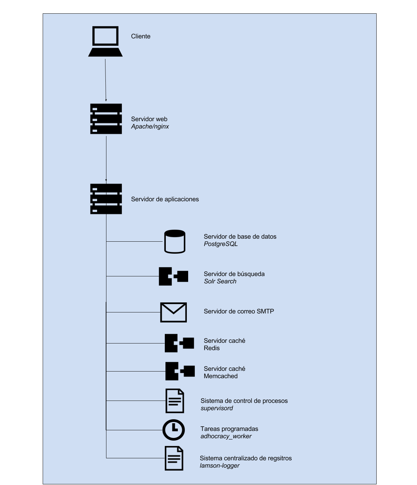

### J.2.4 Arquitectura 

Cuenta con la capacidad de cambiar su imagen gráfica a través de temas. Ofrecen algunos de ejemplo en los que basarse: 

* [https://github.com/hhucn/adhocracy.hhu_theme](https://github.com/hhucn/adhocracy.hhu_theme) 

* [https://github.com/liqd/adhocracy.gruene_nrw_theme](https://github.com/liqd/adhocracy.gruene_nrw_theme)

* [https://github.com/liqd/adhocracy.adhocracy_theme](https://github.com/liqd/adhocracy.adhocracy_theme)

* [https://github.com/liqd/adhocracy.enquete_theme](https://github.com/liqd/adhocracy.enquete_theme)

Cuentan con un script de instalación automática (NOTE:  https://raw.githubusercontent.com/liqd/adhocracy/develop/build.sh ) en sistemas GNU/Linux de tipo Debian, Arch o Ubuntu. 

**Figura J.2.4.1: **Esquema de servidores de adhocracy

