### J.2.7 Capturas de pantallas 

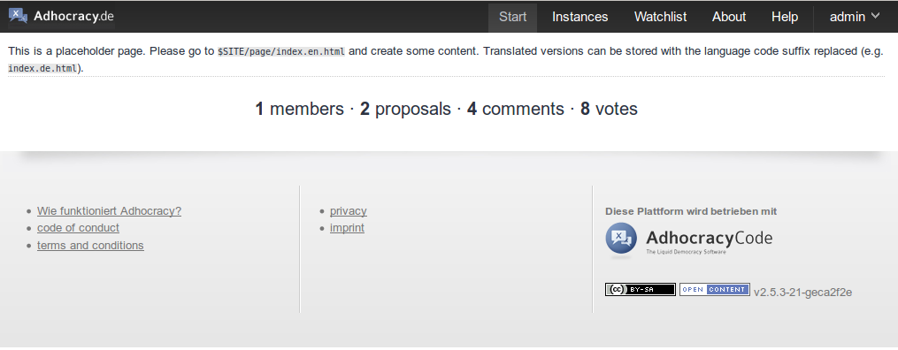

**Figura J.2.7.1: **Página principal

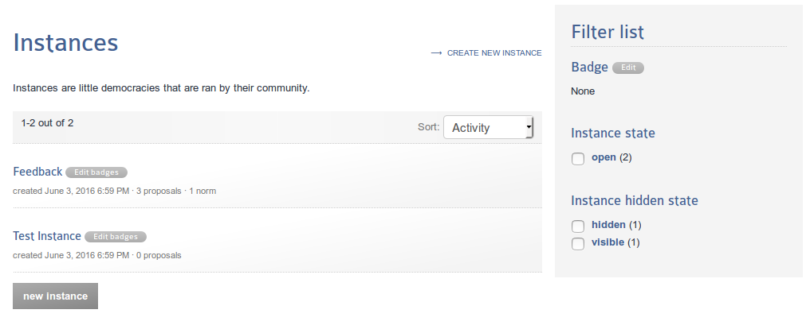

**Figura J.2.7.2: **Listado de Instancias 

**Figura J.2.7.3: **Página de Instancia

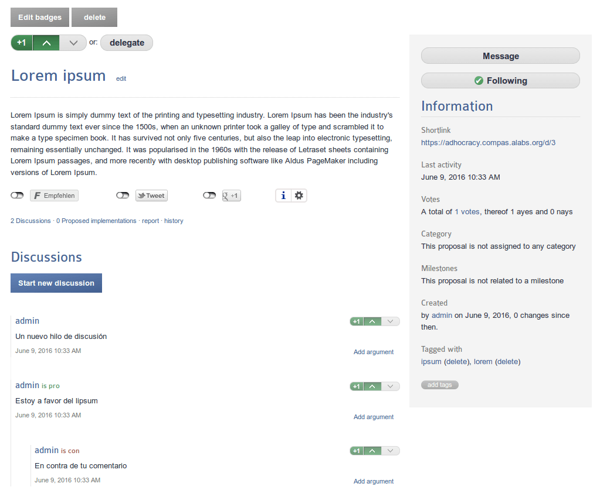

**Figura J.2.7.4: **Página de propuesta

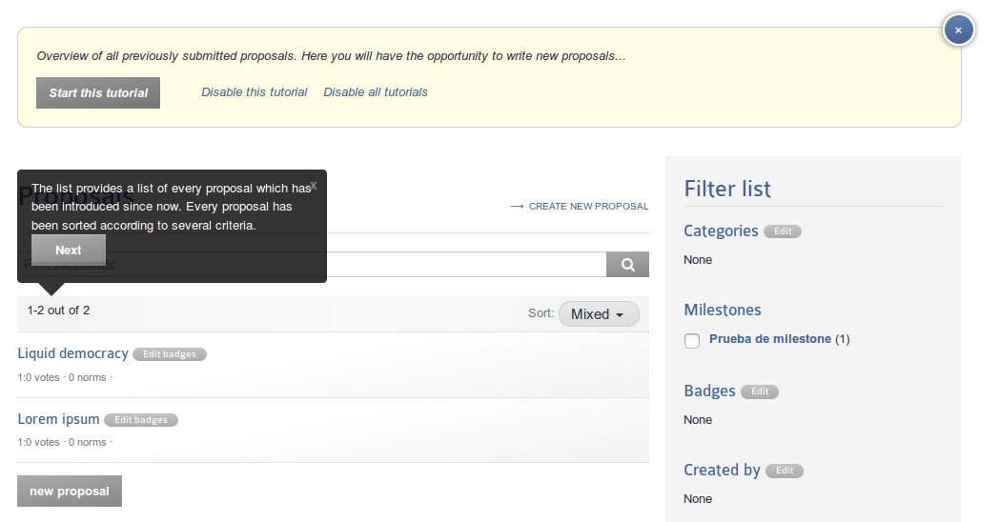

**Figura J.2.7.5: **Textos de ayuda

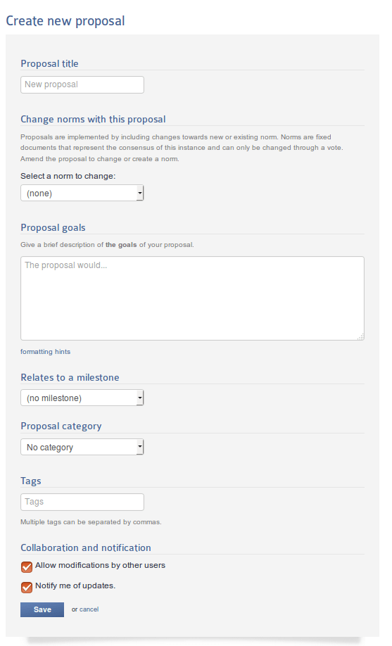

**Figura J.2.7.6:** Formulario de creación de propuesta

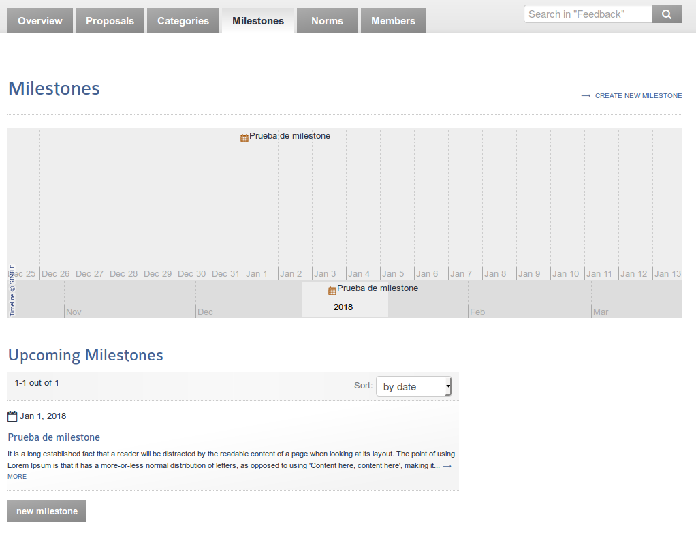

**Figura J.2.7.7: **Listado de hitos (milestones)

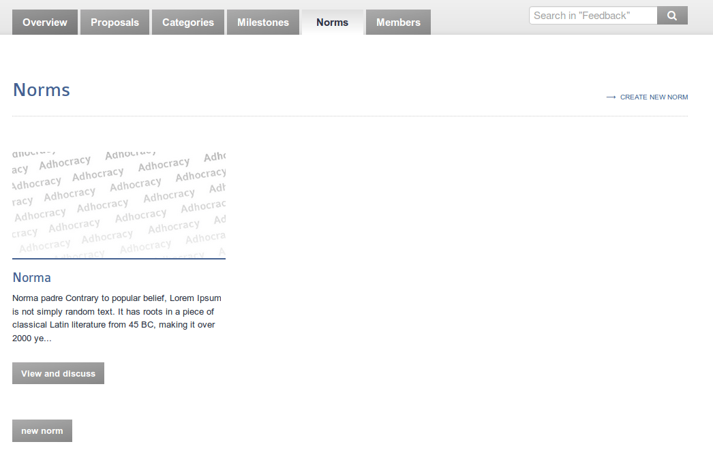

**Figura J.2.7.8: **Listado de normas

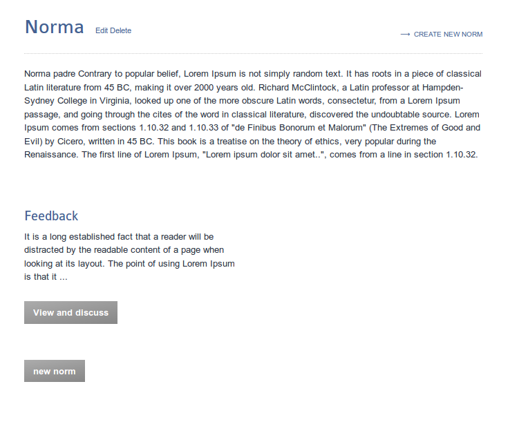

**Figura J.2.7.9: **Página de presentación de norma

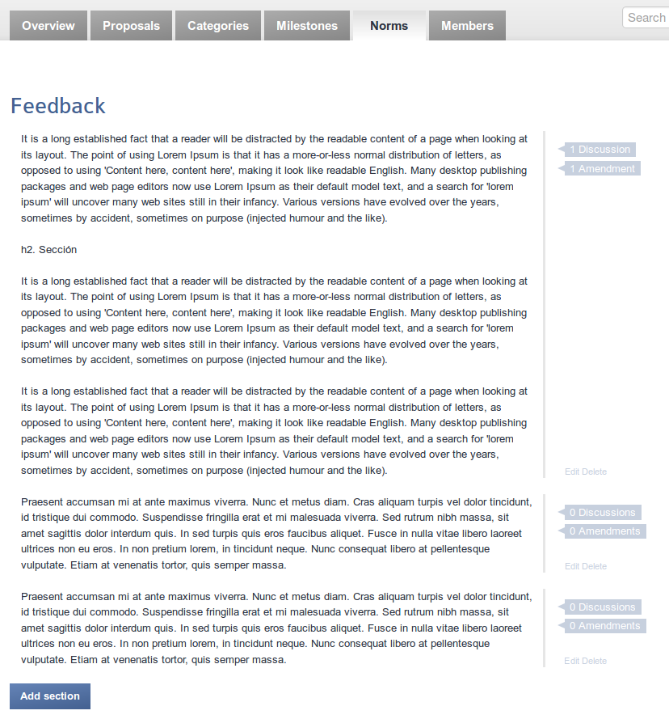

**Figura J.2.7.10: **Página de norma

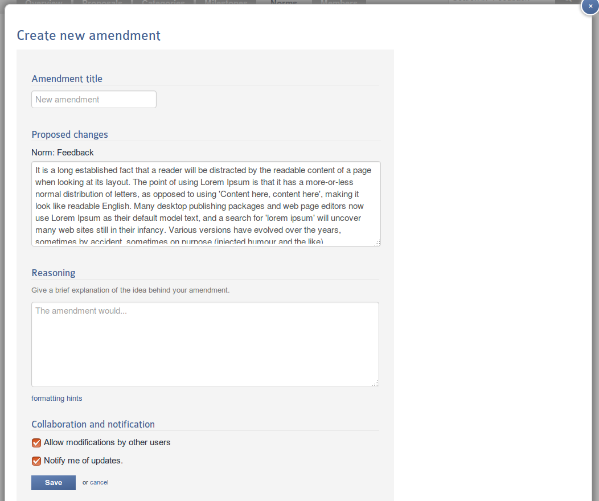

**Figura J.2.7.11: **Formulario de enmiendas

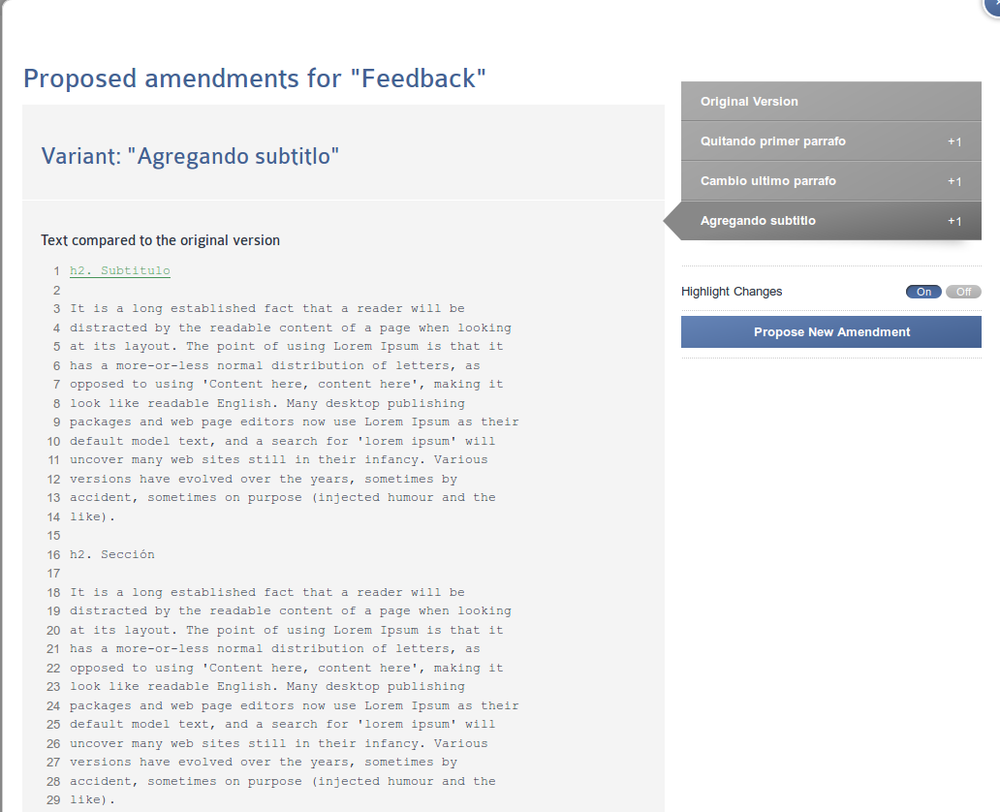

**Figura J.2.7.12: **Visionado de enmiendas

