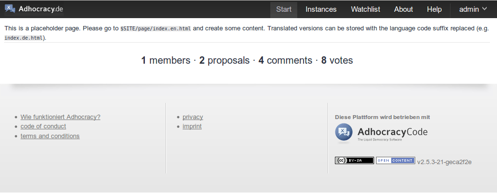
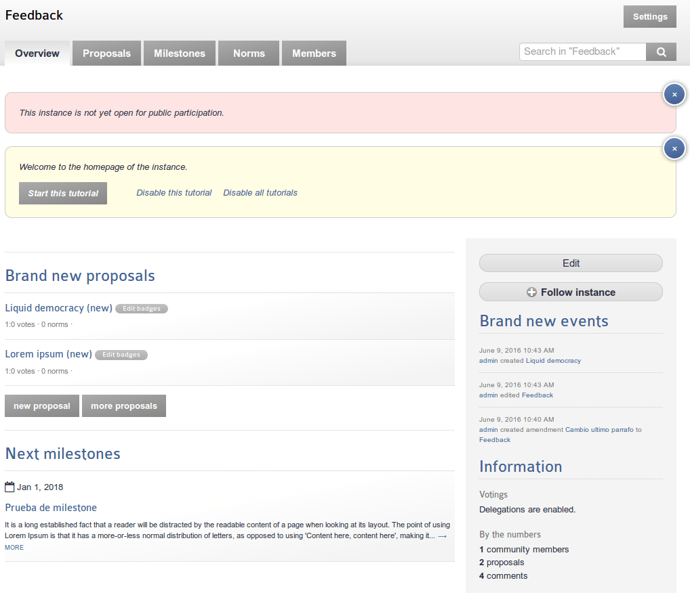

### J.2.7 Capturas de pantallas 

**Figura J.2.7.1: **Página principal

**Figura J.2.7.2: **Listado de Instancias 

**Figura J.2.7.3: **Página de Instancia

**Figura J.2.7.4: **Página de propuesta

**Figura J.2.7.5: **Textos de ayuda

**Figura J.2.7.6:** Formulario de creación de propuesta

**Figura J.2.7.7: **Listado de hitos (milestones)

**Figura J.2.7.8: **Listado de normas

**Figura J.2.7.9: **Página de presentación de norma

**Figura J.2.7.10: **Página de norma

**Figura J.2.7.11: **Formulario de enmiendas

**Figura J.2.7.12: **Visionado de enmiendas

