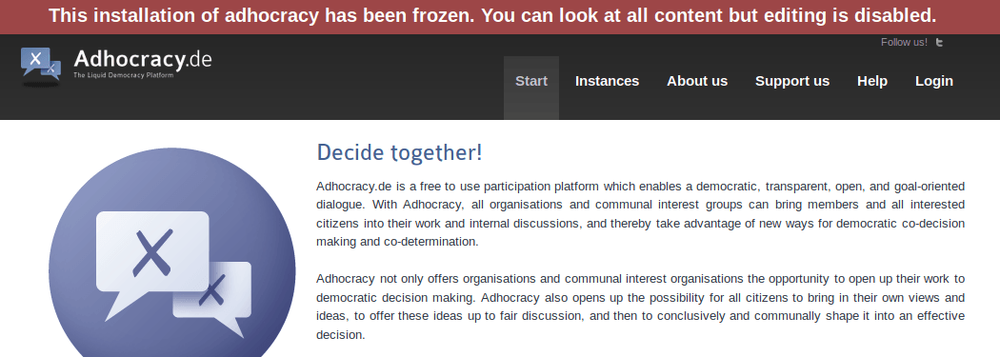

### J.2.6 Conclusiones

Al ser un aplicativo no mantenido y con carencias graves para el uso moderno (por ejemplo no cuenta con diseño responsivo), no se recomienda su integración. Relacionado con la falta de mantenimiento, la instalación principal ha bloqueado la edición de contenidos en su plataforma pública:  

**Figura J.2.6.1: **Mensaje de bloqueo de la instalación principal

