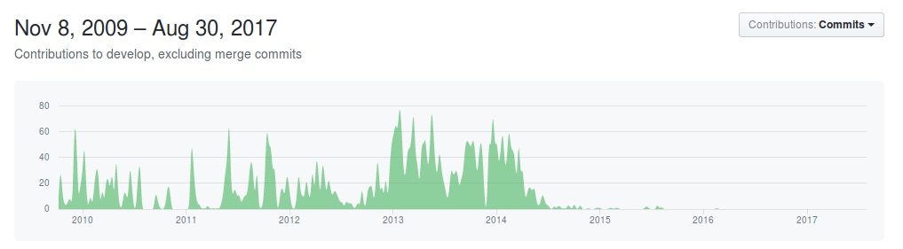

### J.2.3 Implantación

Ha sido utilizado por el Gobierno de Múnich en el 2011 para organizar el MOGDy (Munich Open Government Day)  (NOTE:   http://www.7-it.de/dokumente/upload/1ae30_mogdy_vortragsunterlagen.pdf 
https://de.wikipedia.org/wiki/Adhocracy ). 

Su principal punto de innovación está en la posibilidad de visionado de diferencias entre enmiendas que facilita la lectura de las diferencias entre versiones propuestas. 

Como se puede observar en el gráfico de colaboraciones de GitHub  (NOTE:  https://github.com/liqd/adhocracy/graphs/contributors ), en los últimos años no cuenta con un desarrollo activo sino sólo de mantenimiento.

 

**Figura J.2.3.1: **Gráfico de contribuciones en GtiHub de adhocracy

