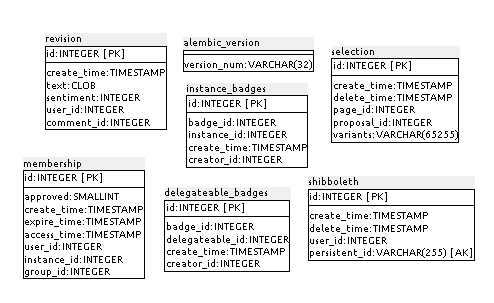
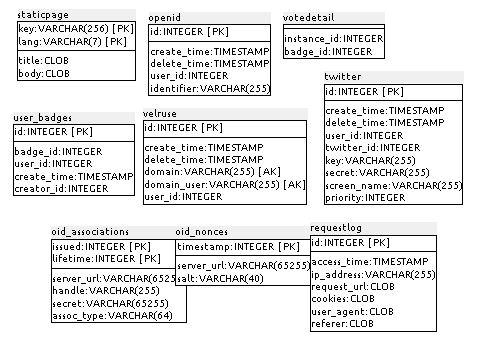
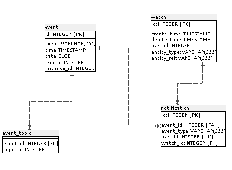
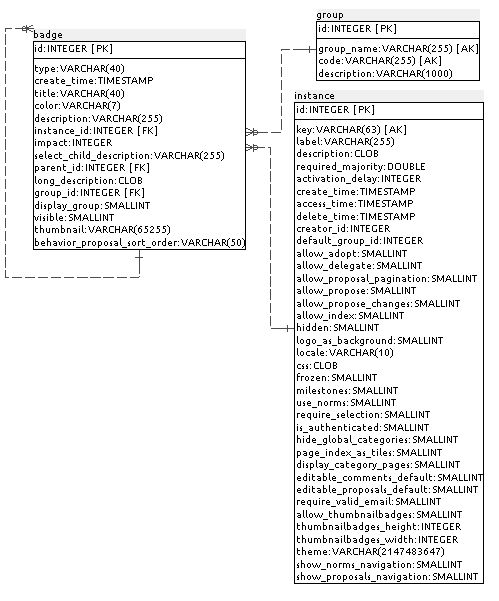
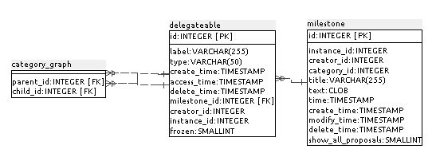
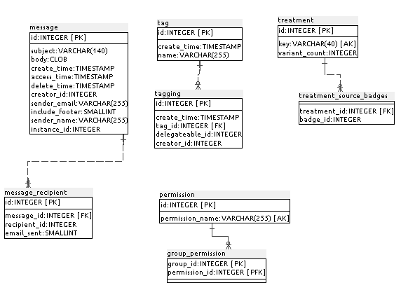
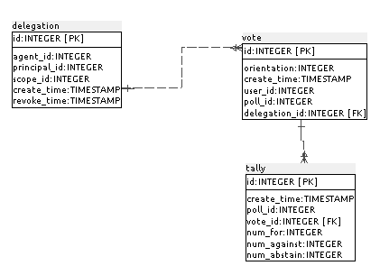
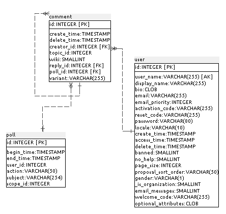
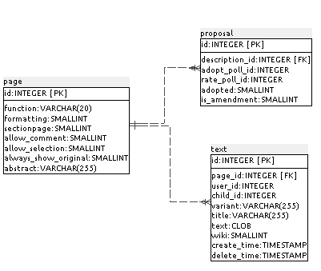

### J.2.5 Modelo de datos 

#### J.2.5.1 Modelos relevantes

Los modelos relevantes de adhocracy son Page, Text, User, Vote, Batch, Notification y Message. 

#### J.2.5.2 Tablas

Cuenta con 43 tablas: 

* alembic_version  	 

* badge            	 

* category_graph   	 

* comment          	 

* delegateable     	 

* delegateable_badges   

* delegation       	 

* event            	 

* event_topic      	 

* group            	 

* group_permission 	 

* instance         	 

* instance_badges  	 

* membership       	 

* message          	 

* message_recipient    

* milestone       	 

* notification    	 

* oid_associations	 

* oid_nonces      	 

* openid          	 

* page            	 

* permission      	 

* poll            	 

* proposal        	 

* requestlog      	 

* revision        	 

* selection       	 

* shibboleth      	 

* staticpage      	 

* tag               	 

* tagging           	 

* tally             	 

* text              	 

* treatment         	 

* treatment_source_badges

* twitter           	 

* user              	 

* user_badges       	 

* velruse           	 

* vote              	 

* votedetail        	 

* watch             	

#### J.2.5.3 Gráficos UML

## 

**Figura J.2.5.1: **Tablas de la base de datos de adhocracy 

**Figura J.2.5.2: **Tablas de la base de datos de adhocracy 

**Figura J.2.5.3: **Tablas de la base de datos de adhocracy 

**Figura J.2.5.4: **Tablas de la base de datos de adhocracy 

**Figura J.2.5.5: **Tablas de la base de datos de adhocracy 

**Figura J.2.5.6: **Tablas de la base de datos de adhocracy 

**Figura J.2.5.7: **Tablas de la base de datos de adhocracy 

**Figura J.2.5.8: **Tablas de la base de datos de adhocracy 

**Figura J.2.5.9: **Tablas de la base de datos de adhocracy

