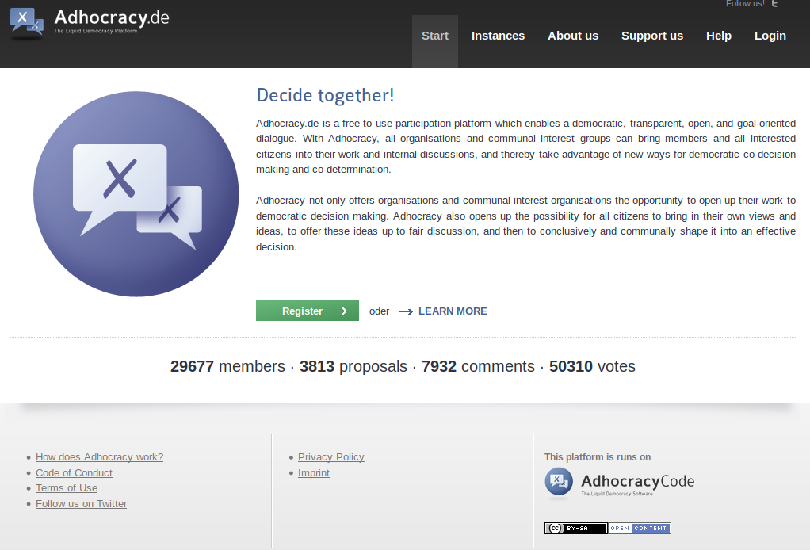

## J.2 Adhocracy 

**Figura J.2.0:** Portada de [https://adhocracy.de/](https://adhocracy.de/) 

*Adhocracy.de es un plataforma de participación libre que permite un diálogo democrático, transparente, abierto y orientado a objetivos. Con Adhocracy, todas las organizaciones y grupos de intereses comunes pueden llevar a sus miembros y a todos los ciudadanos interesados dentro de su trabajo y discusiones internas, y con ello aprovechar las nuevas maneras para la toma de co-decisión democrática y co-determinación.* [^1]

[^1] Traducido de https://adhocracy.de/ 
Texto original: Adhocracy.de is a free to use participation platform which enables a democratic, transparent, open, and goal-oriented dialogue. With Adhocracy, all organisations and communal interest groups can bring members and all interested citizens into their work and internal discussions, and thereby take advantage of new ways for democratic co-decision making and co-determination.

