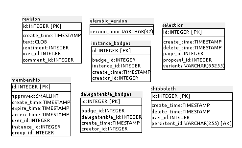
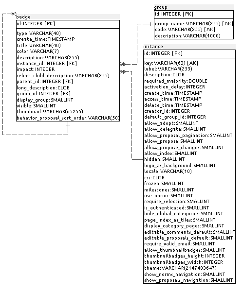
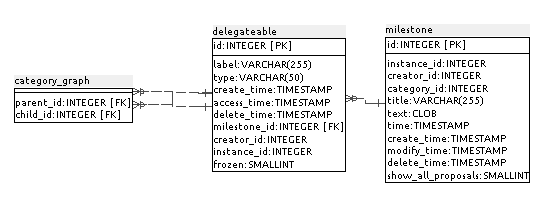
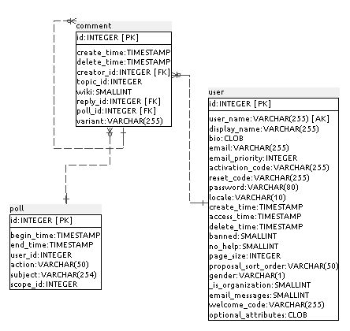
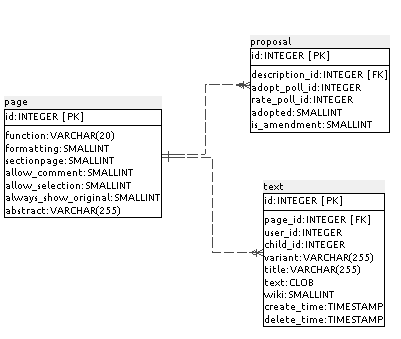
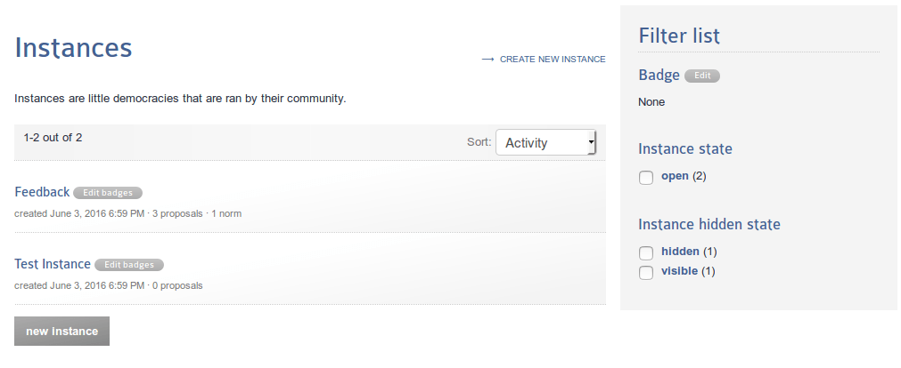
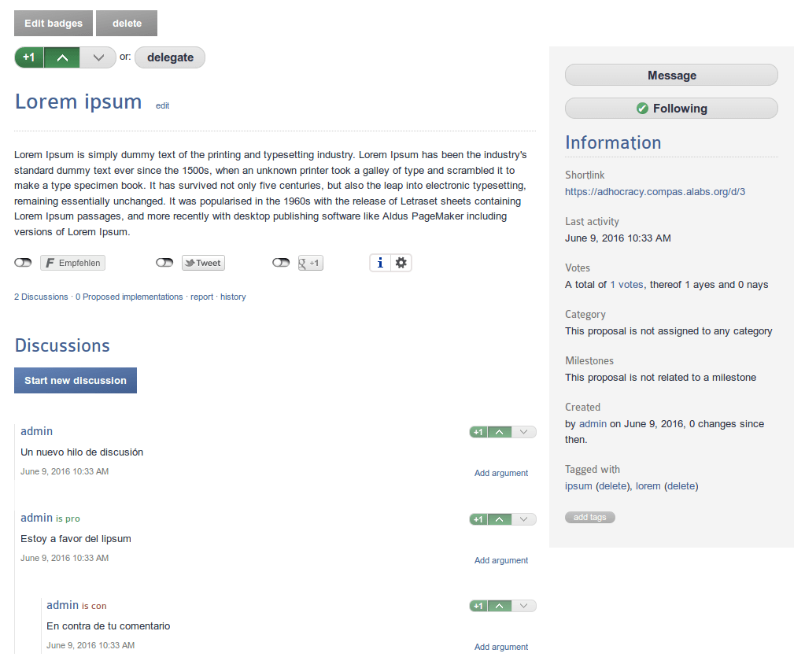
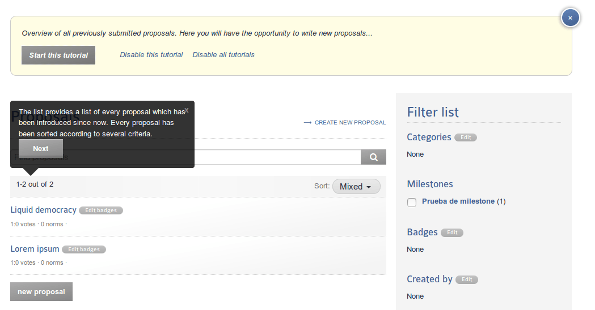
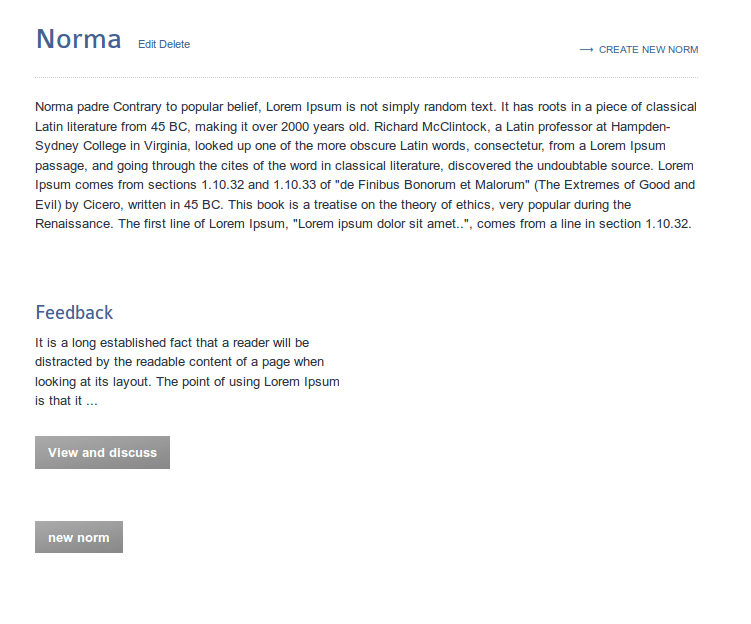

## Anexo J.2 Adhocracy 

**Figura J.2.0: **Portada de [https://adhocracy.de/](https://adhocracy.de/) 

*Adhocracy.de es un plataforma de participación libre que permite un diálogo democrático, transparente, abierto y orientado a objetivos. Con Adhocracy, todas las organizaciones y grupos de intereses comunes pueden llevar a sus miembros y a todos los ciudadanos interesados dentro de su trabajo y discusiones internas, y con ello aprovechar las nuevas maneras para la toma de co-decisión democrática y co-determinación.* (NOTE:  Traducido de https://adhocracy.de/ 
Texto original: Adhocracy.de is a free to use participation platform which enables a democratic, transparent, open, and goal-oriented dialogue. With Adhocracy, all organisations and communal interest groups can bring members and all interested citizens into their work and internal discussions, and thereby take advantage of new ways for democratic co-decision making and co-determination.)*  *

### J.2.1 Metadatos

<table>
  <tr>
    <td>Nombre</td>
    <td>Adhocracy</td>
  </tr>
  <tr>
    <td>URL</td>
    <td>https://adhocracy.de/  </td>
  </tr>
  <tr>
    <td>URL repositorio</td>
    <td>https://github.com/liqd/adhocracy </td>
  </tr>
  <tr>
    <td>Resumen (Inglés)</td>
    <td>A policy drafting and decision making software for distributed groups and open institutions.</td>
  </tr>
  <tr>
    <td>Resumen (Castellano)</td>
    <td>Una software para la elaboración de políticas y la toma de decisiones para grupos distribuidos e instituciones abiertas.</td>
  </tr>
  <tr>
    <td>Lenguaje</td>
    <td>Python</td>
  </tr>
  <tr>
    <td>Framework</td>
    <td>Pylons</td>
  </tr>
  <tr>
    <td>Fecha primer commit</td>
    <td>Noviembre de 2009</td>
  </tr>
  <tr>
    <td>Versión analizada</td>
    <td>2.5.3</td>
  </tr>
  <tr>
    <td>Nº de versiones</td>
    <td>33</td>
  </tr>
  <tr>
    <td>Nº de tablas en la BBDD</td>
    <td>43</td>
  </tr>
  <tr>
    <td>Nº de contribuidores</td>
    <td>29</td>
  </tr>
  <tr>
    <td>Nº de stars</td>
    <td>135</td>
  </tr>
  <tr>
    <td>Licencia</td>
    <td>GNU Affero GPL v3</td>
  </tr>
  <tr>
    <td>Mantenido</td>
    <td>No</td>
  </tr>
  <tr>
    <td>Diseño responsivo</td>
    <td>No</td>
  </tr>
</table>

### J.2.2 Funcionalidades 

* Permite tener distintas Instancias o grupos de trabajo independientes. 

* Permite crear propuestas y discutirlas a través de comentarios.

* Permite iniciar sesión con Yahoo o con el estándar OpenID. 

* Permite votar a favor o en contra de una propuesta. 

* Permite embeber la última actividad de una Instancia en una página externa. 

* Permite que en cada instancia se pueda delegar el voto a otro usuario para una propuesta. 

* Permite personalizar cada Instancia con CSS específico a la misma. 

* Cuenta con una serie de tutoriales que muestran en pantalla las posibles acciones paso a paso. 

* Permite configurar hitos (milestones) a los que están relacionados las propuestas y normas (textos).

* Permite discutir y votar normas (textos), así como realizar varias enmiendas o revisiones de las mismas y a su vez votarlas y discutirlas. Permite realizar una comparativa diferencial (*diff*) de las enmiendas.

### J.2.3 Análisis

Ha sido utilizado por el Gobierno de Múnich en el 2011 para organizar el MOGDy (Munich Open Government Day)  (NOTE:   http://www.7-it.de/dokumente/upload/1ae30_mogdy_vortragsunterlagen.pdf 
https://de.wikipedia.org/wiki/Adhocracy ). 

Su principal punto de innovación está en la posibilidad de visionado de diferencias entre enmiendas que facilita la lectura de las diferencias entre versiones propuestas. 

Como se puede observar en el gráfico de colaboraciones de GitHub  (NOTE:  https://github.com/liqd/adhocracy/graphs/contributors ), en los últimos años no cuenta con un desarrollo activo sino sólo de mantenimiento.

## 

**Figura J.2.3.1: **Gráfico de contribuciones en GtiHub de adhocracy

### J.2.4 Arquitectura 

Cuenta con la capacidad de cambiar su imagen gráfica a través de temas. Ofrecen algunos de ejemplo en los que basarse: 

* [https://github.com/hhucn/adhocracy.hhu_theme](https://github.com/hhucn/adhocracy.hhu_theme) 

* [https://github.com/liqd/adhocracy.gruene_nrw_theme](https://github.com/liqd/adhocracy.gruene_nrw_theme)

* [https://github.com/liqd/adhocracy.adhocracy_theme](https://github.com/liqd/adhocracy.adhocracy_theme)

* [https://github.com/liqd/adhocracy.enquete_theme](https://github.com/liqd/adhocracy.enquete_theme)

Cuentan con un script de instalación automática (NOTE:  https://raw.githubusercontent.com/liqd/adhocracy/develop/build.sh ) en sistemas GNU/Linux de tipo Debian, Arch o Ubuntu. 

**Figura J.2.4.1: **Esquema de servidores de adhocracy

### J.2.5 Modelo de datos 

#### J.2.5.1 Modelos relevantes

Los modelos relevantes de adhocracy son Page, Text, User, Vote, Batch, Notification y Message. 

#### J.2.5.2 Tablas

Cuenta con 43 tablas: 

* alembic_version  	 

* badge            	 

* category_graph   	 

* comment          	 

* delegateable     	 

* delegateable_badges   

* delegation       	 

* event            	 

* event_topic      	 

* group            	 

* group_permission 	 

* instance         	 

* instance_badges  	 

* membership       	 

* message          	 

* message_recipient    

* milestone       	 

* notification    	 

* oid_associations	 

* oid_nonces      	 

* openid          	 

* page            	 

* permission      	 

* poll            	 

* proposal        	 

* requestlog      	 

* revision        	 

* selection       	 

* shibboleth      	 

* staticpage      	 

* tag               	 

* tagging           	 

* tally             	 

* text              	 

* treatment         	 

* treatment_source_badges

* twitter           	 

* user              	 

* user_badges       	 

* velruse           	 

* vote              	 

* votedetail        	 

* watch             	

#### J.2.5.3 Gráficos UML

## 

**Figura J.2.5.1: **Tablas de la base de datos de adhocracy 

**Figura J.2.5.2: **Tablas de la base de datos de adhocracy 

**Figura J.2.5.3: **Tablas de la base de datos de adhocracy 

**Figura J.2.5.4: **Tablas de la base de datos de adhocracy 

**Figura J.2.5.5: **Tablas de la base de datos de adhocracy 

**Figura J.2.5.6: **Tablas de la base de datos de adhocracy 

**Figura J.2.5.7: **Tablas de la base de datos de adhocracy 

**Figura J.2.5.8: **Tablas de la base de datos de adhocracy 

**Figura J.2.5.9: **Tablas de la base de datos de adhocracy

### J.2.6 Conclusiones

Al ser un aplicativo no mantenido y con carencias graves para el uso moderno (por ejemplo no cuenta con diseño responsivo), no se recomienda su integración. Relacionado con la falta de mantenimiento, la instalación principal ha bloqueado la edición de contenidos en su plataforma pública:  

**Figura J.2.6.1: **Mensaje de bloqueo de la instalación principal

### J.2.7 Capturas de pantallas 

**Figura J.2.7.1: **Página principal

**Figura J.2.7.2: **Listado de Instancias 

**Figura J.2.7.3: **Página de Instancia

**Figura J.2.7.4: **Página de propuesta

**Figura J.2.7.5: **Textos de ayuda

**Figura J.2.7.6:** Formulario de creación de propuesta

**Figura J.2.7.7: **Listado de hitos (milestones)

**Figura J.2.7.8: **Listado de normas

**Figura J.2.7.9: **Página de presentación de norma

**Figura J.2.7.10: **Página de norma

**Figura J.2.7.11: **Formulario de enmiendas

**Figura J.2.7.12: **Visionado de enmiendas

