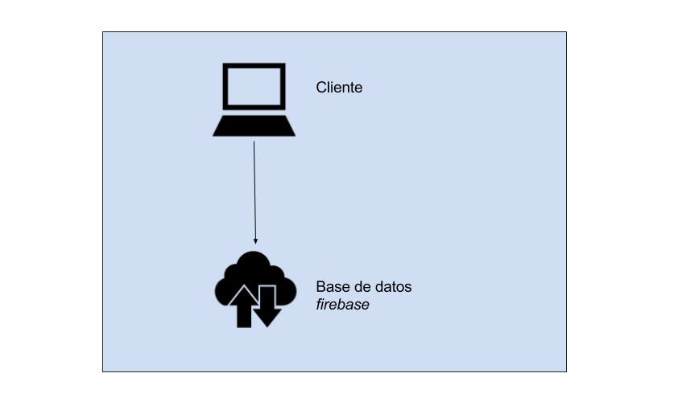

### K.1.4 Arquitectura

Al ser una web estática (sin programación a nivel de servidor) es fácilmente integrable en otras aplicaciones. 

A nivel de tecnologías y arquitectura de software, se trata de una aplicación estática hecha en el lado del cliente, es decir sin usar ningún servidor. Para su base de datos usa el servicio cloud (en la nube) de base de datos de Firebase, pudiendo guardar y obtener los datos necesarios (PIN del evento, reacciones, turnos de palabras de cola de participantes, etc). 

**Figura K.1.4.1:** Aplicación en Google Play Store de Android

