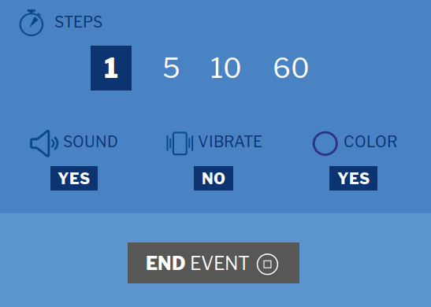

### K.1.7 Capturas de pantallas 

**Figura K.1.7.1:** Portada

**Figura K.1.7.2:** Creación de evento nuevo I

**Figura K.1.7.3:** Creación de evento nuevo II

**Figura K.1.7.4:** Contador sin empezar

**Figura K.1.7.5:** Contador en curso

**Figura K.1.7.6:** Turnos de palabra en contador

**Figura K.1.7.7:** Contador en curso (mitad de turno)

**Figura K.1.7.8:** Contador en curso (final de turno) 

**Figura K.1.7.9:** Estadísticas al finalizar el evento (sin terminar)

**Figura K.1.7.10:** Participante nuevo en evento

**Figura K.1.7.11:** Interacciones por parte de participante

**Figura K.1.7.12:** Bug al agregar nuevo participante

**Figura K.1.7.13:** Aplicación en Google Play Store de Android

