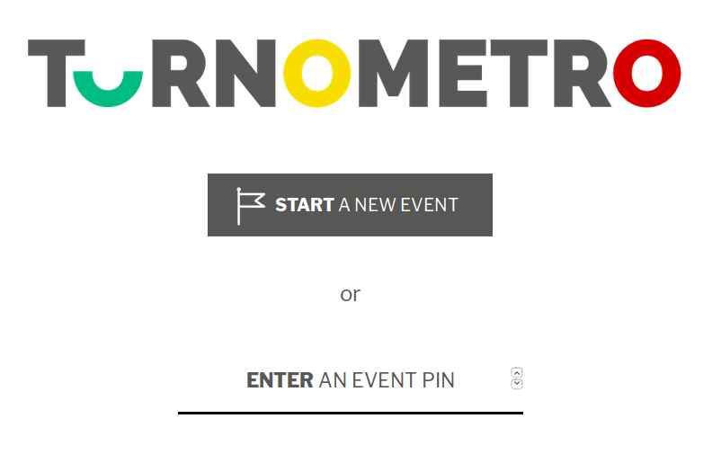
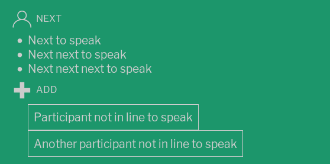
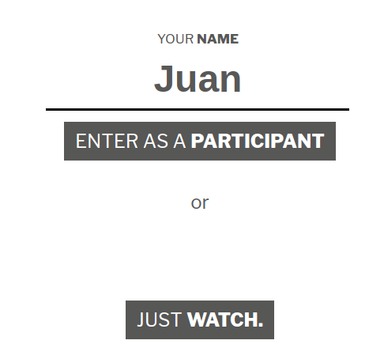
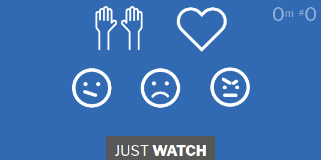
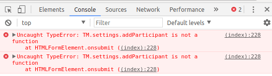
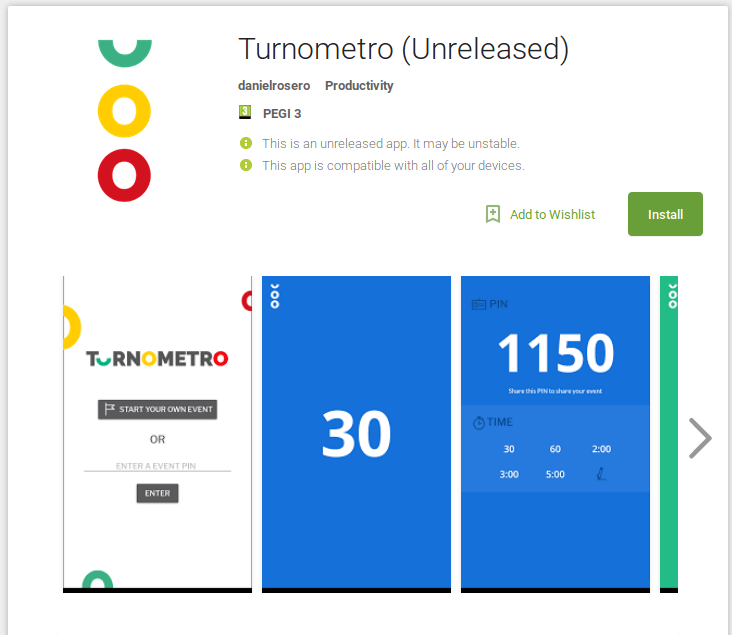

## K.1 Turnometro

### 

**Figura K.1.0:** Portada de [http://turnometro.org](http://turnometro.org) 

*Turnometro es una herramienta web para asambleas más efectivas e inclusivas. Quiere ser útil para cualquier tipo de deliberación cara a cara promoviendo brevedad y estructura, un uso más igualitario y equilibrado del derecho a hablar, y la transmisión y registro de (des)acuerdos y emociones. * (NOTE:  Traducido de http://turnometro.org/ 
Texto original: Turnometro  is a web tool for more effective & inclusive assemblies. It wants to be useful for any kind of face-to-face deliberation by promoting brevity & structure, a more equal & balanced use of the right to speak, and the airing & recording of (dis)agreements & emotions.)

### K.1.1 Metadatos

<table>
  <tr>
    <td>Nombre</td>
    <td>Turnometro</td>
  </tr>
  <tr>
    <td>URL</td>
    <td>http://turnometro.org/ </td>
  </tr>
  <tr>
    <td>URL repositorio</td>
    <td>https://github.com/elzr/Turnometro </td>
  </tr>
  <tr>
    <td>Resumen (Inglés)</td>
    <td>A web tool for more effective & inclusive assemblies. </td>
  </tr>
  <tr>
    <td>Resumen (Castellano)</td>
    <td>Una herramienta web para asambleas más efectivas e inclusivas.</td>
  </tr>
  <tr>
    <td>Lenguaje</td>
    <td>Javascript</td>
  </tr>
  <tr>
    <td>Framework</td>
    <td>No aplica</td>
  </tr>
  <tr>
    <td>Fecha primer commit</td>
    <td>Noviembre de 2016</td>
  </tr>
  <tr>
    <td>Nº de versiones</td>
    <td>0</td>
  </tr>
  <tr>
    <td>Nº de tablas en la BBDD</td>
    <td>No aplica</td>
  </tr>
  <tr>
    <td>Nº de contribuidores</td>
    <td>1</td>
  </tr>
  <tr>
    <td>Nº de stars</td>
    <td>4</td>
  </tr>
  <tr>
    <td>Licencia</td>
    <td>No aplica </td>
  </tr>
  <tr>
    <td>Mantenido</td>
    <td>No</td>
  </tr>
  <tr>
    <td>Diseño responsivo</td>
    <td>Sí</td>
  </tr>
</table>

 

### K.1.2 Funcionalidades 

* Permite a un grupo de personas organizar los turnos para una asamblea, poniendo una limitación de cada turno de, por ejemplo, 60 segundos, 5 minutos, 10 minutos, etc.

* Hay varios indicadores de los tiempos de los turnos a través de una barra temporal y del cambio de colores de fondo según el tiempo restante: verde cuando es superior al 50% del tiempo disponible, amarillo cuando es inferior, naranja para cuando quedan menos de 10 segundos y rojo cuando se ha superado el tiempo. 

* Permite sincronizar esta cuenta atrás con las otras participantes a través de un PIN de acceso autogenerado.   

* Como oyente de un evento, se puede expresar acuerdos, desacuerdos y emociones, que aparecen como burbujas en tiempo real en otros Turnometros. Si muchas personas expresan lo mismo a la vez se muestra de forma gráfica aumentando el tamaño de estas burbujas. 

* Como oyente de un evento, se puede pedir turno en la cola presionando un botón. Cuando llegue el turno de la persona para hablar, se le mostrará en su Turnometro. 

* Al final del evento, se puede ver un reporte de cuando ha hablado cada participante y las emociones expresadas durante el evento. 

### K.1.3 Análisis

El estudio del aplicativo se ha realizado durante las sesiones de Inteligencia Colectiva para la Democracia en el MediaLab Prado en Madrid (España) que tuvieron lugar del 18 de noviembre al 2 de diciembre de 2016. 

Continuó su desarrollo en el OGP Summit Hackathon de 2016 del 7 al 9 de diciembre en París (Francia).

Cuenta con aplicación móvil disponible en la Google Play Store (NOTE:  https://play.google.com/store/apps/details?id=me.danielrosero.turnometro ). 

### K.1.4 Arquitectura

Al ser una web estática (sin programación a nivel de servidor) es fácilmente integrable en otras aplicaciones. 

A nivel de tecnologías y arquitectura de software, se trata de una aplicación estática hecha en el lado del cliente, es decir sin usar ningún servidor. Para su base de datos usa el servicio cloud (en la nube) de base de datos de Firebase, pudiendo guardar y obtener los datos necesarios (PIN del evento, reacciones, turnos de palabras de cola de participantes, etc). 

**Figura K.1.4.1:** Aplicación en Google Play Store de Android

### K.1.5 Modelo de datos

Como no utiliza base de datos relacional, lo más parecido a un esquema de la base de datos con lo que se cuenta es el fichero db.json (NOTE:  https://github.com/elzr/Turnometro/blob/f9e854960678fc63fce70f92edc8a1811eaa4f03/db.json ), donde se definen dos clases:

* events

* reactions

### K.1.6 Conclusiones y recomendaciones

Al ser un aplicativo que no se encuentra con mantenimiento activo y cuenta con varios bugs en la programación no se recomienda su integración en Decidim. 

Aún así consideramos la dinámica propuesta lo suficientemente innovadora como para presentarla en este informe. 

En caso de querer desarrollarse una funcionalidad similar a la propuesta por esta aplicación, se recomienda utilizar un servicio alternativo en la base de datos, ya que actualmente se utiliza Firebase (que es de software propietario) por uno que sea de software libre, como gun (NOTE:  http://gun.js.org/ ). 

### K.1.7 Capturas de pantallas 

**Figura K.1.7.1:** Portada

**Figura K.1.7.2:** Creación de evento nuevo I

**Figura K.1.7.3:** Creación de evento nuevo II

**Figura K.1.7.4:** Contador sin empezar

**Figura K.1.7.5:** Contador en curso

**Figura K.1.7.6:** Turnos de palabra en contador

**Figura K.1.7.7:** Contador en curso (mitad de turno)

**Figura K.1.7.8:** Contador en curso (final de turno) 

**Figura K.1.7.9:** Estadísticas al finalizar el evento (sin terminar)

**Figura K.1.7.10:** Participante nuevo en evento

**Figura K.1.7.11:** Interacciones por parte de participante

**Figura K.1.7.12:** Bug al agregar nuevo participante

**Figura K.1.7.13:** Aplicación en Google Play Store de Android

